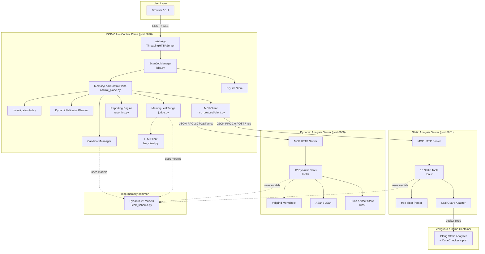
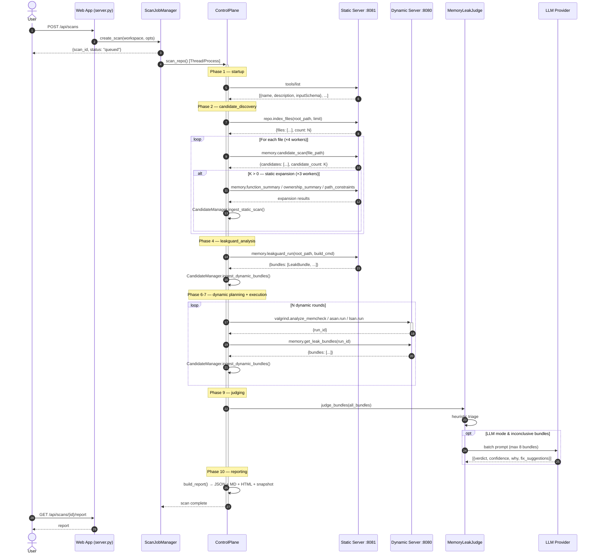
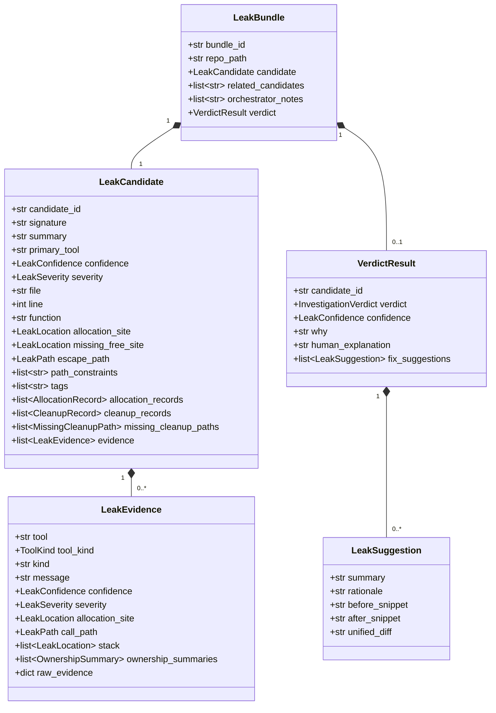
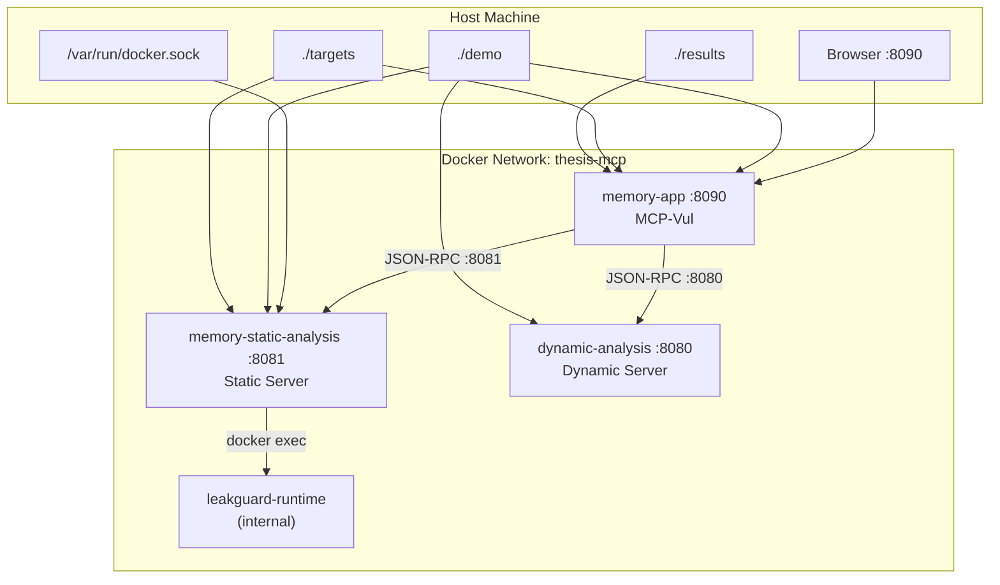
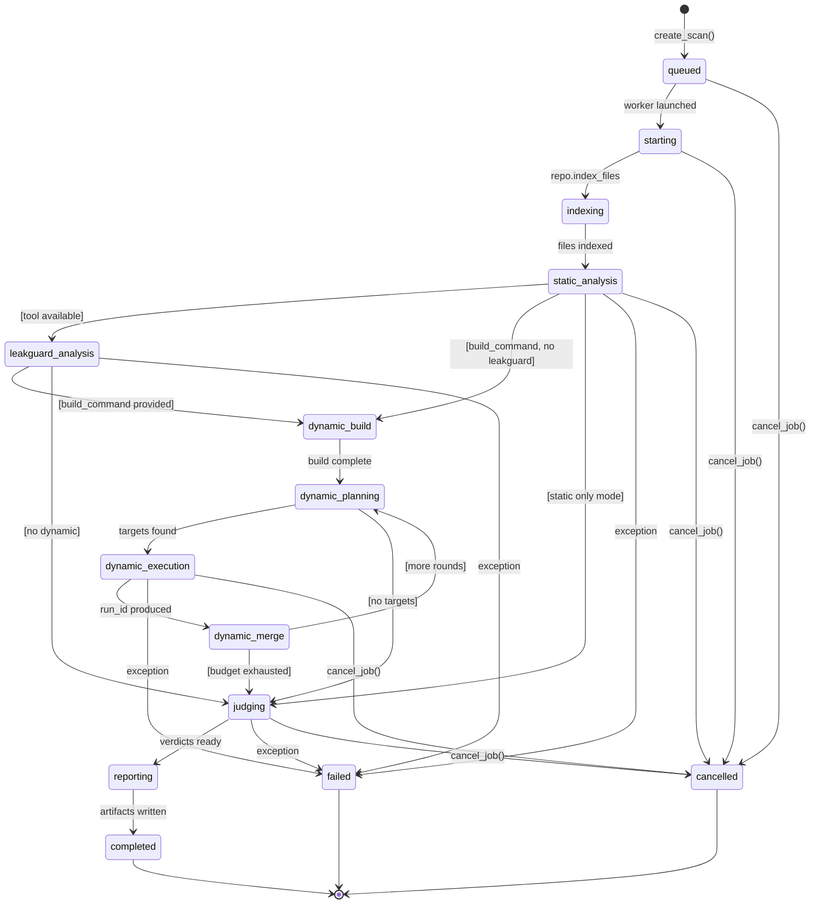

# Architecture Documentation

**Project:** LLM-Orchestrated Memory Leak Investigation for C/C++ Repositories  
**Version:** 1.0 — Updated: 2026-05-17

---

## Table of Contents

1. [System Overview](#1-system-overview)
2. [High-Level Architecture Diagram](#2-high-level-architecture-diagram)
3. [Component Breakdown](#3-component-breakdown)
4. [Communication Protocol](#4-communication-protocol)
5. [Core Pipeline Flow](#5-core-pipeline-flow)
6. [Data Model](#6-data-model)
7. [Static Analysis Tools Catalog](#7-static-analysis-tools-catalog)
8. [Dynamic Analysis Tools Catalog](#8-dynamic-analysis-tools-catalog)
9. [Judging & Verdict Engine](#9-judging--verdict-engine)
10. [Web Application & Frontend](#10-web-application--frontend)
11. [Deployment Architecture (Docker)](#11-deployment-architecture-docker)
12. [ScanJob State Machine](#12-scanjob-state-machine)
13. [Key Design Decisions](#13-key-design-decisions)
14. [Environment Configuration Reference](#14-environment-configuration-reference)

---

## 1. System Overview

This system is an **LLM-orchestrated memory leak investigator** for C/C++ source repositories. It employs a microservices architecture in which a central control plane (**MCP-Vul**) drives a multi-phase investigation workflow by remotely calling two specialised **MCP (Model Context Protocol)** analysis servers over HTTP.

The orchestrator combines:
- **Static evidence** — AST traversal, data-flow analysis, ownership modelling, and the LeakGuard Clang Static Analyzer
- **Dynamic runtime evidence** — Valgrind Memcheck, AddressSanitizer (ASan), and LeakSanitizer (LSan)
- **LLM judge** — heuristic rule engine optionally augmented by Anthropic/OpenAI for final verdicts, explanations, and fix suggestions

### User-Facing Entry Points

| Entry Point | Description |
|---|---|
| **Web UI** (port 8090) | React SPA backed by a Python `ThreadingHTTPServer`; real-time scan progress via SSE |
| **CLI tools** | `mcp-vul-memory-scan`, `mcp-vul-memory-batch`, `mcp-vul-memory-compare` |

### Five Core Components

| Component | Role | Port |
|---|---|---|
| **MCP-Vul** | Control plane — orchestration, judging, reporting, web UI | 8090 |
| **mcp-memory-static-analysis-server** | Static analysis — AST, lexical scan, call graph, LeakGuard | 8081 |
| **mcp-dynamic-analysis-server** | Dynamic analysis — Valgrind, ASan, LSan, run artifacts | 8080 |
| **mcp-memory-common** | Shared Pydantic v2 schemas — `LeakBundle`, `VerdictResult`, etc. | (library) |
| **leak_guard_tool** | Clang Static Analyzer wrapper — invoked via Docker-in-Docker | (Docker) |

---

## 2. High-Level Architecture Diagram



---

## 3. Component Breakdown

### 3.1 MCP-Vul — Control Plane

**Technology Stack:**

| Layer | Technology |
|---|---|
| Language | Python 3.12 |
| Web server | `http.server.ThreadingHTTPServer` (stdlib) |
| Parallelism | `concurrent.futures.ThreadPoolExecutor` |
| LLM clients | `anthropic` SDK + `openai`-compatible HTTP |
| Data models | Pydantic v2 via `mcp-memory-common` |
| Persistence | SQLite (stdlib `sqlite3`) |
| Packaging | `pyproject.toml` + `uv` lockfile |

**Source Layout (`MCP-Vul/src/`):**

```
src/
├── config.py                    # Env-var runtime configuration
├── llm_client.py                # Unified LLM client (Anthropic + OpenAI-compat)
├── mcp_protocol/
│   ├── client.py                # MCPClient — HTTP + stdio transports
│   └── remote_bridge.py         # Env-var factory for MCP connections
└── memory_leak/
    ├── control_plane.py         # MemoryLeakControlPlane.scan_repo() — 10-phase pipeline
    ├── investigation_policy.py  # InvestigationPolicy — adaptive tool selection
    ├── candidate_manager.py     # CandidateManager — dedup / merge / cluster bundles
    ├── judge.py                 # HeuristicMemoryLeakJudge + MemoryLeakJudge (LLM)
    ├── reporting.py             # MD / HTML / JSON / snapshot report renderers
    ├── dynamic_orchestration.py # DynamicValidationPlanner — binary discovery & ranking
    ├── batch_runner.py          # Corpus manifest evaluator
    ├── compare_snapshots.py     # Snapshot diff CLI
    └── shared_schema.py         # Re-exports from mcp-memory-common
memory_leak_app/
    ├── server.py                # ThreadingHTTPServer — REST + SSE endpoints
    ├── jobs.py                  # ScanJob dataclass + ScanJobManager lifecycle
    ├── log_collector.py         # Per-scan log aggregation for SSE
    ├── persistence.py           # SQLite ScanStateStore
    └── workspaces.py            # Workspace path security validation
```

**Key Classes:**

| Class | File | Purpose |
|---|---|---|
| `MemoryLeakControlPlane` | `control_plane.py` | 10-phase scan orchestrator; drives all MCP tool calls |
| `InvestigationPolicy` | `investigation_policy.py` | Selects tools per file (`minimal`/`balanced`/`full` mode) |
| `CandidateManager` | `candidate_manager.py` | Deduplicates and merges `LeakBundle` objects |
| `DynamicValidationPlanner` | `dynamic_orchestration.py` | Ranks bundles, discovers binaries and inputs |
| `HeuristicMemoryLeakJudge` | `judge.py` | Pure rule-based verdict engine (no LLM) |
| `MemoryLeakJudge` | `judge.py` | Hybrid: heuristic triage → selective LLM batch (size 8) |
| `ScanJobManager` | `jobs.py` | Job lifecycle; spawns thread/process workers; SSE event bus |

---

### 3.2 mcp-memory-static-analysis-server

**Technology Stack:** Python 3.12, `tree-sitter` + `tree-sitter-c`/`tree-sitter-cpp`, Docker SDK, port 8081.

**Source Layout:**

```
src/mcp_memory_static_analysis_server/
├── app.py                    # Tool registration + JSON-RPC dispatcher
├── http_server.py            # stdlib BaseHTTPRequestHandler on /mcp
└── tools/
    ├── _parser.py            # Shared tree-sitter C/C++ parser pool
    ├── index_files.py        # repo.index_files
    ├── candidate_scan.py     # memory.candidate_scan (regex lexical)
    ├── ast_scan.py           # memory.ast_scan
    ├── function_summary.py   # memory.function_summary
    ├── call_graph.py         # memory.call_graph
    ├── path_constraints.py   # memory.path_constraints
    ├── interprocedural_flow.py  # memory.interprocedural_flow
    ├── call_path_summary.py  # memory.call_path_summary
    ├── ownership_summary.py  # memory.ownership_summary
    ├── ownership_conventions.py  # memory.ownership_conventions
    ├── project_ownership_graph.py  # repo.project_ownership_graph
    └── leakguard_run.py      # memory.leakguard_run + leakguard_get_report
```

**Docker Requirement:** Needs `/var/run/docker.sock` mounted for Docker-in-Docker LeakGuard calls.

---

### 3.3 mcp-dynamic-analysis-server

**Technology Stack:** Python 3.12, Valgrind (Linux only), ASan/LSan, port 8080. **Linux-only** — use Docker on macOS.

**Source Layout:**

```
src/mcp_dynamic_analysis_server/
├── app.py / http_server.py / config.py
├── core/
│   ├── parser_memcheck.py    # Valgrind XML → raw findings
│   ├── parser_asan.py        # ASan/LSan stderr → raw findings
│   ├── normalizer.py         # raw → NormalizedReport
│   ├── normalizer_asan.py    # ASan raw → NormalizedReport
│   ├── leak_bundle.py        # NormalizedReport → LeakBundle[]
│   ├── artifact_store.py     # per-run filesystem store (runs/{id}/)
│   ├── command_builder.py    # builds valgrind CLI arguments
│   └── validators.py         # WORKSPACE_ROOT path security
└── tools/
    ├── analyze_memcheck.py / get_report.py / list_findings.py
    ├── compare_runs.py / get_raw_artifact.py
    ├── get_leak_bundles.py / asan_run.py / lsan_run.py
    ├── run_binary.py / build_target.py / list_runs.py
    └── create_upload_url.py
```

---

### 3.4 mcp-memory-common

Single installable library. All three Python services import shared Pydantic v2 models from here.

**Models:** `LeakBundle`, `LeakCandidate`, `LeakEvidence`, `LeakLocation`, `AllocationRecord`, `CleanupRecord`, `OwnershipTransfer`, `CleanupObligation`, `MissingCleanupPath`, `FalsePositiveHint`, `OwnershipSummary`, `LeakPath`, `ArtifactRef`, `VerdictResult`, `LeakSuggestion`, plus enums `ToolKind`, `LeakSeverity`, `LeakConfidence`, `InvestigationVerdict`.

---

### 3.5 leak_guard_tool

Pre-existing Clang Static Analyzer–based detector. Not modified by this thesis. Runs inside `leakguard-runtime` Docker container invoked via `docker exec` from the static server. LeakGuard outputs Apple Clang `.plist` files which `leakguard_run.py` parses back into `LeakBundle[]`.

---

## 4. Communication Protocol

### 4.1 JSON-RPC 2.0 over HTTP (MCP)

All tool calls use MCP wire format: JSON-RPC 2.0 over `POST /mcp`.

**Request:**
```json
{
  "jsonrpc": "2.0",
  "id": 1,
  "method": "tools/call",
  "params": {
    "name": "memory.candidate_scan",
    "arguments": { "file_path": "/workspace/demo/leak.c" }
  }
}
```

**Response:**
```json
{
  "jsonrpc": "2.0",
  "id": 1,
  "result": {
    "content": [{"type": "text", "text": "{\"candidates\": [...]}"}],
    "isError": false
  }
}
```

### 4.2 MCPClient Transports

| Mode | Mechanism | Use Case |
|---|---|---|
| **HTTP** | `urllib.request` POST to `/mcp` | Production Docker services |
| **stdio** | Subprocess `stdin`/`stdout` JSON-RPC | Local dev / embedded mode |

Timeouts: standard calls = `MCP_HTTP_TIMEOUT_SECONDS` (30s); long-running (LeakGuard, Valgrind) = `MCP_LONG_RUNNING_HTTP_TIMEOUT_SECONDS` (1800s).

### 4.3 SSE (Server-Sent Events) — Real-Time UI

| Endpoint | Method | Description |
|---|---|---|
| `GET /api/scans/{id}/events` | SSE stream | Pushes `data: {...}\n\n` frames as phases advance |
| `POST /api/scans` | REST | Create new scan job |
| `GET /api/scans/{id}/report` | REST | Fetch completed report (JSON/MD/HTML) |
| `DELETE /api/scans/{id}` | REST | Cancel or delete scan |

SSE heartbeat sent every 15 seconds. `ScanJobManager` wakes waiting handlers via `threading.Condition`.

### 4.4 Docker Network

All services on `thesis-mcp` bridge network. DNS: `memory-static-analysis:8081`, `dynamic-analysis:8080`, `leakguard-runtime`.

---

## 5. Core Pipeline Flow

`MemoryLeakControlPlane.scan_repo()` — 10 deterministic phases.

### 5.1 Phase Summary

| # | Phase Key | Condition | Primary Tool(s) |
|---|---|---|---|
| 1 | `startup` | Always | `tools/list`, policy init |
| 2 | `candidate_discovery` | Always | `repo.index_files`, `memory.candidate_scan`, expansion tools |
| 3 | `project_ownership_graph` | Tool available + candidates found | `repo.project_ownership_graph` |
| 4 | `leakguard_analysis` | Tool available | `memory.leakguard_run` / `memory.leakguard_get_report` |
| 5 | `dynamic_build` | `build_command` provided | `dynamic.build_target` |
| 6 | `dynamic_planning` | Dynamic mode != off | `DynamicValidationPlanner.plan()` |
| 7 | `dynamic_execution` | Targets identified | `valgrind.analyze_memcheck` / `asan.run` / `lsan.run` |
| 8 | `dynamic_merge` | Prior `run_ids` provided | `memory.get_leak_bundles` |
| 9 | `judging` | Always | `MemoryLeakJudge.judge_bundles()` |
| 10 | `reporting` | Always | `build_report()` → MD / HTML / JSON / snapshot |

### 5.2 Candidate Discovery Parallelism

```
ThreadPoolExecutor(max_workers=4)   ← MEMORY_LEAK_FILE_ANALYSIS_CONCURRENCY
  └── per file: memory.candidate_scan
        └── if candidates > 0:
              ThreadPoolExecutor(max_workers=3)  ← MEMORY_LEAK_STATIC_TOOL_CONCURRENCY
                ├── memory.function_summary
                ├── memory.ownership_summary
                └── memory.path_constraints   (balanced mode)
```

### 5.3 Sequence Diagram



---

## 6. Data Model

### 6.1 LeakBundle Hierarchy



### 6.2 Enumerations

| Enum | Values |
|---|---|
| `LeakSeverity` | `critical` / `high` / `medium` / `low` / `info` |
| `LeakConfidence` | `high` / `medium` / `low` |
| `InvestigationVerdict` | `confirmed_leak` / `likely_leak` / `inconclusive` / `false_positive` |
| `ToolKind` | `static` / `dynamic` / `orchestrator` / `judge` |

### 6.3 Tool Rank (Merge Priority)

| Rank | Source |
|---|---|
| 3 (highest) | Valgrind / ASan / LSan — runtime dynamic evidence |
| 2 | LeakGuard — Clang Static Analyzer |
| 1 | tree-sitter static tools |
| 0 | other |

### 6.4 CandidateManager Merge Logic

For each incoming `LeakBundle`:
1. **Key lookup** — check `candidate.signature` in bundle registry
2. **Fuzzy match** — same file + (sig stem match OR line ≤3 apart OR same function ≤15 lines OR token overlap)
3. **Merge** — union `tags`/`path_constraints`, accumulate all `LeakEvidence`, upgrade confidence/severity/tool by rank
4. **Insert** — new bundle if no match

---

## 7. Static Analysis Tools Catalog

All tools at `POST :8081/mcp`.

| Tool | Input | Technique | Key Output |
|---|---|---|---|
| `repo.index_files` | `root_path`, `limit` | `pathlib.rglob` | `files[]`, `count` |
| `memory.candidate_scan` | `file_path` | Regex lexical | `candidates[]` per allocation site |
| `memory.ast_scan` | `file_path`, `function_name` | tree-sitter (1 fn) | AST nodes, alloc/free calls |
| `memory.function_summary` | `file_path` | tree-sitter (all fns) | `leaked_variables[]`, `has_allocation_without_local_free` |
| `memory.call_graph` | `file_path` | tree-sitter | Intra-file `edges[]` (caller→callee) |
| `memory.path_constraints` | `file_path` | Branch analysis | `constraints[]`, `early_return_conditions[]` |
| `memory.interprocedural_flow` | `file_path` | Cross-fn dataflow (intra-file) | `flows[]`, per-fn `risk` level |
| `memory.call_path_summary` | `file_path`, `start_function?` | DFS up to `max_depth` | Call tree with alloc/dealloc events |
| `memory.ownership_summary` | `file_path` | Ownership analysis | `cleanup_obligations[]`, `transfers[]`, `false_positive_hints[]` |
| `memory.ownership_conventions` | `file_path` | Name heuristics | `allocators[]`, `deallocators[]` |
| `repo.project_ownership_graph` | `root_path` | Repo-wide ownership | Cross-file `edges[]`, `allocator_deallocator_pairs[]` |
| `memory.leakguard_run` | `root_path`, `build_command?` | Docker + CodeChecker + Clang SA | `bundles[]` from plist |
| `memory.leakguard_get_report` | `artifact_path?` | Plist parsing only | `bundles[]` (no re-run) |

### Static Expansion Modes

| Mode | Tools Invoked |
|---|---|
| `minimal` | `function_summary`, `ownership_summary`, `path_constraints` |
| `balanced` (default) | + `ownership_conventions`, `interprocedural_flow` |
| `full` | + `ast_scan`, `call_graph`, `call_path_summary` |

---

## 8. Dynamic Analysis Tools Catalog

All tools at `POST :8080/mcp`.

| Tool | Purpose | Key Output |
|---|---|---|
| `valgrind.analyze_memcheck` | Run Valgrind Memcheck (XML) | `{run_id, summary}` |
| `valgrind.get_report` | Fetch `NormalizedReport` for a run | `{findings[], stats}` |
| `valgrind.list_findings` | Query findings with filters | `{findings[]}` |
| `valgrind.compare_runs` | Diff two runs by SHA1 signature | `{new[], resolved[], unchanged[]}` |
| `valgrind.get_raw_artifact` | Read raw file (xml/log/stderr) | `{content, mime_type}` |
| `memory.get_leak_bundles` | `NormalizedReport` → `LeakBundle[]` | `{bundles[]}` |
| `asan.run` | Execute ASan-instrumented binary | `{run_id, exit_code, leak_detected}` |
| `lsan.run` | Execute LSan binary | `{run_id, exit_code, leak_summary}` |
| `dynamic.run_binary` | Generic dispatch (asan/lsan) | delegated |
| `dynamic.build_target` | Run build command in workspace | `{success, binary_paths[]}` |
| `dynamic.list_runs` | List stored run records | `{runs[]}` |
| `artifact.create_upload_url` | Presigned R2 PUT URL | `{upload_url, public_url}` |

### Run Artifact Storage

Each run stores under `runs/{run_id}/`:

| File | Content |
|---|---|
| `request.json` | Serialized input parameters |
| `command.txt` | CLI string (`shlex.join`) |
| `stdout.txt` / `stderr.txt` | Captured process output |
| `valgrind.xml` | Valgrind XML (Memcheck only) |
| `normalized_report.json` | Full `NormalizedReport` |
| `summary.json` | Stats + top-5 findings |
| `metadata.json` | run_id, tool, exit_code, duration, timestamps |

---

## 9. Judging & Verdict Engine

### 9.1 Architecture

```
CandidateManager.list_bundles()
    │
    ▼
HeuristicMemoryLeakJudge     ← always runs first
    │
    ├─ confirmed_leak / false_positive  → DONE
    │
    └─ likely_leak / inconclusive
            │  (only if MEMORY_LEAK_JUDGE_MODE=llm)
            ▼
    MemoryLeakJudge._route_bundle()
            │
            ├─ "skip" → keep heuristic verdict
            └─ "llm"  → LLM batch (max 8 bundles)
                    │
                    ▼
            _calibrate_llm_verdict()  ← caps confidence without dynamic evidence
```

### 9.2 Heuristic Judge Rules

| Priority | Condition | Verdict | Confidence |
|---|---|---|---|
| 1 | Dynamic evidence (`ToolKind.DYNAMIC`) + leak confirmed | `confirmed_leak` | High |
| 2 | LeakGuard evidence + cleanup gap | `likely_leak` | High |
| 3 | Multiple static tools + `missing_cleanup_paths` non-empty | `likely_leak` | Medium |
| 4 | Single static tool + `missing_cleanup_paths` | `inconclusive` | Medium |
| 5 | `false_positive_hints` dominate | `false_positive` | Medium |
| 6 | No corroborating evidence | `inconclusive` | Low |

### 9.3 LLM Judge

- **Batching:** Up to 8 bundles per LLM call
- **Prompt:** JSON payload with `candidate` metadata, `evidence` list, `missing_cleanup_paths`
- **Parsing:** `_extract_json_robust()` — balanced-brace finder to tolerate prose wrappers
- **Calibration:** Caps `confirmed_leak` confidence at `medium` when no dynamic evidence
- **Fallback:** On LLM error, preserves heuristic verdict
- **Model:** `ANTHROPIC_API_KEY` → `claude-sonnet-4-20250514`; `LOCAL_LLM_BASE_URL` → configurable

### 9.4 Fix Suggestions

`_fix_suggestions()` generates up to 3 `LeakSuggestion` per bundle:
1. **Primary fix** — inserts cleanup at earliest missing-cleanup path branch
2. **RAII wrapper** — scope-guard or smart-pointer refactoring
3. **Null-path guard** — NULL check before allocation on early-return branches

Each suggestion includes `before_snippet`, `after_snippet`, `unified_diff` from actual source file.

---

## 10. Web Application & Frontend

### 10.1 REST + SSE Routes

| Route | Method | Handler |
|---|---|---|
| `/` | GET | Serve React SPA (`frontend/dist/index.html`) |
| `/api/workspaces` | GET | List allowed workspace roots |
| `/api/scans` | GET/POST | List all scans / Create new scan |
| `/api/scans/{id}` | GET/DELETE | Get status / Cancel or delete |
| `/api/scans/{id}/events` | GET (SSE) | Real-time progress stream |
| `/api/scans/{id}/report` | GET | Fetch report (JSON/MD/HTML/snapshot) |
| `/api/scans/purge-terminal` | POST | Bulk-delete all terminal scans |
| `/api/logs` | GET (SSE) | Server-side Python log stream |

### 10.2 Frontend Tech Stack

| Package | Version | Role |
|---|---|---|
| React | 19.2 | UI framework |
| Vite | 7.3 | Build tool + dev server (port 5173) |
| Tailwind CSS | 4.1 | Utility-first CSS |
| DaisyUI | 5.0 | Component library |
| `@xyflow/react` | 12.10 | Pipeline DAG canvas visualization |
| `react-router-dom` | 7.9 | Client-side routing |
| `lucide-react` | 1.11 | Icon set |

### 10.3 Pages

| Page | Route | Description |
|---|---|---|
| `SetupPage` | `/` | Repository selection, scan options (mode, build cmd) |
| `ActivityPage` | `/scan/:id` | Real-time phase timeline + `@xyflow/react` DAG |
| `LogsPage` | `/scan/:id/logs` | Scrollable event log viewer |
| `ReportPage` | `/scan/:id/report` | Verdict table, evidence cards, diff viewer |

### 10.4 ScanJobManager Worker Modes

| Mode | Isolation | Cancel Mechanism | Use Case |
|---|---|---|---|
| `thread` | Shared memory | Cooperative flag | Development / CI |
| `process` | OS process (`spawn`) | SIGTERM / SIGKILL | Production (default) |

---

## 11. Deployment Architecture (Docker)

### 11.1 Services



### 11.2 Service Summary

| Service | Port | Key Mounts | Depends On |
|---|---|---|---|
| `memory-app` | 8090 | `./demo`, `./targets`, `./results` | both servers |
| `memory-static-analysis` | 8081 | `./leak_guard_tool`, `/var/run/docker.sock` | `leakguard-runtime` |
| `leakguard-runtime` | — | `./leak_guard_tool` | — |
| `dynamic-analysis` | 8080 | `dynamic-runs` named volume | — |

### 11.3 Docker-in-Docker (D-in-D) Pattern

```
Host Docker daemon
    ├── memory-static-analysis container
    │       └── leakguard_run.py
    │               │  (docker exec via /var/run/docker.sock)
    │               ▼
    └── leakguard-runtime container
            └── CodeChecker → Clang SA → .plist output
```

---

## 12. ScanJob State Machine



### State Descriptions

| State | Description |
|---|---|
| `queued` | Job created, worker not yet allocated |
| `starting` | Worker thread/process launched, MCP connections establishing |
| `indexing` | `repo.index_files` running |
| `static_analysis` | Per-file `candidate_scan` + expansion tools (concurrent) |
| `leakguard_analysis` | LeakGuard Clang SA running in Docker |
| `dynamic_build` | Target compiled with instrumentation |
| `dynamic_planning` | `DynamicValidationPlanner` ranking bundles, discovering binaries |
| `dynamic_execution` | Valgrind / ASan / LSan running |
| `dynamic_merge` | Ingesting `LeakBundle[]` from runtime results |
| `judging` | `MemoryLeakJudge` producing `VerdictResult` for each bundle |
| `reporting` | Serializing JSON, Markdown, HTML, and snapshot |
| `completed` | All artifacts written; terminal and immutable |
| `failed` | Unhandled exception; `error` field populated |
| `cancelled` | Explicit `cancel_job()` received |

---

## 13. Key Design Decisions

### 13.1 MCP as the Integration Bus

MCP was chosen so that the same `tools/list` + `tools/call` interface can be called by an LLM agent directly in the future, without code changes. Each analysis server is independently deployable and testable.

### 13.2 Heuristic-First Judging

The heuristic judge always runs first:
- Sub-second judging for obvious cases (dynamic confirmed, clear false positive)
- LLM cost incurred only for genuinely ambiguous bundles (`inconclusive`/`likely_leak`)
- Fully deterministic and reproducible without API access

### 13.3 Shared Schema Library

`mcp-memory-common` as a dedicated pip package enforces identical Pydantic model versions across all three services, preventing serialisation drift as the schema evolves.

### 13.4 Static Expansion Modes for Ablation

Three modes (`minimal`/`balanced`/`full`) enable controlled ablation experiments by changing only `MEMORY_LEAK_STATIC_EXPANSION_MODE`, keeping all other variables constant.

### 13.5 Process-Mode Worker Isolation

Production web app spawns a fresh Python process per scan (`multiprocessing.get_context("spawn")`):
- Reliable cancellation via SIGTERM
- Scan crash doesn't affect web server
- No memory accumulation across scans

---

## 14. Environment Configuration Reference

### MCP-Vul (Control Plane)

| Variable | Default | Description |
|---|---|---|
| `MCP_STATIC_SERVER_URL` | `http://localhost:8081/mcp` | Static MCP server endpoint |
| `MCP_DYNAMIC_SERVER_URL` | `http://localhost:8080/mcp` | Dynamic MCP server endpoint |
| `MCP_HTTP_TIMEOUT_SECONDS` | `30` | Standard tool call timeout |
| `MCP_LONG_RUNNING_HTTP_TIMEOUT_SECONDS` | `1800` | LeakGuard / Valgrind timeout |
| `MEMORY_LEAK_JUDGE_MODE` | `heuristic` | `heuristic` or `llm` |
| `MEMORY_LEAK_JUDGE_SCOPE` | `selective` | `selective` or `all` |
| `MEMORY_LEAK_STATIC_EXPANSION_MODE` | `balanced` | `minimal`, `balanced`, or `full` |
| `MEMORY_LEAK_FILE_ANALYSIS_CONCURRENCY` | `4` | File-level ThreadPoolExecutor workers |
| `MEMORY_LEAK_STATIC_TOOL_CONCURRENCY` | `3` | Concurrent expansion tools per file |
| `LLM_PROVIDER` | `claude` | `anthropic`, `openai`, or `local` |
| `ANTHROPIC_API_KEY` | — | Anthropic API key |
| `CLAUDE_MODEL` | `claude-sonnet-4-20250514` | Claude model identifier |
| `LOCAL_LLM_BASE_URL` | `http://127.0.0.1:1234/v1` | OpenAI-compatible local endpoint |
| `LOCAL_LLM_MODEL` | `local-model` | Model name for local provider |
| `MEMORY_LEAK_APP_WORKSPACE_ROOTS` | — | Colon-separated allowed workspace roots |
| `MEMORY_LEAK_APP_ARTIFACT_DIR` | `results/app_scans` | Scan artifact storage directory |
| `MEMORY_LEAK_APP_DB_PATH` | `<artifact_dir>/memory_leak_app.sqlite3` | SQLite database path |

### Static Analysis Server

| Variable | Default | Description |
|---|---|---|
| `MCP_TRANSPORT` | `stdio` | `stdio` or `http` |
| `MCP_HTTP_PORT` | `8081` | Listen port |
| `LEAKGUARD_REPO_ROOT` | — | Path to `leak_guard_tool` repository |
| `LEAKGUARD_DOCKER_IMAGE` | `leakguard-tool:dev` | LeakGuard container image |
| `LEAKGUARD_DOCKER_PLATFORM` | `linux/amd64` | Docker platform |

### Dynamic Analysis Server

| Variable | Default | Description |
|---|---|---|
| `MCP_TRANSPORT` | `stdio` | `stdio` or `http` |
| `MCP_HTTP_PORT` | `8080` | Listen port |
| `WORKSPACE_ROOT` | — | Root for allowed execution paths |
| `RUNS_DIR` | `/workspace/dynamic/runs` | Run artifact directory |
| `VALGRIND_BIN` | `valgrind` | Valgrind binary path |
| `LOG_LEVEL` | `INFO` | Logging verbosity
