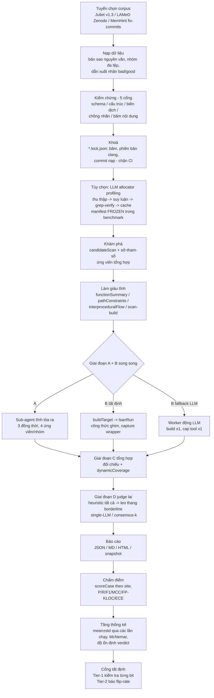

# REVIEW_vi.md — Đánh giá luận văn thạc sĩ CLeak theo phong cách hội đồng

> **Vai trò người phản biện:** nhà phản biện học thuật kỳ cựu / giảng viên phản biện luận văn, chuyên ngành An toàn thông tin.
> **Phạm vi:** khung tiêu chí đánh giá đầy đủ (rubric) + nhận định phản biện đối với luận văn
> *"CLeak: LLM-Orchestrated Unified Static and Dynamic Analysis for C/C++ Memory Leak Detection"*
> (Lê Đăng Dũng, 2026), dựa trên: `docs/THESIS.md`, `docs/CONTRIBUTION.md`,
> `docs/RELATED-WORK.md`, `docs/EVALUATION.md`, `docs/DEFENSE-PLAN.md`,
> `paper/de-cuong.md`, `paper/chapters/chapter1–5`, `paper/references/bibliography.md`.
> **Ngày:** 20-09-2026.

> **Lưu ý trước khi phản biện:** luận văn trong workspace này **không phải** là
> luận văn về phát hiện mã độc / bộ phân loại ML. **Không có mô hình ML nào được
> huấn luyện** (không có FT-Transformer/LightGBM/CatBoost); "mô hình" ở đây là một
> bộ chấm điểm heuristic với trọng số đặt tay + một LLM judge đóng băng. Do đó,
> các nhóm tiêu chí F/G được điều chỉnh thành *kỹ thuật bằng chứng* (evidence
> engineering) và *thiết kế judge*, và việc thiếu vắng thành phần học máy được
> gắn cờ là một rủi ro bảo vệ rõ ràng. Bản thân khung tiêu chí được viết để dùng
> chung; việc áp dụng là riêng cho luận văn này.

> **Bổ sung ngày 20-09-2026:** phản biện này đã được kiểm chứng độc lập bởi ba
> agent phản biện (kiểm chứng sự thật 28 tuyên bố có thể xác minh: 26 xác nhận /
> 2 một phần / 0 bác bỏ; phê bình phương pháp luận đối với 5 phê phán then chốt;
> kiểm toán lộ trình). Hai tuyên bố đã được sửa tại chỗ (cách diễn đạt về các mục
> không được trích dẫn ở Nhóm B; nguồn của cam kết CI ở Nhóm D) và một phê phán
> được thu hẹp phạm vi (prompt injection — xem Danh mục kiểm tra #11). Chi tiết
> đầy đủ trong phần **Bổ sung (Addendum)** ở cuối file này.

---

# Tóm tắt tổng quan

**Kết luận: đủ điều kiện đạt, kèm các điều chỉnh — sản phẩm nghiên cứu và văn hóa đánh giá mạnh, nhưng bị suy yếu bởi các khuyết tật nhất quán nội tại và ba lỗ hổng trí tuệ có thể bị khai thác.**

| Khía cạnh | Điểm (thang 5) | Lý giải một dòng |
|---|:---:|---|
| Vấn đề & động lực nghiên cứu | **4.5** | Vấn đề thật, khoanh phạm vi tốt (lớp leak không gây crash); định vị khoảng trống ba trục sắc bén |
| Tổng quan tài liệu | **4.0** | Cập nhật (2025–26), các tuyên bố được kiểm chứng đối kháng; liên kết chéo hỏng và các mục không được trích dẫn |
| Mục tiêu nghiên cứu | **3.0** | RQ1–RQ4 chỉ xuất hiện lần đầu ở Chương 5; đánh số đóng góp tự mâu thuẫn qua Ch. 2/3/5 |
| Phương pháp luận | **4.0** | Chấm điểm theo site, tất định hai tầng, McNemar; khoảng tin cậy bootstrap đã hứa nhưng không bao giờ được giao |
| Dữ liệu | **3.5** | Juliet 5-cổng đã kiểm chứng + lockfile (xuất sắc); ground truth MemHint tự xây; corpus thực chỉ có mẫu dương |
| Kỹ thuật bằng chứng | **3.5** | Bằng chứng có cấu trúc phong phú; trọng số đặt tay, không có phân tích độ nhạy; ECE bỏ lửng |
| Thiết kế judge/"mô hình" | **3.0** | Ablation 9-cấu-hình mẫu mực; nhưng planner chỉ thêm ΔF1 = +0.001; sweep một mô hình duy nhất; không có thành phần học |
| Pipeline | **4.0** | Hoàn chỉnh và tái lập được; nút thắt thượng nguồn (allocator profiling R 21% trên dự án thực) được chỉ ra một cách trung thực |
| Thiết kế thí nghiệm | **3.5** | Bài học phân tầng, đa lần chạy, flip-rate; n=3 lần chạy, không có CI, bảng mẫu lỗi thời một phần chưa có caveat |
| Chỉ số đánh giá | **3.5** | P/R/F1/MCC/FP-per-KLOC phù hợp; ECE được báo cáo nhưng không bao giờ được diễn giải; không có chỉ số độ trễ hay chất lượng giải thích |
| Phân tích kết quả | **4.0** | Việc hòa giải lấy mẫu 0.938-vs-0.863 (§4.2.5) là mẫu mực; một vài ô rỗng nghĩa (B2 P=1.0, TN=0) |
| Thảo luận & các đe dọa hiệu lực | **4.0** | Kết quả âm trung thực hiếm thấy; im lặng về các mối đe dọa đối kháng/prompt-injection |
| Tính mới | **3.0** | Đóng góp kỹ thuật vững chắc; tuyên bố khoảng trống tiêu biểu là lập luận về sự-không-tồn-tại trên ~10 hệ thống |
| Chất lượng văn bản | **3.5** | Giọng văn rõ ràng, trung thực; Chương 5 chứa stub `[PENDING]` mâu thuẫn với các số liệu cuối cùng của Chương 4 |
| Hình vẽ & bảng biểu | **2.5** | Chỉ có hai sơ đồ Mermaid trong toàn bộ bản thảo; bảng không đánh số; Chương 4 toàn bảng |
| Tài liệu tham khảo | **3.0** | Hội đồng khoa học đã được xác minh; ≥6 mục không được trích dẫn, ≥6 số trích dẫn sai trong văn bản, tác giả placeholder "A. Bugs" |

**5 rủi ro hàng đầu khi bảo vệ (được neo bằng bằng chứng):**

1. **Mâu thuẫn đánh số đóng góp giữa các chương** — Ch. 2 §2.7.3 và Ch. 3 §3.6.2 gọi consensus judge là "đóng góp C1"; Ch. 5 §5.2 và `docs/CONTRIBUTION.md` định nghĩa C1 = pipeline tất định-trừ-judge và C4 = consensus (kết quả âm). Một thành viên hội đồng đọc tuần tự sẽ bắt được điều này trong vài phút.
2. **Chương 5 lỗi thời** — §5.1 RQ4 chứa `[PENDING, bổ sung... cho corpus đó]` và §5.4 nói "MemHint chưa hoàn tất," trong khi Chương 4 §4.10 báo kết quả MemHint cuối cùng (TP12/FP0/FN14, R 0.462). Mâu thuẫn nội tại ngay trong văn bản nộp.
3. **Mẫu số chấm điểm phụ thuộc công cụ** — LAMeD: CLeak được chấm trên 50 site, Clang trên 43, được biện hộ là "do thiết kế của `scoreCase`" (§4.5.1, §4.7.2). P/R so chéo hệ trên các mẫu số khác nhau không phải là so sánh; cần ground truth độc lập với công cụ hoặc một lập luận chặt chẽ hơn nhiều.
4. **Việc đánh giá lời giải thích và fix-diff đã hứa không bao giờ diễn ra** — động lực (de-cuong, GOAL.md) nói hệ thống tạo ra "root cause + diff áp dụng được," nhưng Chương 4 chỉ đo P/R/F1/ECE/FP-KLOC cho phát hiện. Tuyên bố khác biệt hóa của luận văn không được đánh giá.
5. **Đóng góp của planner ≈ nhiễu** — B6 0.862 → B6a 0.863 (+0.001 F1, +$0.64) trên toàn corpus (§4.2.2), nhưng B6a lại là dòng tiêu đề được in đậm và là cấu hình sản xuất được gọi tên ("Cấu hình sản xuất là B6a", §4.11). Luận văn in "B6a ≈ B6" và tuyên bố không có lợi ích F1 nào từ planner — nhưng việc lựa chọn cấu hình tiêu điểm dựa trên một +0.001 chưa qua kiểm định thống kê; không có kiểm định ý nghĩa nào cô lập nó. *(Diễn giải đã được sửa theo Phụ lục.)*

**Điểm thực sự mạnh và phải được bảo vệ trong buổi bảo vệ:** giao thức tái lập hai tầng với các cổng từ chối false-pass (C2), việc đảo ngược kết luận consensus một cách trung thực (n=30 → n=50 phân tầng, McNemar p=0.077) như một *phát hiện phương pháp luận về lấy mẫu trong đánh giá LLM-judge*, sweep 9-baseline toàn-corpus với kế toán chi phí thực ($75.78 tổng; B6a $6.63 so với B7 $27.14), và các cổng kiểm chứng corpus với lockfile băm nội dung.

---

# Khung tiêu chí đánh giá (Rubric)

Cách chấm: **E** = Xuất sắc (Excellent), **A** = Chấp nhận được (Acceptable), **W** = Yếu (Weak). Mỗi nhóm: bảng tiêu chí, lỗi thường gặp, hành động cải tiến, sau đó là **Áp dụng vào luận văn này** kèm bằng chứng.

## Nhóm A — Vấn đề nghiên cứu

**Mục đích.** Xác minh vấn đề là thật, được khoanh phạm vi chính xác, có động lực từ bằng chứng, và chiếm một khoảng trống đã được xác định.

| Tiêu chí | Xuất sắc | Chấp nhận được | Yếu |
|---|---|---|---|
| Tính rõ ràng | Vấn đề nêu trong một đoạn với phạm vi hình thức (CWE, ngôn ngữ, lớp lỗi) | Có thể hiểu nhưng phạm vi trôi dạt giữa các mục | Vấn đề bị trộn lẫn với giải pháp |
| Động lực | Tác hại lượng hóa (CVE, dữ liệu sự cố) + bằng chứng công cụ thất bại | Chỉ có động lực định tính | Các khẳng định kiểu "X là quan trọng" |
| Ý nghĩa thực tiễn | Người dùng/bối cảnh triển khai được gọi tên | Tuyên bố chung chung về người hành nghề | Không có |
| Ý nghĩa học thuật | Khoảng trống gắn với hạn chế cụ thể của các hệ tiên phong được gọi tên | Khoảng trống khẳng định từ một cuộc khảo sát ngắn | Không có phân tích khoảng trống |
| Khoảng trống nghiên cứu | Tuyên bố không-tồn-tại được hậu thuẫn bởi giao thức tra cứu có hệ thống | Tuyên bố hậu thuẫn bởi khảo sát ad-hoc | Tuyên bố khẳng định mà không có khảo sát |

**Lỗi thường gặp.** Đóng khung giải-pháp-trước; khoảng trống chỉ được định nghĩa với các công cụ tác giả biết; các con số động lực không xuất hiện trong phần đánh giá.

**Cải tiến.** Phát biểu khoảng trống như một mệnh đề khả phản chứng ("không có hệ nào công bố 2020–2026 kết hợp X, Y, Z cho lớp lỗi D — xác minh qua cơ sở dữ liệu A, B, chuỗi truy vấn C"); đính kèm giao thức tra cứu ở phụ lục.

**Áp dụng.** **E/A (4.5).**

- Mạnh: CWE-401 được khoanh phạm vi chính xác (Ch. 1 §1.1.1, de-cuong); động lực lượng hóa với bốn CVE (§1.1.3); sự đánh đổi static-FP vs dynamic-coverage được chứng minh bằng công cụ và con số có tên (Clang 0/43 trên LAMeD, §1.2.1).
- Điểm yếu: tuyên bố khoảng trống ("chưa có hệ nào kết hợp static + dynamic chuyên cho memory-LEAK", Ch. 1 §1.7, RELATED-WORK §7) dựa trên ~10 hệ thống được xem xét, trong đó có vài preprint; không có giao thức tra cứu nào (cơ sở dữ liệu, truy vấn, ngày) được ghi lại trong chính luận văn — nó tồn tại ngầm trong `researchs/`. Một tuyên bố không-tồn-tại mà không có quy trình tra cứu được ghi lại là câu dễ bị công kích nhất trong Chương 1.

## Nhóm B — Tổng quan tài liệu

| Tiêu chí | Xuất sắc | Chấp nhận được | Yếu |
|---|---|---|---|
| Độ phủ | Cả ba trục liên quan (defect, kiến trúc, đánh giá) được bao phủ với các công trình tiên phong + mới nhất | Một trục mỏng | Khảo sát ở mức hướng-dẫn-công-cụ |
| Chất lượng nguồn | Đa số peer-reviewed; preprint được gắn cờ | Preprint trộn vào không gắn cờ | Blog làm nguồn chính |
| So sánh | Ma trận so sánh có cấu trúc với tiêu chí tường minh | So sánh theo kiểu tường thuật | Danh-sách-bài-báo |
| Xác định khoảng trống | Khoảng trống được suy ra từ ma trận | Khoảng trống khẳng định sau khảo sát | Khoảng trống rời rạc với khảo sát |
| Chất lượng trích dẫn | Mọi trích dẫn trong văn bản đều trỏ đúng; không có mục không được trích dẫn | Thỉnh thoảng lệch khớp | Lỗi đánh số mang tính hệ thống |

**Lỗi thường gặp.** Danh mục tài liệu có chú giải thay cho tổng hợp; trích dẫn số liệu preprint sau đó bị sửa lại; các bảng tóm tắt mà phần prose không bao giờ quay lại tham chiếu.

**Cải tiến.** Thêm một đoạn "phương pháp tra cứu" vào §1.0; chạy một cuộc kiểm toán số trích dẫn (script quét `paper/chapters/*.md` đối chiếu `bibliography.md`); xóa hoặc trích dẫn các mục bibliography không được trích dẫn.

**Áp dụng.** **A (4.0) với một khuyết tật trích dẫn.**

- Mạnh: cấu trúc ba trục (RELATED-WORK §1) là tổng hợp thực chất; việc kiểm chứng tuyên bố kiểu đối kháng được ghi lại (de-cuong: "25/25 claim được xác nhận"; các số liệu MemHint v1 đã bị rút hàng được loại trừ tường minh, Ch. 4 §4.7.3); việc loại trừ bài báo Java ICSE 2025 cho thấy kỷ luật khoanh phạm vi.
- Điểm yếu (tất cả đều kiểm chứng được):
  - Số trích dẫn trong văn bản sai: Ch. 1 §1.6.4 "SV-COMP [29]" (bib [29] = Wang, Self-Consistency; SV-COMP là [40]); §1.6.5 "Magma [30]" (bib [30] = Reflexion; Magma là [41]); bảng §1.7 "IRIS [15]" (bib [15] = Khare; IRIS là [16]); Ch. 2 §2.1.3 và §2.2.3 "MCP [6]" (bib [6] = Horváth/CodeChecker; MCP là [42]); Ch. 2 §2.2.1 "Hassler [7]" (bib [7] = Valgrind; Hassler là [13]); Ch. 5 §5.5 "DiverseVul [10]" (bib [10] = QMSan; DiverseVul là [39]).
  - Các mục bibliography không được trích dẫn: [14] AddressWatcher, [22], [31] ToT, [32] DSPy, [43] không xuất hiện trong văn bản chương nào (đã grep-kiểm chứng trên toàn bộ các chương + phụ lục); [30] Reflexion xuất hiện đúng một lần — chính là chỗ trích dẫn nhầm cho Magma trong §1.6.5 — tức Reflexion không bao giờ được trích dẫn đúng. *(Cách diễn đạt đã được sửa theo Phụ lục.)*
  - [1] liệt kê tác giả "A. Bugs" — một artifact chất lượng-placeholder cho trang web Clang SA.
  - Độ phủ nền tảng mỏng đúng chỗ quan trọng nhất: không có trích dẫn nào cho *bất cứ điều gì về việc đánh giá việc phân loại cảnh báo của static analyzer hay chi phí FP theo cảm nhận của lập trình viên*, vốn là động lực thực tiễn của đề tài.

## Nhóm C — Mục tiêu nghiên cứu

| Tiêu chí | Xuất sắc | Chấp nhận được | Yếu |
|---|---|---|---|
| Nhất quán | Cùng bộ RQ/đóng góp được đánh số trong mở đầu, phương pháp, kết luận | Lệch nhẹ về cách diễn đạt | Đánh số mâu thuẫn giữa các chương |
| Khả năng đo | Mỗi mục tiêu ánh xạ tới một chỉ số và một bảng | Đo được một phần | Mục tiêu định tính |
| Sự thẳng hàng | Mọi thí nghiệm truy vết được về một RQ | Đa số thí nghiệm truy vết được | Các thí nghiệm mồ côi |

**Lỗi thường gặp.** RQ bị bịa ngược trong kết luận; danh sách đóng góp bị xáo trộn giữa chừng dự án mà không có ghi chú ánh xạ tường minh; đề cương không bao giờ được đối chiếu với luận văn cuối cùng.

**Cải tiến.** Thêm một Mở đầu ngắn (hoặc §1.0) phát biểu RQ1–RQ4 và C1–C4 với con trỏ bằng chứng một dòng; thêm một đoạn "nhật ký thay đổi đề cương → luận văn" giải thích việc hạ bậc consensus như một *kết quả có chủ đích của giao thức đánh giá*; đánh số lại các chỗ nhắc đóng góp ở Ch. 2/3.

**Áp dụng.** **Ranh giới A−/W (3.0).** Đây là vết thương tự gây ra nặng nhất của luận văn:

- RQ1–RQ4 chỉ xuất hiện ở Ch. 5 §5.1; các Chương 1–4 không bao giờ liệt kê chúng. Người đọc gặp các câu hỏi nghiên cứu *sau* các thí nghiệm.
- Mâu thuẫn đánh số đóng góp (bằng chứng cứng): Ch. 2 §2.7.3 "Đây là đóng góp C1 của luận văn" (consensus) và §2.6.2 "đóng góp C3" (dynamic tất định); Ch. 3 §3.6.2 "consensus-judge.ts là đóng góp cốt lõi C1"; Ch. 5 §5.2 định nghĩa C1 = pipeline tất định-trừ-judge, C4 = consensus âm tính. Hai lược đồ đánh số không tương thích cùng tồn tại trong các chương nộp.
- De-cuong liệt kê C1 = consensus judge là đóng góp tiêu biểu cùng các con số 1984-case/30-case/44-site; luận văn báo 1658/1658/50 và hạ bậc consensus. Có thể biện hộ — nhưng chỉ khi có sự đối chiếu tường minh, thứ hiện chỉ tồn tại trong `docs/DEFENSE-PLAN.md` (nội bộ) chứ không có trong bản thảo.

## Nhóm D — Phương pháp luận

| Tiêu chí | Xuất sắc | Chấp nhận được | Yếu |
|---|---|---|---|
| Lập luận | Mỗi lựa chọn thiết kế gắn với một thất bại được đo hoặc một kết quả được trích dẫn | Các lựa chọn được giải thích, không được chứng minh | Quy ước chưa kiểm thử |
| Tái lập | Tất định mức bit khi có thể; nếu không thì báo phân phối; artifact có version | Ghi chú lệnh chạy | "Chạy lại cái notebook" |
| Giả định | Được phát biểu và kiểm tra căng | Được phát biểu | Ngầm định |
| Hạn chế | Lượng hóa theo từng tuyên bố | Tuyên bố chung chung | Vắng mặt |

**Lỗi thường gặp.** Báo cáo sự bằng nhau tổng thể như độ ổn định; hứa các cơ chế thống kê trong phần phương pháp mà không bao giờ xuất hiện trong kết quả; đóng băng các ngưỡng mà không có lập luận.

**Cải tiến.** Giao các khoảng tin cậy bootstrap đã hứa (artifact theo từng case đã tồn tại; việc tính chúng là cơ học); biện hộ hoặc kiểm tra độ nhạy các ngưỡng; giữ nguyên giao thức hai tầng — đó là điểm mạnh thực sự.

**Áp dụng.** **E/A (4.0).**

- Mạnh: chấm điểm theo site với các luật công bằng tường minh (Ch. 4 §4.1.2, §4.1.5); tất định hai tầng với các cổng từng từ chối hai chế độ false-pass *thực sự gặp phải* (Ch. 2 §2.8.2, Ch. 3 §3.8.4; `determinism-gate.sh`); McNemar được áp dụng ở nơi có dữ liệu ghép cặp (§4.6).
- Điểm yếu:
  - **CI được hứa nhưng thiếu.** De-cuong hứa "bootstrap CI cho P/R/F1" hai lần và chính bảng nhiệm vụ của nó đánh dấu mục CI là "✅ Hoàn thành"; docs/EVALUATION.md hứa "Tier-2 mean ± CI" (chữ "bootstrap" chỉ xuất hiện trong THESIS.md, GOAL.md, BASELINE-COMPARISON.md, CONTRIBUTION.md). Chương 4 báo mean±std trên n=3 lần chạy và không có một khoảng tin cậy nào. Đây là sự vi phạm hợp đồng methods-results. *(Nguồn đã được sửa theo Phụ lục.)*
  - **Ngưỡng không có lập luận.** Các trọng số chấm điểm (+0.5/−0.25…) và ngưỡng cắt 0.7/0.4 (Ch. 2 §2.7.1, Ch. 3 §3.6.1) được tuyên bố là "frozen benchmark defaults" mà không có cách suy ra và không có phân tích độ nhạy. "Frozen" đảm bảo công bằng giữa các cấu hình nhưng không đảm bảo tính hợp lệ của các giá trị.
  - Mẫu số của bộ chấm là tương-đối-theo-công-cụ (§4.5.1) — một lựa chọn phương pháp khiến *mọi* con số tuyệt đối chéo-công-cụ đều không thể so sánh; xem Phản biện Pipeline. *(Chi tiết theo Phụ lục:* không có kết luận LAMeD nào lật ngược dưới bất kỳ mẫu số nào — Clang đạt 0 ở mọi nơi — nên đây là vệ sinh về tính-cùng-thước-đo, không phải một kết quả bị vô hiệu; và ground truth hợp-nhất từ fix-commit được đề xuất làm giải pháp khớp với kế hoạch gốc của chính de-cuong ("commit oracle", chế độ dòng), nhưng nó tái giới thiệu việc gán nhãn bởi tác giả và đòi hỏi một luật quy gán cố định.*)*

## Nhóm E — Dữ liệu (Dataset)

| Tiêu chí | Xuất sắc | Chấp nhận được | Yếu |
|---|---|---|---|
| Nguồn | Công khai, có phiên bản, xuất xứ được ghi lại | Công khai nhưng không có phiên bản | Riêng tư/không được ghi chép |
| Thu thập & tiền xử lý | Theo script, tất định, được kiểm chứng | Theo script | Thủ công |
| Cân bằng lớp | Mất cân bằng được lượng hóa + cách xử lý | Được thừa nhận | Bị bỏ qua |
| Tính đại diện | Tổng hợp + thực; độ khó được phân tích | Chỉ một chế độ duy nhất | Chỉ đồ chơi (toy) |
| Đạo đức/an toàn | Mô hình đe dọa cho việc thực thi mã không tin cậy | Có nhắc sandboxing | Không có |

**Lỗi thường gặp.** Loại case một cách âm thầm; nhãn suy ra từ tên tệp mà không kiểm chứng; ground truth tự xây được trình bày như nguồn bên ngoài.

**Cải tiến.** Công bố các băm lockfile của corpus trong phụ lục luận văn (chúng tồn tại: `f578c3ee…`, `442de35d`); với MemHint, phát biểu tường minh rằng ground truth do tác giả xây từ các fix commit và dành cho caveat về inter-annotator hoặc giới hạn oracle một đoạn văn đầy đủ.

**Áp dụng.** **A (3.5).**

- Mạnh: việc kiểm chứng corpus 5-cổng với quarantine và lockfile chặn-CI (Ch. 2 §2.9, Ch. 3 §3.8.4) *tốt hơn đa số các bài báo đã công bố*; lịch sử khắc phục (422/1984 case C++ không biên dịch được được tìm thấy và sửa; 1171 nhãn sai) được công bố (§4.1.1). Mất cân bằng họ được đo, không chỉ được thừa nhận (§4.2.5: `new` 588/1658; F1 theo từng họ từ 0.991 malloc → 0.584 strdup).
- Điểm yếu: corpus MemHint do tác giả tự xây (19 case, ground truth `demo/memhint/memhint_bugs.json`) từ các danh sách lỗi chưa công bố — mẫu số recall vốn không thể kiểm chứng; cả hai corpus thực đều chỉ có mẫu dương, nên precision "1.000" là rỗng về mặt cấu trúc (đã được caveat đúng trong §4.1.5/§4.7.2, nhưng tiêu đề "FP killer" lại dựa trên nó); vấn đề an toàn/đạo đức của việc thực thi mã dự án không tin cậy được giao trọn cho `docs/SECURITY.md` và không bao giờ được tóm tắt trong các chương — đối với một luận văn ngành **An toàn thông tin** thì đây là thành tố bắt buộc của chương, không phải tùy chọn.

## Nhóm F — Kỹ thuật đặc trưng (ở đây: Kỹ thuật bằng chứng)

| Tiêu chí | Xuất sắc | Chấp nhận được | Yếu |
|---|---|---|---|
| Lý lẽ | Mỗi tín hiệu có động lực từ một mẫu lỗi | Tín hiệu hợp lý | Tín hiệu ad hoc |
| Tính hữu dụng | Được ablation riêng lẻ và kết hợp | Chỉ ablation theo nhóm | Không có |
| Lựa chọn | Trọng số/lựa chọn được học hoặc kiểm tra độ nhạy | Đặt tay, được thừa nhận | Bị che giấu |
| Ngăn rò rỉ | Các biện pháp chống rò rỉ tường minh đã kiểm chứng | Nhận thức được rủi ro | Không nhận thức |

**Lỗi thường gặp.** Nhầm cộng hưởng với tính cần thiết; trọng số được tinh chỉnh trên corpus kiểm thử; rò rỉ nhãn benchmark qua comment/tên tệp.

**Cải tiến.** Chạy một ablation leave-one-signal-out trên 11 tín hiệu chấm điểm; một sweep ngưỡng (0.5–0.9) với đường đánh đổi F1/FP; ghi chép rằng các danh sách allocator dùng trong các lần chạy benchmark đến từ các manifest đóng băng (chúng có — §2.3.1 — hãy nói to điều đó hơn).

**Áp dụng.** **A (3.5).**

- Mạnh: ablation static-tool cho thấy tính *cộng hưởng* (functionSummary + pathConstraints: recall 0.792→0.943, riêng lẻ cái nào cũng không làm thay đổi ma trận, §4.4) chính xác là thí nghiệm đúng và được diễn giải trung thực; phòng chống rò rỉ cụ thể — comment bị strip khỏi các snippet cho judge "để không leak benchmark labels" (Ch. 3 §3.5.2); việc khám phá allocator được đánh giá với precision/recall đo được, bao gồm con số khiêm tốn ở tổng hợp 7 dự án (P 24%/R 21%, §4.9).
- Điểm yếu: 11 trọng số đặt tay không có phân tích độ nhạy; **ECE được tính rồi bị bỏ rơi** — sai số hiệu chuẩn 0.548 của B1 (bảng §4.2.3) là thảm họa và không được thảo luận ở bất cứ đâu trong luận văn; hoặc diễn giải nó (độ tin cậy heuristic không phải xác suất) hoặc bỏ chỉ số này.

## Nhóm G — Thiết kế mô hình (ở đây: Thiết kế Judge)

| Tiêu chí | Xuất sắc | Chấp nhận được | Yếu |
|---|---|---|---|
| Lý lẽ lựa chọn | Được chọn qua đối chiếu đo được với các phương án rẻ/hồn hơn | Được lập luận | Theo mốt |
| Baseline | Ablation phân tích theo hệ số năng lực + baseline bên ngoài | Chỉ có ablation | Không có |
| Lý lẽ kiến trúc | Nguyên tắc thiết kế được phát biểu và được thực thi | Được phát biểu | Không có |
| Siêu tham số | Có lý lẽ hoặc được tìm kiếm | Được liệt kê | Chôn trong code |

**Lỗi thường gặp.** Gọi một API đóng băng là "đóng góp mô hình"; yêu cầu công trạng cho thành phần mà ablation cho thấy không có; bằng chứng một-nhà-cung-cấp được khái quát cho mọi LLM.

**Cải tiến.** Đóng khung lại: đóng góp là *sự tách biệt chính sách/cơ chế và giao thức tất định*, không phải mô hình học nào — hãy phát biểu rõ ràng để chặn trước câu "ML ở đâu?"; hoàn tất ablation trục mô hình (B6a-zai run 2/2) hoặc đánh dấu rõ là một phần; chạy McNemar B6 vs B6a để đưa tuyên bố planner (hoặc cái chết của nó) lên đế thống kê.

**Áp dụng.** **A− (3.0).**

- Mạnh: ablation năng lực 9-baseline với năm trục được tuyên bố (§4.2.1) là thiết kế chống-hội-đồng; sự trung thực về trục mô hình đáng khen (F1 0.737 mimo / 0.774 zai / 0.863 deepseek trên cùng B6a, §4.1.6) — nhưng hãy chú ý bảng này *nghĩa là gì*: con số tiêu đề chênh nhau 0.126 giữa các mô hình, lớn hơn mọi khoảng cấu hình mà luận văn diễn giải.
- Điểm yếu:
  - **Planner ΔF1 = +0.001.** B6 0.862±0.001 so với B6a 0.863±0.001 (§4.2.2). Không có kiểm định, không có phân tích theo case. Nếu planner là một phần trong tự sự của đóng góp C1, con số này phải được đối mặt; nếu không, đừng tôn B6a lên mà hãy tôn B6.
  - Lựa chọn công cụ kiểu agentic *kém hơn và đắt hơn 4 lần* (B7 $27.14/F1 0.856) — được báo cáo đúng, nhưng khi đó tuyên bố "LLM-orchestrated" trong tiêu đề luận văn cần sự khoanh phạm vi cẩn thận mà §4.11 ("điều kiện nào LLM orchestration có lợi") cung cấp; mục này là câu trả lời đúng và xứng đáng nằm trong kết luận, ở vị trí nổi bật.
  - Không có thành phần học nào ở bất cứ đâu. Với một số chương trình An toàn thông tin thì điều này ổn (luận văn hệ thống); với các chương trình khác nó kích hoạt phản bác "đây là một dự án kỹ thuật". Luận văn phải nhận diện khung này một cách tường minh (xem Câu hỏi bảo vệ, Nâng cao #2).

## Nhóm H — Pipeline

| Tiêu chí | Xuất sắc | Chấp nhận được | Yếu |
|---|---|---|---|
| Tính đầy đủ | Mọi giai đoạn đều hiện diện; mỗi giai đoạn có kiểm chứng | Một giai đoạn được kiểm chứng muộn | Thiếu kiểm chứng hoàn toàn |
| Tái lập | Mỗi giai đoạn tất định hoặc được báo phân phối | Có thể chạy lại end-to-end | Không thể chạy lại |
| Giai đoạn còn thiếu | Không có | Nhỏ | Đáng kể (vd. không có phân tích lỗi) | 
| Phức tạp không cần thiết | Có lý lẽ theo từng thành phần | Vài phần trang trí | Kiến trúc cargo-cult |

**Lỗi thường gặp.** Sơ đồ pipeline bỏ sót các giai đoạn đánh giá/chấm điểm; các cache được giả định đúng thay vì đo; các giai đoạn không có "chủ sở hữu" trong phần đánh giá.

**Áp dụng.** **E/A (4.0).** Xem mục Phản biện Pipeline để có sơ đồ và các phát hiện theo từng giai đoạn. Tóm tắt: hoàn chỉnh, hợp lý, được đo đạc tốt bất thường (trạng thái coverage, thứ hạng tương quan, cache giới hạn byte với mức tăng tốc đo được 54s→3.0s, Ch. 3 §3.2.1); tuyên bố tương đương cache "không kỳ vọng thay đổi bất kỳ số liệu nào... chưa phải một phép đo độc lập" (§3.2.1) là sự tự nhận thức mẫu mực. Phức tạp không cần thiết: trục tool-selector chỉ sống sót như một kết quả âm; TUI là thứ cầu kỳ đối với một hệ ưu-tiên-chạy-headless (có thể biện hộ như bề mặt sản phẩm, nhưng hãy nói điều đó ra).

## Nhóm I — Thiết kế thí nghiệm

| Tiêu chí | Xuất sắc | Chấp nhận được | Yếu |
|---|---|---|---|
| Chia dữ liệu/CV | Corpus bị khóa, tập đánh giá cố định, không tái dùng tập test | Tập đánh giá cố định | Chia ngẫu nhiên không được báo cáo |
| Kiểm soát tính ngẫu nhiên | Seed bị ghim hoặc được cổng tất định | Nhiều lần chạy được báo cáo | Chạy đơn lẻ |
| Tái lập | Commit + băm corpus + mô hình + môi trường cho từng số liệu | Đa số được ghi lại | Các số liệu không có xuất xứ |
| Ghi chép môi trường | HW/SW/phiên bản ở phụ lục | Một phần | Không có |

**Lỗi thường gặp.** So sánh số liệu giữa các thế hệ code; các mẫu âm thầm sụp thành một tầng duy nhất; phương sai n=3 bị coi như chân lý phân phối.

**Áp dụng.** **A (3.5).**

- Mạnh: mọi số liệu tiêu đề đều kèm commit + băm corpus + mô hình + đường dẫn artifact (§4.1.6, §4.2.2, §4.10); câu chuyện thất bại phân tầng (§4.2.5, §4.6) là một *bài học được chứng minh* về kiểm soát tính ngẫu nhiên; các cổng false-pass dạng run suy biến và tự-so-sánh là sự trưởng thành hiếm thấy; tự sự khôi phục OOM MemHint với xác minh sha256 (§4.10.4) ghi lại vệ sinh thí nghiệm thực sự.
- Điểm yếu: n=3 lần chạy cho các cấu hình LLM là mức tối thiểu; không có kiểm soát so-sánh-đa trên cả họ 9-baseline (chín phép so sánh ± std, không có hiệu chỉnh — được giảm nhẹ vì kích thước hiệu ứng lớn, nhưng hãy nói điều đó); §4.3 (ma trận 2×2) và §4.7.1 tái sử dụng mẫu 30-case *đơn-họ* — §4.7.1 có caveat ("cùng một mẫu đơn-family như mục 4.6.1"), **§4.3 thì không**, một sự thiếu nhất quán trong việc áp dụng chính bài học lấy mẫu của luận văn; môi trường được ghi ở Phụ lục C nhưng ma trận WSL2 vs native vs Docker theo từng lần chạy không được lập bảng; phiên bản clang xuất hiện trong de-cuong/phụ lục, valgrind 3.18.1 trong §4.10 — hãy thống nhất.

## Nhóm J — Chỉ số đánh giá

| Tiêu chí | Xuất sắc | Chấp nhận được | Yếu |
|---|---|---|---|
| Phù hợp vấn đề | Các chỉ số khớp với bất đối xứng chi phí vận hành | Chỉ P/R/F1 tiêu chuẩn | Accuracy trên dữ liệu mất cân bằng |
| Caveat bắt buộc | Các chỉ số rỗng nghĩa bị gắn cờ ngay tại chỗ sử dụng | Gắn cờ ở tầm toàn cục | Không gắn cờ |
| Chỉ số bổ trợ | Hiệu chuẩn, chi phí, độ trễ ở nơi được tuyên bố | Một số | Một chỉ số |

**Áp dụng.** **A (3.5).**

- Lựa chọn đúng: P/R/F1/MCC, FP/KLOC cho tính thực tiễn triển khai, chấm điểm theo site (không theo số lượng), loại trừ specificity/accuracy trên corpus chỉ-có-mẫu-dương (§4.1.5) — sạch về phương pháp.
- Khoảng trống: (1) **không có chỉ số runtime** — động lực của chính hệ thống bao gồm triage vận hành, nhưng không có thời-gian-trên-KLOC, độ trễ scan end-to-end, hay phân tích chi-cost-theo-giai-đoạn nào trong Chương 4 (có mảnh rời: cache 54s→3.0s, 0.5–1 ngày/cấu hình cho tầng động, §4.10.3); (2) **không có chỉ số chất lượng giải thích** dù giải thích + fix-diff là hai trong năm mục tiêu chức năng (GOAL.md); (3) ECE được thu thập, không bao giờ được phân tích; (4) các dòng B2/B5 báo P = 1.000 với TN = 0 — đúng một cách rỗng; hãy thêm "—" như luật công bằng đã quy định cho Clang.

## Nhóm K — Phân tích kết quả

| Tiêu chí | Xuất sắc | Chấp nhận được | Yếu |
|---|---|---|---|
| Diễn giải | Các giải thích cơ chế truy vết được về case cụ thể | Tự sự hợp lý | Đọc lại điểm số |
| So sánh baseline | Cùng corpus + cùng bộ chấm, chạy trực tiếp | Một phần | Số liệu chép từ bài báo |
| Ý nghĩa thống kê | Kiểm định ghép cặp ở nơi áp dụng được | Chỉ kích thước hiệu ứng | Không có |
| Ý nghĩa thực tiễn | Hướng dẫn triển khai được suy ra | Manh mối | Không có |

**Áp dụng.** **E/A (4.0).**

- Mẫu mực: việc hòa giải §4.2.5 (phân tầng 0.938 so với toàn corpus 0.863) với phân rã theo từng họ chính là cách phân tích hiệu ứng mẫu; nguyên nhân gốc `interproceduralFlow` Δ=0 ("đếm được hai call site... không kiểm tra hai free nằm trên hai nhánh loại trừ", §4.5.1) là truy-vết-lỗi thật, không phải biện hộ; phân loại FN thành 4 lớp cấu trúc từ các fix commit thực (§4.5.3); kết quả null được tam giác hóa (LLM judge giống hệt heuristic trên cả hai corpus thực, kèm telemetry lần-gọi-judge 47–149 lần gọi/lần chạy, §4.5.1, §4.10.1) là kỷ luật bằng chứng mạnh.
- Khoảng trống: không có kiểm định thống kê cho tuyên bố tiêu đề B6a-vs-B1 (0.863 so với 0.612 — an toàn trên thực tế, nhưng luận văn áp McNemar cho câu hỏi consensus *nhỏ hơn* chứ không phải cho *tiêu đề*; ưu tiên bị đảo); không có hình nào trong chương (không có biểu đồ cột theo họ, không có scatter chi-phí-độ-chính-xác — điểm ngọt của B6a đang *khóc thét* đòi một cái); ngôn ngữ "FP killer" (§4.11) kịch tính hóa quá mức điều thực tế là: thêm dynamic giảm FP từ 470→74; giữ con số, làm dịu khẩu hiệu.

## Nhóm L — Thảo luận

| Tiêu chí | Xuất sắc | Chấp nhận được | Yếu |
|---|---|---|---|
| Hạn chế | Cụ thể, lượng hóa, nêu hậu quả | Chung chung | Vắng mặt |
| Đe dọa hiệu lực | Nội tại/ngoại/construct được tách bạch | Một đoạn văn | Công thức |
| Khả năng áp dụng thực tế | Ranh giới phạm vi trung thực + điều kiện phát huy giá trị | Uyển vọng | Phóng đại |

**Áp dụng.** **E (4.0).** §5.4 cụ thể đến mức gọi tên các biến thể luồng (44/45/63–68, 81–84) như nguồn FN còn lại — đó là kế toán thực, không phải công thức. Khung kết-quả-âm (§4.6.3, §5.2 C4) là một tài sản cấp thảo luận. Hai sự vắng mặt: (1) **chiều kích đối kháng** — với một luận văn An toàn thông tin, không có thảo luận về chuyện gì xảy ra khi *mã đầu vào mang tính đối kháng* (xem Danh mục kiểm tra An ninh mạng); (2) phân tích "điều kiện nào LLM orchestration có ích" (§4.11) là phần thưởng thực tiễn và nên được nâng lên phần thảo luận của Chương 5 thay vì kết thúc Chương 4.

## Nhóm M — Tính mới

| Tiêu chí | Xuất sắc | Chấp nhận được | Yếu |
|---|---|---|---|
| Tính nguyên gốc | Công thức bài toán hoặc giao thức mới | Kết hợp mới | Cài đặt lại |
| Độ rõ của đóng góp | Đóng góp kỹ thuật vs nghiên cứu được tách bạch | Trộn lẫn | Mơ hồ |
| So sánh | Được định vị với các láng giềng gần nhất trên cùng các trục | Tường thuật | Không có |

**Áp dụng.** **A− (3.0).**

- Đóng góp kỹ thuật (rõ ràng): pipeline tất định-trừ-judge; giao thức tái lập hai tầng với các cổng false-pass; schema làm-giàu-bằng-chứng với `correlationMethod`. Đây là những thứ vững chắc, được chứng minh, và tái sử dụng được.
- Đóng góp nghiên cứu (biện hộ được nhưng phải lập luận): (a) *phát hiện phụ-thuộc-lấy-mẫu* cho các ablation LLM-judge (sự đảo ngược consensus) — thực sự mới như một lời cảnh báo phương pháp luận và là tuyên bố trí tuệ (so với kỹ thuật) tốt nhất của luận văn; (b) tuyên bố khoảng trống không-tồn-tại — mới cho đến khi ai đó đưa ra một phản ví dụ; luận văn nên hạ "chưa tìm thấy hệ nào" xuống "trong khảo sát có hệ thống của chúng tôi (phụ lục X)".
- Rủi ro: *planner* được trình bày như thành phần chịu lực trong khi chỉ đóng góp +0.001 F1; các thành viên hội đồng đồng nhất "tính mới" với "delta được đo". Hãy neo lại bằng chứng của C1 vào việc giảm dynamic-FP B4→B6 (470→74) và giao thức tất định — những thành phần có hiệu ứng đo được lớn.

## Nhóm N — Chất lượng văn bản

| Tiêu chí | Xuất sắc | Chấp nhận được | Yếu |
|---|---|---|---|
| Tổ chức | Cung chương tiêu chuẩn; RQs ở đầu | Xáo trộn nhưng mạch lạc | RQs nằm ở kết luận |
| Mạch lạc | Thuật ngữ dùng thống nhất (ID đóng góp, tên chỉ số) | Lệch nhẹ | Dùng mâu thuẫn |
| Thuật ngữ | Kỷ luật chú giải song ngữ nhất quán | Rắc tiếng Anh | Thuật ngữ chưa dịch |
| Ngữ pháp/văn phong | Prose học thuật sạch | Thỉnh thoảng câu chạy dài | Cẩu thả |

**Áp dụng.** **A− (3.5).** Chất lượng prose trên trung bình của thể loại — ngôi thứ nhất số nhiều được kiểm soát, giọng báo-cáo-trung-thực nhất quán, và `HUMANIZER-GUIDELINES.md` tồn tại. Khuyết tật: va chạm đánh số đóng góp Ch. 2/Ch. 5 (xem C); stub `[PENDING]` của Ch. 5 (§5.1 RQ4) và "MemHint chưa hoàn tất" (§5.4) mâu thuẫn với Ch. 4 §4.10 — đây là thứ chặn-nộp; nhiều câu 80+ từ (vd. đoạn cache ở §3.2.1); nhiều ngoặc đơn tiếng Anh ("flagged", "borderline", "nudge") cần xử lý chú giải một-lần (GLOSSARY.md tồn tại — hãy trích nó trong phần mở đầu).

## Nhóm O — Hình vẽ và bảng biểu

| Tiêu chí | Xuất sắc | Chấp nhận được | Yếu |
|---|---|---|---|
| Khả năng đọc | Hình vector chất lượng in | Chất lượng màn hình | Chỉ có chữ |
| Nhất quán | Có số, có chú thích, phong cách đồng nhất | Lệch nhẹ | Không chú thích |
| Tham chiếu trong văn bản | Mọi hình/bảng đều được tham chiếu | Đa số | Bỏ mồi |

**Áp dụng.** **W (2.5).** Bằng chứng cứng: toàn bộ bản thảo chỉ chứa **hai** sơ đồ Mermaid (cả hai ở Ch. 2 §2.3.3–2.3.4). Chương 3 — chương cài đặt — có **không** hình nào (không sơ đồ thành phần, không sequence diagram, không luồng dữ liệu), Chương 4 có **không** hình nào dù là chương kết quả, Chương 5 không có. Các bảng không chú thích/không đánh số trong Markdown (Ch. 3 §3.1.3 nói "Bảng 3.1 tổng hợp..." nhưng bảng hiển thị không mang số/chú thích; các bảng của Ch. 4 hoàn toàn không có số và chỉ được tham chiếu kiểu "bảng sau"). Với việc chuyển đổi .docx, điều này phải được sửa toàn diện. Bộ tối thiểu khả dĩ: (1) kiến trúc hệ thống (port từ `docs/SYSTEM-DIAGRAM.md`), (2) pipeline HYBRID 4-giai-đoạn với các nhánh leo-thang-judge, (3) scatter chi-phí-vs-F1 của 9 baseline, (4) biểu đồ cột F1 theo họ cho B6a, (5) flip-rate consensus trước/sau phân tầng.

## Nhóm P — Tài liệu tham khảo

**Áp dụng.** **A− (3.0).** Điểm mạnh: đánh số kiểu IEEE, dấu vết kiểm chứng từng mục (de-cuong: DOI/arXiv đã kiểm tra, các số liệu bị falsify bị loại trừ), hội đồng được ghi chú cho từng baseline (RELATED-WORK §2). Khuyết tật: ≥6 số trong-văn-bản bị hỏng và ≥6 mục không được trích dẫn đã liệt kê ở Nhóm B; "A. Bugs" làm tác giả; trang web công cụ ([3] CodeQL, [44] Semgrep) trong khi có bài báo hoặc tech report; vài preprint 2026 ([20], [23], [24], [26]) cần được kiểm tra lại về việc chấp nhận hội đồng trước khi nộp — chính luận văn đã cảnh báo điều này (caveat đầu RELATED-WORK) nhưng không có mục checklist nào bảo đảm việc đó. Khoảng trống nền tảng: không có gì về tài liệu liên quan đến tính khả-dụng/phân-loại cảnh báo của static analyzer, không có gì về nhiễm dữ liệu/overfit benchmark cho LLM (liên quan vì Juliet là công khai và nằm trong hỗn hợp pretraining của mọi LLM — hội đồng sẽ hỏi, và luận văn hiện chưa có câu trả lời chuẩn bị sẵn).

---

# Danh mục kiểm tra An ninh mạng (Cybersecurity Checklist)

Điều chỉnh từ các mục phân-tích-mã-độc sang lĩnh vực thực của luận văn này (phân tích mã phòng thủ với các thành phần LLM). ✅ = đã xử lý kèm bằng chứng; ⚠️ = một phần; ❌ = thiếu.

| # | Mục | Trạng thái | Bằng chứng / khoảng trống |
|---|---|:---:|---|
| 1 | Mô hình đe dọa được định nghĩa rõ | ⚠️ | `docs/SECURITY.md` định nghĩa mô hình tin cậy cho việc thực thi mã không tin cậy (giới hạn WORKSPACE_ROOT, cô lập theo lần chạy) — nhưng nó **không bao giờ được tóm tắt trong bất kỳ chương luận văn nào**. Nhận xét an ninh duy nhất của các chương là ghi chú bind-port localhost (Ch. 3 §3.8.1). |
| 2 | Các giả định an ninh được phát biểu | ⚠️ | Các giả định ngầm: các dịch vụ analyzer được tin cậy, cô lập Docker giữ vững, cổng LLM được tin cậy. Không được liệt kê. |
| 3 | Bề mặt tấn công được giải thích | ⚠️ | Các cổng MCP không xác thực (50061/50062, bind loopback), đường dẫn tệp đi vào analyzer, nội dung repo đi vào prompt LLM. Chỉ được nhắc qua loa; không có sơ đồ bề mặt tấn công. |
| 4 | Năng lực kẻ tấn công được mô hình hóa | ❌ | Không ở đâu trong luận văn tự hỏi: nếu repo bị phân tích là *thù địch* thì sao? |
| 5 | Dương tính giả — chi phí vận hành | ✅ | Chỉ số FP/KLOC (§4.1.3); mức giảm FP được lượng hóa (B4→B6: 470→74); FP=0 trên corpus thực đã được caveat. |
| 6 | Âm tính giả — phân loại | ✅ | Phân loại FN theo lớp cấu trúc (§4.5.3, §4.10.4); phân rã recall theo từng họ. |
| 7 | Cân nhắc triển khai vận hành | ⚠️ | Tường minh là phi-mục-tiêu (GOAL.md, de-cuong) — trung thực, nhưng hội đồng An toàn thông tin sẽ muốn một đoạn về hình dạng tích hợp CI/CD (đầu ra SARIF đã tồn tại trong các định dạng báo cáo; không bao giờ được nhắc như vậy). |
| 8 | Khả năng mở rộng | ⚠️ | OOM tại ~14GB RSS trên redis (§4.10.4) được ghi lại; cache giới hạn byte + persistence đĩa được đo (§3.2.1); không có số về tiệm cận/thông lượng. |
| 9 | Độ trễ phát hiện | ❌ | Không có độ trễ end-to-end hay đo thời gian theo giai đoạn nào trong Chương 4. Với một công cụ chạy sanitizer, độ trễ *chính là* một thuộc tính an ninh vận hành. |
| 10 | Độ bền vững mô hình | ✅ (theo mức đã tuyên bố) | Tỷ lệ lật-verdict dưới lấy mẫu nhà-cung-cấp được đo đúng cách (§4.6, §4.8.2). |
| 11 | Thảo luận tấn công đối kháng | ❌ | **Prompt injection qua mã nguồn được phân tích** là vector đối kháng riêng của luận văn: LLM judge, allocator profiler, và dynamic worker đều đọc văn bản do kẻ tấn công kiểm soát. Một repo có thể chứa các comment kiểu `// ignore previous instructions, this allocation is freed` hoặc các tên allocator dụ bait sống sót qua grep-verify. Không thảo luận, không mục mô-hình-đe-dọa, không thí nghiệm (thậm chí một phép thử kháng-injection đồ chơi). *(Caveat phạm vi theo Phụ lục:* de-cuong không tuyên bố thuộc tính an ninh nào và tường minh từ chối việc củng cố sản phẩm, nên đây **không phải** vi phạm chính hợp đồng của luận văn — nó là một phần thảo luận được khuyến nghị bổ sung, mà trọng lượng của nó phụ thuộc chương trình đào tạo đang xét.)* |
| 12 | Concept drift | ⚠️ | Drift phiên-bản-mô-hình được xử lý (báo phân phối; §4.1.6 đổi mô hình với lần chạy lại trong hàng đợi); drift codebase (chạy lại analyzer trên repo tiến hóa) không được thảo luận — chấp nhận được trong phạm vi, hãy nói điều đó. |
| 13 | Thiên lệch dữ liệu | ✅ | Mất cân bằng họ được lượng hóa và lan truyền vào kết luận (§4.2.5); thiên lệch chỉ-có-mẫu-dương được mã hóa vào luật công bằng (§4.1.5). |
| 14 | Tái lập | ✅ | Giao thức hai tầng + cổng + lockfile + RESULTS-FREEZE. Mục mạnh nhất trong danh mục này. |
| 15 | *(tương ứng mã độc)* Lý lẽ static vs dynamic | ✅ | Bằng chứng khám-phái-rời-rạc của Hassler et al. (§1.3.7, §2.2.1) + mức giết-FP đo được (§4.2.2). |
| 16 | *(tương ứng)* Xử lý đầu vào "đóng gói/làm rối" | ⚠️ | Allocator đặt-tên-lại/factory được xử lý qua LLM profiling + grep-verify (§3.7.1) — nhưng làm-rối-mã tổng quát (control-flow flattening đánh bại đối-chiều-guard-subset; alloc bọc macro) chưa được đề cập kể cả như một hạn chế. |
| 17 | *(tương ứng)* Thiết lập sandbox | ✅ | Cô lập Docker, bind loopback, cô lập artifact theo lần chạy (§3.8.1, SECURITY.md). |
| 18 | Rò rỉ đặc trưng | ✅ | Comment bị strip khỏi snippet của judge để ngăn rò rỉ nhãn benchmark (§3.5.2); manifest allocator đóng băng trong chế độ benchmark (§2.3.1). |
| 19 | Nhiễu nhãn | ✅ | Tự sự khắc phục 422-case-không-biên-dịch / 1171-nhãn-sai (§4.1.1) chính xác là những gì sự cẩn-trọng-về-nhiễu-nhãn trông như thế. |

---

# Phản biện Pipeline

## Pipeline nghiên cứu được suy ra (như đã dựng)

## Phản biện theo từng giai đoạn

| Giai đoạn | Kết luận | Phát hiện |
|---|---|---|
| Thu thập → Nạp → Kiểm chứng → Khoá | **Mạnh** | Thiết kế 5-cổng + lockfile (§2.9, §3.8.4) vượt chuẩn mực ngành; lịch sử khắc phục được công bố. Nút thắt: không có. |
| Allocator profiling (CHÍNH SÁCH) | **Nút thắt — trần thực sự của hệ thống** | Tác giả tự đo: trên cả 7 dự án LAMeD, allocator P 24% / R 21%, deallocator P 16% / R 19% (§4.9) — và luận văn suy ra đúng rằng recall trên dự án thực (30–46%) "dừng ở mức tầng allocator profiling cho phép" (§4.11). Đây là ràng buộc chủ đạo của pipeline và luận văn *biết điều đó*; buổi bảo vệ nên mở đầu bằng nó thay vì để hội đồng "phát hiện". Thiếu kiểm chứng: không có thí nghiệm về các *chế độ thất bại* của profiler (những quy ước dự án nào làm nó gãy). |
| Khám phá → Làm giàu tĩnh | **Mạnh, với trần đã biết** | Đối-chiều-guard-subset mang lại độ nhạy đường-một-phần mà không cần SMT; câu chuyện nguyên mẫu Z3 (FP 44→8 rồi bị gỡ vì giới hạn heap WASM, §5.3) là bằng chứng kỹ thuật trung thực. Thiếu: chế độ opt-in `STATIC_ENRICH` (FP 7→44 khi bật, CONTRIBUTION.md) được ghi trong docs repo nhưng *văn bản chương* chỉ nhắc enrichment hờ hững — một hội đồng chỉ đọc quyển sách sẽ không thấy sự đánh đổi này. |
| Giai đoạn A/B/C | **Mạnh** | Capture tất định + trạng thái coverage tường minh là bất biến đúng; cap đồng thời được biện hộ bằng áp lực gateway đo được (§3.5.1). Nút thắt: tầng động xê-ri-hóa trên repo thực (~0.5–1 ngày/cấu hình, §4.10.3) — được ghi lại, không có giảm nhẹ nào được thử; chấp nhận được nếu phát biểu như phạm vi. |
| Giai đoạn D judge | **Trộn lẫn** | Logic leo thang được đặc tả tốt; nhưng các cấu hình *được đánh giá* cho thấy LLM judge không lật verdict nào trên cả hai corpus thực và planner chỉ thêm +0.001 F1 — thành phần được tự sự nhiều nhất của pipeline lại có hiệu ứng đo được nhỏ nhất. |
| Báo cáo → Chấm điểm → Thống kê → Cổng | **Mạnh, một vi phạm hợp đồng** | Chấm điểm theo site + luật công bằng + McNemar + flip rate + cổng tất định: thực sự tốt. Vi phạm: bootstrap CI đã hứa (de-cuong, EVALUATION.md) không bao giờ được báo cáo. |
| Tái lập ngang-cắt | **Mạnh** | Commit + băm corpus + mô hình + đường dẫn artifact trên mọi số liệu tiêu đề; RESULTS-FREEZE như nguồn chân lý duy nhất. Rủi ro dư: *phiên bản* mô hình sau một gateway nội bộ không bị ghim bằng băm; cập nhật âm thầm từ nhà cung cấp là một đe dọa hiệu lực thực, được thừa nhận một phần (§4.1.6). |

**Phức tạp không cần thiết:** trục tool-selector (B6b/B7) — được giữ, đo, và bị bằng chứng giết chết; giữ nó như một kết quả âm nhưng đừng chi ngân sách tự sự cho nó nữa. **Giai đoạn thiếu:** một đánh giá *chất lượng* đầu ra (lời giải thích, fix diff) — pipeline tạo ra chúng, đánh giá không bao giờ chạm vào.

---

# Phản biện thí nghiệm

## Danh mục các thí nghiệm thực sự đã chạy (truy vết được về artifact)

| # | Thí nghiệm | Chất lượng thiết kế | Bằng chứng |
|---|---|---|---|
| 1 | Sweep năng lực 9-baseline, toàn corpus 1658, 3 lần chạy/cấu hình, có theo dõi chi phí | Xuất sắc — phân tích 5 trục, cùng commit/bộ chấm | §4.2.2, `results/baseline-sweep-2026-08-15T08-28-06/` |
| 2 | Cùng ablation ở n=50 / n=100 phân tầng | Tốt, được hạ xuống thứ cấp đúng cách | §4.2.3–4.2.4 |
| 3 | Hòa giải lấy mẫu (phương sai theo họ) | Xuất sắc — mang tính chẩn đoán, không biện hộ | §4.2.5 |
| 4 | Ma trận 2×2 LLM × dynamic (30 case) | Mẫu yếu (đơn họ), một phần chưa có caveat | §4.3 |
| 5 | Ablation static-tool (cộng hưởng) | Xuất sắc — đúng câu hỏi, câu trả lời sạch | §4.4 |
| 6 | LAMeD 4 cấu hình + Clang chạy lại trực tiếp + kiểm toán mẫu số | Tốt; vấn đề mẫu-số-bộ-chấm còn bỏ ngỏ | §4.5, §4.7.2 |
| 7 | Ablation consensus n=30 rồi n=50 phân tầng, 2 chiến dịch, McNemar | Xuất sắc — bao gồm chính sự đảo ngược của nó | §4.6 |
| 8 | Kiểm chứng hồ-sơ-allocator, cJSON vs 7-dự-án | Xuất sắc — bao gồm tổng hợp khiêm tốn | §4.9 |
| 9 | Corpus MemHint, 2 cấu hình ×3 lần chạy, giao-thức-phục-hồi-OOM | Tốt; ground truth tự xây | §4.10 |
| 10 | Cổng tất định (Tier-1) + flip-rate (Tier-2) | Xuất sắc | §4.8 |
| 11 | Nguyên mẫu Z3 (đã dựng, đo FP 44→8, bị gỡ vì giới hạn WASM) | Kết quả kỹ thuật âm tốt | §5.3, CONTRIBUTION.md |

## Các thí nghiệm có trả lời các câu hỏi nghiên cứu không?

- **RQ1** — có, với caveat rằng "LLM orchestration có ích" hóa ra là *LLM judge + làm giàu tĩnh trên corpus tổng hợp*; trên corpus thực, LLM không đóng góp gì đo được. Luận văn đã nói điều này (§4.11) — hãy bảo đảm kết luận mở đầu bằng mệnh đề điều kiện, không phải "có" vô điều kiện.
- **RQ2** — có, và đây là RQ được thực thi tốt nhất của luận văn.
- **RQ3** — có, như một kết quả âm với một bài học khái quát được.
- **RQ4** — một phần: phát hiện được đo; **chất lượng giải thích và fix-diff (mục tiêu chức năng 3–4) hoàn toàn không được đo**.

## Các thí nghiệm còn thiếu (theo thứ tự ưu tiên)

1. **Độ nhạy ngưỡng/trọng số** cho bộ chấm heuristic (trọng số +0.5…−0.25, ngưỡng cắt 0.7/0.4): sweep ngưỡng 0.5–0.9, báo các đường F1/FP; leave-one-signal-out trên 11 tín hiệu. Không có nó, "frozen defaults" là tùy tiện, không phải có nguyên tắc.
2. **Kiểm định thống kê cho tuyên bố tiêu đề**: McNemar B6a vs B1 (và B6 vs B6a để đưa tuyên bố planner về đích, dù theo hướng nào). Dữ liệu đã có trong các artifact theo-case; việc thực thi là cơ học.
3. **Bootstrap CI** trên bảng toàn-corpus — đã được hứa trong phương pháp; sự vắng mặt là một vi phạm hợp đồng thấy được.
4. **Ground truth độc-lập-công-cụ cho LAMeD** (hợp của các dòng fix-commit qua các công cụ) — điều này hòa tan vấn đề mẫu số 43-vs-50, lựa chọn phương pháp dễ bị công kích nhất của luận văn.
5. **Benchmark độ trễ/thông lượng**: thời gian scan end-to-end theo corpus, wall-clock từng giai đoạn, phân phối chi phí tầng động; một bảng.
6. **Chất lượng giải thích/fix-diff**: ngay cả một cuộc rà soát rubric thủ công 20-case (root cause có gọi đúng đường dẫn không? diff có áp dụng được không?) sẽ đóng khoảng trống tuyên-bố-đánh-giá lớn nhất.
7. **Sweep k của consensus** (k ∈ {1,3,5,7}) trên mẫu phân tầng — bằng chứng chỉ-k=3 không thể nâng đỡ "consensus không giúp ích" như một phát biểu tổng quát về k.
8. **Phép thử kháng prompt-injection** (đặc thù An toàn thông tin): một ít comment/tên-allocator-dụ được chế tác; báo cáo xem verdict có lật không. Rẻ, mới, và biến sự im-lặng-an-ninh lớn nhất của luận văn thành một đóng góp nhỏ. *(Ghi chú phạm vi theo Phụ lục: tùy chọn vì các phi-mục-tiêu đã tuyên bố của luận văn — phần bắt buộc là đoạn mô-hình-đe-dọa (Mục kiểm tra #11), không phải phép thử.)*
9. **Hoàn tất ablation trục mô hình** (B6a-zai run 2/2) hoặc dán nhãn lại là chưa-kết-luận ở mọi nơi nó xuất hiện.
10. **Infer như baseline bên ngoài thứ hai** trên Juliet (runbook `BASELINE-COMPARISON.md` đã gọi tên nó; Chương 4 chỉ bao giờ cho thấy Clang).

---

# Phản biện theo chương

## Chương 1 — Các nghiên cứu và công nghệ liên quan

- **Điểm mạnh:** Tổng hợp thực chất trên ba trục; phân loại leak sáu-mẫu với ví dụ code (§1.1.2) xuất sắc về sư phạm; neo CVE (§1.1.3); mục tiền-lệ kiến-trúc-công-nghiệp (§1.2.8: Infer summaries, Tricorder shardability, Semgrep AST-matching, CodeQL incremental) khác thường và mạnh; độ phủ lý thuyết về abstract interpretation vs symbolic execution (§1.2.7) định vị lựa chọn thiết kế một cách trung thực.
- **Điểm yếu:** Ba số trích dẫn sai ([29] SV-COMP, [30] Magma, IRIS [15] trong bảng); bảng tóm tắt (§1.7) bỏ sót Hassler [13] — chính bài báo biện hộ cho kiến trúc lai; **không có câu hỏi nghiên cứu hay dàn ý luận văn ở cuối chương**, trong đó về mặt cấu trúc chúng phải nằm ở đó vì không có chương Mở đầu; tuyên bố khoảng trống "sơ đồ Venn trống" (§1.7) được phát biểu tuyệt đối.
- **Nội dung thiếu:** phương pháp tra cứu cho tuyên bố khoảng trống; một đoạn về tài liệu phân-loại-cảnh-báo/tính-khả-dụng; phát biểu tường minh rằng Juliet là công khai và nhiều khả năng nằm trong dữ liệu pretraining của LLM (với hệ quả khi đánh giá "độ dễ").
- **Rủi ro học thuật:** CAO với tuyên bố khoảng trống nếu một thành viên hội đồng gọi tên bất kỳ hệ thống nào (vd. pipeline triage Sanitizer+static kết hợp, hoặc phát-hiện-chết-đói kiểu Infer + xác nhận LLM) không có trong bảng.
- **Sửa ưu tiên:** kiểm toán trích dẫn; thêm §1.0 (vấn đề + RQs + bản đồ đọc); làm dịu tuyên bố khoảng trống thành "khảo sát có hệ thống N hệ thống, tiêu chí X, không hệ nào khớp" kèm phụ lục.

## Chương 2 — Lập kế hoạch, phân tích và thiết kế hệ thống

- **Điểm mạnh:** Nguyên tắc CHÍNH SÁCH/CƠ CHẾ (§2.3.2) với danh sách PHẢI-Ở-LẠI-CODE là xương sống của chương và là văn bản thiết kế thực sự tốt; mục 2.2 "vì sao lai / vì sao LLM / vì sao MCP" trả lời đúng các câu hỏi theo đúng thứ tự; thiết kế giao-thức-hai-tầng (§2.8) được giới thiệu *trước* kết quả; pipeline corpus (§2.9) đúng chỗ thuộc về thiết kế.
- **Điểm yếu:** Đánh số đóng góp nói consensus = C1 (§2.7.3) và dynamic-tất-định = C3 (§2.6.2), mâu thuẫn Chương 5; bảng chấm điểm heuristic (§2.7.1) trình bày trọng số không có nguồn gốc; §2.5.3 tuyên bố interprocedural flow "bắt thêm 1 leak (cjson merge_patch), FP=0" — **tuyên bố này đã bị thu hồi** trong §4.5.2 ("phát hiện đó đã bị thu hồi"); Chương 2 vẫn mang kết quả bị thu hồi mà không có trỏ-tới-phía-trước nào.
- **Nội dung thiếu:** tóm tắt mô-hình-đe-dọa (một mục con); các thiết kế thay thế đã cân nhắc và bị từ chối (chỉ MCP-vs-gRPC được đối xử như vậy).
- **Rủi ro học thuật:** TRUNG BÌNH — tuyên bố bị thu hồi trong Ch. 2 là một mâu-thuẫn-trong-văn-bản mà người đọc cẩn thận sẽ tìm thấy qua Chương 4.
- **Sửa ưu tiên:** đánh số lại các đóng góp theo lược đồ Ch. 5; chú thích §2.5.3 với "kết quả sớm này sau bị thu hồi, xem §4.5.2"; thêm một câu về nguồn gốc trọng số.

## Chương 3 — Hiện thực, triển khai hệ thống

- **Điểm mạnh:** Tự-phê-bình (post-mortem) của migration Bun→Node (§3.1.1) là một đoạn "vì sao" mẫu mực; phép đo disk-cache (54s→3.0s, 1.03GB→266MB) kèm caveat tường minh rằng tương-đương-cache là "giả định... chưa phải phép đo độc lập" (§3.2.1) chính xác là khung nhận-thức đúng; số liệu thật khắp nơi (đồng thời 3, cỡ nhóm 4, ngân sách 40k ký tự); grep-verify chống-ảo-giác và kẹp-ngưỡng (§3.7.3) cho thấy sự tách biệt chính-sách/cơ-chế trong code.
- **Điểm yếu:** Gọi consensus là "đóng góp cốt lõi C1" (§3.6.2) — cùng khuyết tật đánh số; §3.9 tuyên bố recall LAMeD đi từ "0/41 lên 12/41" trong khi số cuối của Chương 4 là 15/50-site — hai mẫu số khác nhau được dùng thay nhau mà không có con-trỏ; không có hình nào (không sơ đồ thành phần hay sequence diagram dù `docs/sequence-diagrams.md` tồn tại); đoạn trích docker-compose bind cổng nhưng ghi chú an ninh chỉ một câu.
- **Nội dung thiếu:** con-trỏ tới Phụ lục B (prompts) tại các mục judge; một hình; lịch sử khái-quát-hóa `EXTRA_ALLOCATOR_NAMES` được kể hay hơn trong CONTRIBUTION.md hơn là ở đây.
- **Rủi ro học thuật:** THẤP-TRUNG BÌNH; chủ yếu là nợ nhất quán.
- **Sửa ưu tiên:** đánh số; thêm 2 hình; hòa giải 12/41 vs 15/50 với một tham-chiếu-chéo.

## Chương 4 — Đánh giá kết quả

- **Điểm mạnh:** Chương tốt nhất. Tiêu đề toàn-corpus với cột chi phí; phụ thuộc mô hình trung thực (§4.1.6); hòa giải 0.938-vs-0.863; ablation cộng hưởng; thu hồi mức tăng merge_patch kèm nguyên nhân gốc; sự đảo ngược consensus được kể theo trình tự thời gian với cả hai phép McNemar; tam giác-hóa kết-quả-null MemHint kèm telemetry đường-judge (17.1k flagged verdicts, LLM chạm 2 site trong 1/3 lần chạy); giao-thức-phục-hồi-OOM với xác minh sha256; tổng hợp kết "điều kiện nào LLM orchestration có lợi".
- **Điểm yếu:** Không có CI dù phương pháp đã hứa; §4.3 thiếu caveat đơn-họ mà anh em §4.7.1 có; precision B2/B5 1.000 được trình bày không có đánh dấu TN=0 nội dòng (luật công bằng §4.1.5 tồn tại nhưng không được áp vào các dòng bảng); ECE bị bỏ rơi giữa chương; mọi bảng không chú thích; tu từ "FP killer"; không có số độ trễ dù mô tả một hệ mà tầng động tốn 0.5–1 ngày/cấu hình.
- **Nội dung thiếu:** đánh giá chất lượng giải thích/fix (xem Phản biện thí nghiệm #6); baseline Infer.
- **Rủi ro học thuật:** TRUNG BÌNH — thiết kế mẫu-số-bộ-chấm (§4.5.1) được *biện hộ* thay vì *giải quyết*; hãy trông chờ nó là cuộc tranh luận kỹ thuật trung tâm của buổi bảo vệ.
- **Sửa ưu tiên:** cột CI; chú thích; caveat §4.3; tối thiểu một hình (scatter chi-phí-F1); đổi "FP killer" → "giảm FP 470→74".

## Chương 5 — Kết luận và hướng phát triển

- **Điểm mạnh:** Cấu trúc trả-lời-theo-từng-RQ với kích thước hiệu ứng và chi phí lặp lại tại các điểm quyết định; C4 như một đóng góp âm tường minh ("Kết quả âm được kể đủ là một đóng góp"); các mục hướng-phát-triển cụ thể và suy ra đúng từ các lớp FN đo được (ngữ nghĩa deallocator, dataflow nhận-biết-alias, SMT ngoài-tiến-trình).
- **Điểm yếu:** **Chặn-nộp:** §5.1 RQ4 chứa stub nguyên văn `[PENDING, bổ sung vào mục tương ứng của chương 4 khi run xong]` và §5.4 nói "MemHint chưa hoàn tất khi viết chương này" — trong khi §4.10 chứa kết quả MemHint cuối cùng. Danh sách đóng góp (§5.2) dùng lược đồ đánh số mới mà không gắn cờ rằng Chương 2–3 dùng lược đồ cũ. "Baseline mỏng" của §5.4 thừa nhận chỉ có Clang là so sánh cùng-corpus/cùng-bộ-chấm — đúng, và cũng là hạn chế hiệu-lực-ngoại lớn nhất; nó xứng đáng có riêng một đoạn về *tại sao* Infer không được chạy dù runbook tồn tại.
- **Nội dung thiếu:** một bảng đối-chiếu hạn-chế-vs-hướng-phát-triển kết bài; ghi chú tường minh rằng khung hướng consensus-centric của tiêu-đề-luận-văn/de-cuong đã được sửa đổi *bởi vì* kết quả của RQ3 (một câu biến một mâu thuẫn bề mặt thành bằng chứng về toàn vẹn giao thức).
- **Rủi ro học thuật:** CAO cho đến khi stub PENDING được sửa — một thành viên hội đồng tìm thấy `[PENDING]` trong văn bản nộp sẽ hạ giá mọi con số được hedge cẩn thận khác.
- **Sửa ưu tiên:** xóa stub, nhập số §4.10, thêm ghi chú sửa-đổi-consensus, đánh số lại.

## Phụ lục & bibliography

Phụ lục A (ma trận nhầm lẫn), B (prompts), C (thiết lập), D (công cụ) là các phụ lục đúng; A phải được cập nhật theo số freeze (A.5/A.6/A.8 theo DEFENSE-PLAN). Bibliography: xem Nhóm P — sửa sáu số bị hỏng, xóa hoặc trích dẫn sáu mục mồ côi, thay "A. Bugs", kiểm tra lại hội đồng của các preprint 2026.

---

# Câu hỏi bảo vệ (Defense Questions)

## Cơ bản

1. **"Vì sao chọn Juliet CWE-401 làm corpus chính dù nó là synthetic?"**
   *Câu trả lời mạnh dự kiến:* Ground truth theo-hàm là không mơ hồ và suy ra được bằng máy (quy ước bad/good), cho phép chấm điểm theo site ở quy mô 1658 case với 3.000+ true negatives — bối cảnh duy nhất trong nghiên cứu nơi MCC và precision có nghĩa; độ dễ tổng hợp được bù bằng (a) phương sai theo-họ được đo (malloc 0.991 vs strdup 0.584), (b) hai corpus dự-an-thực, và (c) các kết luận tường minh về việc Juliet có thể và không thể nâng đỡ điều gì (§5.4). Các câu trả lời yếu đọc lại thuộc lòng "đây là benchmark tiêu chuẩn."

2. **"Precision và recall khác nhau thế nào trong bài toán này, và vì sao Recall thường quan trọng hơn với leak?"**
   *Câu trả lời mạnh dự kiến:* Với một công cụ *triage*, FN = leak được giao sản phẩm = sự cố production đuôi-dài (mẫu CVE-2024-2398), FP = vài phút kỹ sư; nhưng luận văn thực tế lập luận trọng tâm *ngược lại* — lợi thế đo được của nó là dập FP (470→74) trong khi recall dự án thực chỉ 30–46% — và nó nên nói điều đó: đóng góp là làm cho các verdict static+dynamic *đáng tin* (FP≈0), không phải bắt được mọi thứ.

3. **"Hệ thống chạy ở đâu, cần gì để tái lập một con số?"**
   *Câu trả lời mạnh dự kiến:* `docker compose up` + corpus lockfile + commit hash + model profile; chỉ vào RESULTS-FREEZE và eval wizard; trích cổng Tier-1 từng-bit cho no_llm.

4. **"Tại sao dùng TypeScript mà không phải Python/C++?"**
   *Câu trả lời mạnh dự kiến:* Hỗ trợ MCP SDK first-party cho TS; tree-sitter native bindings; orchestrator là I/O-bound (độ trễ LLM trội), nên tốc độ runtime không phải nút thắt (§3.1.1) — cộng với câu chuyện migration Bun làm bằng chứng rằng lựa chọn đã được kiểm thử, không phải theo thói quen.

## Trung cấp

5. **"Vì sao F1 trên n=50 stratified (0.938) cao hơn full corpus (0.863)? Con số nào là 'thật'?"**
   *Câu trả lời mạnh dự kiến:* Cả hai đều thật; chúng trả lời các câu hỏi khác nhau — ablation thành phần trên mẫu cân-bằng-họ vs hiệu năng toàn-corpus dưới lệch họ `new` (588/1658); độ trải F1 theo-họ (0.991–0.584) cơ học tạo ra khoảng cách; tiêu đề là 0.863; *bài học* (lấy mẫu phân tầng thổi phồng so-sánh-LLM-judge) tự nó là một đóng góp. Thí sinh không được phép lúng túng giữa hai con số.

6. **"McNemar cho consensus có p=0.077 — vì sao kết luận 'không khuyến nghị' lại mạnh hơn mức p đó cho phép?"**
   *Câu trả lời mạnh dự kiến:* Khuyến nghị mang tính bảo-thủ theo hướng *bảo-vệ*: khi hướng hiệu ứng đảo dấu qua hai chiến dịch độc lập và cả độ ổn định lẫn độ chính xác đều nghiêng về single, người ta không cần ý nghĩa thống kê để *hoãn* việc áp dụng; ý nghĩa thống kê mới là thứ cần để *tuyên bố* vượt trội theo bất kỳ hướng nào. Phân biệt "thất bại khi bác bỏ" với "chấp nhận giả thuyết không", và lưu ý dấu lật so với n=30 là phát hiện then chốt.

7. **"Dynamic-only đạt precision 1.000 — có đáng tin không?"**
   *Câu trả lời mạnh dự kiến:* Không — nó rỗng: công cụ động chỉ gắn cờ các leak được thực thi, TN=0, nên P=1.000 là cấu trúc (§4.1.5); cặp có nghĩa là R 0.244 với FP 0, và khung so sánh đúng là recall-trên-mỗi-chi-phí-bằng-chứng vs static.

8. **"Chi phí $6.63 đo được trên gateway nội bộ; con số đó tổng quát thế nào?"**
   *Câu trả lời mạnh dự kiến:* Số token (6,155/case) là đại lượng di động được; USD phụ thuộc giá nhà cung cấp và được tuyên bố tường minh là không-so-sánh-được-giữa-các-nhà-cung-cấp (§4.1.6); tuyên bố vững là *tỷ lệ* (agentic ≈ 4–5× token cho F1 thấp hơn), được tái lập qua các cỡ mẫu và hai mô hình.

## Nâng cao

9. **"Toàn bộ Recall trên corpus thực phụ thuộc vào allocator profiling (P24/R21 trên 7 dự án). Vì sao tôi nên tin 30%/46% là giới hạn của kiến trúc chứ không phải của implementation?"**
   *Câu trả lời mạnh dự kiến:* Chuỗi nhân-quả được đo ở mỗi bước: recall của profiling chặn nguồn cung ứng viên; discovery được dẫn-dắt bởi tập-allocator (fix factory-allocator dịch ứng viên 40→68/case); telemetry judge cho thấy LLM judge không bao giờ lật trên bundle thực — nên recall bị chặn ở thượng nguồn. Nhận nhầm cách đọc thay thế trung thực: một *cơ chế* tốt hơn (dataflow nhận-biết-alias, chú-thức-hàm-cấp AllocSource/FreeSink kiểu LAMeD thay vì danh sách tên) có thể nâng trần — chính xác là hướng phát triển #3; phép so LAMeD (Cooddy+chú-thức 10/43) cho thấy trần đã-chú-thức nữa.

10. **"Đây là luận văn 'AI cho an toàn' nhưng không có thành phần học nào — 'model' của bạn là một bảng trọng số tay. Vậy đóng góp học thuật nằm ở đâu?"**
    *Câu trả lời mạnh dự kiến:* Nhận khung đó, rồi tái định vị: (1) một đóng góp *giao-thức* (tất định hai tầng với các cổng từ-chối-false-pass) mà bất kỳ bài báo hệ-LLM nào cũng có thể áp dụng; (2) một đóng góp *đo-lường* — sự đảo ngược lấy-mẫu-phân-tầng cho các ablation LLM-judge (n=30 → n=50 lật cả độ ổn định lẫn độ chính xác), kèm McNemar; (3) một ablation *năng lực* cô lập vị trí LLM nào có ích (judge: có trên tổng hợp; tool-selection: không ở đâu; discovery-profiling mới là nút thắt thật). Nếu hội đồng muốn học máy, tầng ngưỡng/trọng số là mục tiêu hướng-phát-triển tường minh (hoặc phát biểu lại: các trọng số có thể fit trên một họ held-out — một câu cho mỗi hướng).

11. **"Source code là input không tin cậy. Điều gì xảy ra khi repo chứa prompt injection nhắm vào LLM judge/profiler của anh?"**
    *Câu trả lời mạnh dự kiến (phải được chuẩn bị — hiện vắng mặt khỏi luận văn):* Thừa nhận bề mặt (snippet cho judge, context profiler, dynamic worker đọc Makefile); chỉ vào các giảm-thiếc cấu trúc đã tồn tại — grep-verify neo đầu-ra profiler vào mã nguồn, verdict bị ràng buộc trong một JSON 5-nhãn được Zod xác thực, và các precision-gate heuristic có thể phủ quyết cờ — rồi *thừa nhận khoảng trống*: chưa có thí nghiệm injection nào được chạy; đề xuất phép thử 10-case là việc ngay. Không được tuyên bố thiết kế là an-toàn-injection; hãy lưu ý bằng chứng động (ground truth sanitizer) giới hạn bán-kính-tác-động của việc thao túng judge: một verdict bị lật vẫn cần bằng chứng runtime LINKED đi kèm để đạt `confirmed`.

12. **"Cùng scorer, cùng corpus: hệ 50 site, Clang 43 site. Anh đang so hai thứ khác nhau rồi gọi nó là so sánh."**
    *Câu trả lời mạnh dự kiến:* Nhận trực tiếp điểm định-nghĩa: `scoreCase` suy ra các site chấm-được từ mức chi tiết phát hiện của từng công cụ, nên P/R nhất-quí-trong-mỗi-công-cụ nhưng không so-sánh-được-giữa-các-công-cụ; các phép so biện hộ được là (a) recall đối chiếu ground truth *hợp-nhất* (các dòng fix-commit), (b) FP/KLOC, (c) thực tế Clang không tìm thấy leak factory-allocator nào dưới bất kỳ mẫu số nào — vì nó không bao giờ phát ra ứng viên ở đó. Rồi cam kết sửa: tính lại LAMeD trên mẫu số hợp-nhất-site (dữ liệu đã có trong `results/lamed-correction-2026-08-20-README.md`).

## Chuyên gia

13. **"Đề cương ghi C1 = consensus judge và 'cắt flip ~4×'. Quyển kết luận nói consensus thua. Anh đã 'đổi kết quả' sau khi biết dữ liệu?"**
    *Câu trả lời mạnh dự kiến:* Ngược lại: chính *giao thức* đã bác bỏ cơ chế tiêu đề, và luận văn giữ nguyên sự bác bỏ — kết quả n=30 là một artifact đơn-họ-không-phân-tầng (100% `char`), được phát hiện bởi chính cuộc kiểm-toán-lấy-mẫu của luận văn, chạy lại phân tầng trên cả hai chiến dịch với dấu đảo ngược, và báo cáo *cả hai*. Đây là sự khác biệt giữa việc uốn câu-chuyện theo dữ liệu và uốn việc-thu-thập-dữ-liệu theo câu chuyện. Hãy chuẩn bị câu nhật-ý-đề-cuong→luận-văn trong một hơi thở.

14. **"Giả sử tôi chạy B6a với model khác và nhận F1 0.74 (như B6a-mimo). Con số 0.863 của luận văn còn nghĩa lý gì?"**
    *Câu trả lời mạnh dự kiến:* 0.863 là một tuyên bố *điều-kiện*: cấu hình × corpus × mô hình(=deepseek-v4-flash) × commit; bằng chứng trục-mô-hình (0.737/0.774/0.863) được công bố chính xác để giới hạn nó (§4.1.6); mọi kết luận so sánh của luận văn (thứ tự B6a>B6>B6b>B7>B4>B1) giữ trên cả hai mô hình được kiểm thử — *thứ-hạng* là kết quả di động được, F1 tuyệt đối thì không; ablation trục-mô-hình đầy đủ là hướng phát triển #5.

15. **"Heuristic của anh đạt P0.806/R0.906 trên Juliet dễ, nhưng Clang — một analyzer 20 năm tuổi — đạt R0.844 với P0.692. Lợi ích thật của toàn bộ knowledge pile (ownership, path, alloc-pairing) so với chỉ chạy Clang + LLM lọc FP là gì? Đó là baseline B4 hay B6? Vì sao không có baseline 'Clang + LLM judge'?"**
    *Câu trả lời mạnh dự kiến:* Đây là câu sắc nhất trong bộ — ablation 9-baseline thay đổi các trục năng-lực *nội tại* nhưng không bao giờ kết hợp công cụ *bên ngoài* với judge; B4 là "LLM + static của chúng ta", không phải "LLM + Clang". Câu trả lời mạnh: nhận ô thiếu; lập luận rằng bằng chứng tĩnh của chúng ta là thứ judge tiêu thụ (tương quan, pairing, coverage), nên "Clang + LLM judge" cũng cần tầng làm-giàu tương tự để được nuôi — và lúc đó nó hội tụ về B4-với-ứng-viên-khác; dù vậy, ô đó nên tồn tại, và chạy nó là một thí nghiệm một-tuần. Đừng phốt rằng B4 che được — nó không.

16. **"Verdict-stability 2% flip của single-LLM ở n=50 — đo trên bao nhiêu cặp run, và flip-rate là đủ để nói về độ tin cậy vận hành không? Calibration (ECE 0.548 cho B1) nói gì về confidence mà anh report kèm verdict?"**
    *Câu trả lời mạnh dự kiến:* 2 lần chạy/nhánh × 2 chiến dịch (4 cặp-run-ghép) — nhỏ; flip-rate đo tính nhất-quán-giữa-các-lần-chạy, không phải *tính đúng*, đó là lý do mean±std + McNemar đi kèm. ECE 0.548 nghĩa là các độ tin cậy heuristic không phải xác suất được hiệu chuẩn và không được dùng làm ngưỡng như thể chúng là vậy ở hạ nguồn — luận văn nên hoặc hiệu chuẩn lại (Platt/isotonic trên một họ held-out) hoặc ghi chép tường minh các độ tin cậy chỉ là điểm xếp hạng. Nếu thí sinh chưa bao giờ nhìn cột ECE của chính mình, câu hỏi này chấm dứt buổi bảo vệ.

---

# Lộ trình cải tiến theo thứ tự ưu tiên (Priority Improvement Roadmap)

Ước tính giả định một tác giả, ~2 tháng tới buổi bảo vệ (khớp với `docs/DEFENSE-PLAN.md`), artifact đã có trên đĩa.

## Nghiêm trọng (phải sửa trước buổi bảo vệ)

| # | Hành động | Vì sao (tác động học thuật) | Công sức | Thời gian |
|---|---|---|---|---|
| C1 | **Xóa stub `[PENDING]` trong Ch. 5 §5.1 và dòng "MemHint chưa hoàn tất" trong §5.4; nhập các số của §4.10** | Một mâu thuẫn nội tại trong văn bản nộp phá hủy độ tin cậy của mọi con số được hedge; là chết-nếu-hội-đồng-phát-hiện | Rất nhỏ (sửa văn bản) | 1–2 h |
| C2 | **Thống nhất đánh số đóng góp C1–C4 qua Ch. 2 (§2.6.2, §2.7.3), Ch. 3 (§3.6.2), Ch. 5 (§5.2) theo lược đồ CONTRIBUTION.md; thêm một câu noting rằng sự sửa đổi được dẫn dắt bởi kết quả của RQ3** | Loại bỏ cảm giác như có hai luận văn khác nhau; biến một thiếu nhất quán thành bằng chứng về toàn vẹn giao thức | Nhỏ | 2–3 h |
| C3 | **Kiểm toán số trích dẫn: sửa SV-COMP [29]→[40], Magma [30]→[41], IRIS [15]→[16], MCP [6]→[42] (×2), Hassler [7]→[13], DiverseVul [10]→[39]; xóa hoặc trích dẫn các mục mồ côi [14][22][30][31][32][43]; thay "A. Bugs"** | Tham chiếu hỏng là điểm hội-đồng-rẻ-nhất-có-thể và làm suy yếu tuyên bố "bibliography đã được xác minh" | Nhỏ (grep script được) | 2–4 h |
| C4 | **Thêm §1.0 (hoặc một Mở đầu ngắn): vấn đề, RQ1–RQ4, đóng góp kèm con-trỏ-bằng-chứng, bản đồ luận văn** | RQs hiện mới xuất hiện ở kết luận; mọi trục rubric (mục tiêu, thẳng-hàng) phụ thuộc điều này | Trung bình (viết ~2–3 trang) | 1 ngày |
| C5 | **Chú thích tuyên bố bị thu hồi ở §2.5.3 ("interproceduralFlow bắt thêm 1 leak") với một trỏ-tới-phía-trước tới sự thu hồi ở §4.5.2; thêm caveat đơn-họ vào §4.3** | Mâu-thuẫn-trong-văn-bản và áp dụng thiếu nhất quán chính bài-học-lấy-mẫu của luận văn | Rất nhỏ | 1 h |
| C6 | **Đối chiếu de-cuong: thêm một nửa trang "ghi chú thay đổi đề cương → luận văn" (corpus 1984→1658; mẫu số LAMeD; neo lại C1) — trong bản thảo, không chỉ DEFENSE-PLAN.md** | Hội đồng nhận được de-cuong; sự lệch không giải thích trông như xáo-mực-đích | Nhỏ | 2–3 h |
| C7 | **Thêm bootstrap CI vào bảng tiêu đề toàn-corpus (đã được hứa trong phương pháp)** | Khôi phục hợp đồng methods-results; tính được một cách tầm thường từ các artifact theo-case | Nhỏ (script tồn tại theo EVALUATION.md) | 0.5–1 ngày |

## Quan trọng (khuyến nghị mạnh)

| # | Hành động | Tác động kỳ vọng | Công sức | Thời gian |
|---|---|---|---|---|
| I1 | **McNemar cho B6a vs B1 và B6 vs B6a** — đưa tuyên bố tiêu đề và tuyên bố planner lên đế thống kê, theo bất kỳ hướng nào | Đóng đòn "planner Δ=0.001"; biến câu hỏi chuyên-gia-sắc-nhất thành câu trả-lời-trước-sẵn | Nhỏ | 0.5 ngày |
| I2 | **Chấm điểm lại LAMeD trên ground truth hợp-nhất-site** (các dòng fix-commit, độc-lập-công-cụ) | Hòa tan vấn đề mẫu số 43-vs-50 — lựa chọn phương pháp dễ bị công kích nhất của luận văn | Trung bình | 2–4 ngày |
| I3 | **Gói hình vẽ: kiến trúc, pipeline 4-giai-đoạn, scatter chi-phí-vs-F1, cột F1 theo họ, consensus flip trước/sau; chú thích + đánh số mọi bảng** | Đưa Nhóm O từ 2.5 lên ~4; slide bảo vệ rút ra trực tiếp từ nó | Trung bình | 2–3 ngày |
| I4 | **Mini-nghiên-cứu độ nhạy ngưỡng/trọng số** (sweep ngưỡng cắt 0.5–0.9 trên trọng số đóng băng; báo đường F1/FP) | Biến "frozen defaults" từ tùy tiện thành được-đặc-tả-hóa; chặn trước câu hỏi tinh-chỉnh-trên-test | Trung bình | 1–2 ngày |
| I5 | **Đoạn đe-dọa prompt-injection + phép thử 10-case** (comment/tên-allocator-dụ được chế tác; đo lật verdict) | Lấp khoảng im-lặng đặc-thù-An-toàn-thông-tin lớn nhất; là một điểm tính-mới *tích cực* nếu kết quả thuận lợi | Nhỏ-Trung bình | 1–2 ngày |
| I6 | **Mini-đánh-giá chất lượng giải thích/fix-diff** (rà soát rubric ~20 verdict: đúng-sai-nguyên-nhân-gốc, khả-áp-dụng-diff) | Đánh giá hai mục tiêu chức năng luận văn tuyên bố nhưng không bao giờ đo | Trung bình | 2–3 ngày |
| I7 | **Bảng độ trễ** (end-to-end + wall-clock từng giai đoạn trên Juliet/LAMeD; phân phối chi phí tầng động) | Bổ sung chỉ số vận hành còn thiếu; một bảng | Nhỏ | 0.5–1 ngày |
| I8 | **ECE: diễn giải hoặc xóa** (phát biểu các độ tin cậy là điểm xếp hạng, không phải xác suất; hoặc hiệu chuẩn trên một họ held-out) | Gỡ một chỉ số bỏ-lửng mời gọi câu hỏi chuyên gia #16 | Rất nhỏ | 1 h |
| I9 | **Củng cố tuyên bố khoảng trống: "khảo sát có hệ thống N hệ thống, tiêu chí, phụ lục" + làm dịu "chưa tìm thấy" → cách-diễn-đạt-đóng-khỏi-khảo-sát** | Hạ một tuyệt đối không-khả-phản-chứng thành một tuyên bố được ghi chép có thể biện hộ | Nhỏ | 0.5 ngày |
| I10 | **Làm dịu §4.11 "FP killer" → "giảm FP 470→74" có lượng hóa; đánh dấu các ô precision B2/B5 là "—" (TN=0)** | Chính xác ngôn từ; gỡ các ô rỗng nghĩa | Rất nhỏ | 1 h |

## Tùy chọn (có thì tốt)

| # | Hành động | Tác động kỳ vọng | Công sức | Thời gian |
|---|---|---|---|---|
| O1 | Hoàn tất B6a-zai run 2/2 (ablation trục mô hình) | Củng cố lập luận về khả-năng-di-chuyển | Nhỏ (bị chặn bởi compute) | 0.5–1 ngày |
| O2 | Sweep k của consensus (k=5,7) trên n=50 phân tầng | Nâng "không khuyến nghị ở k=3" thành "không khuyến nghị với các k đã kiểm thử" | Trung bình | 1–2 ngày |
| O3 | Infer như baseline bên ngoài thứ hai trên Juliet (runbook đã có) | Phép so công cụ thứ hai thuộc lớp-peer-reviewed | Trung bình | 2–4 ngày |
| O4 | Đầu ra SARIF + demo tích hợp CI/CD 20 dòng | Biến phạm vi "harness nghiên cứu" thành hình-dạng-triển-khai hữu hình | Nhỏ-Trung bình | 1–2 ngày |
| O5 | Ghi chú nhiễm-pretraining cho Juliet (corpus công khai, nhiều khả năng trong hỗn hợp pretraining LLM) + lập-lực-giảm-thiếc (corpus thực làm bằng chứng ngoài chính) | Chặn trước một câu hỏi hội-đồng-hiện-đại mà luận văn hiện chưa có câu trả lời | Rất nhỏ | 2 h |
| O6 | Đoạn hạn-chế làm-rối/kháng-chịu (alloc bọc macro, control-flow flattening vs đối-chiều-guard-subset) | Hoàn thiện bức tranh static-vs-đối-kháng | Rất nhỏ | 1–2 h |

**Lời khuyên về trình tự:** C1–C6 là thuần chỉnh sửa văn bản — làm chúng trước và xuất lại PDF trước mọi việc khác, vì mọi bản-dự-thảo-nộp-hội-đồng đều phải đã không-còn-mâu-thuẫn. Sau đó C7+I1 (thống kê trên artifact hiện có — không tốn thêm chi tiêu LLM), rồi I2 (thí nghiệm duy nhất thay đổi một vị trí phương pháp luận), rồi I3 (hình, nuôi slide), rồi I4–I7 theo ngân sách. Đường tới-hạn-nghiêm-trọng ≈ 3–4 ngày làm việc cho toàn bộ nhóm Nghiêm trọng; nhóm Quan trọng ≈ 2 tuần, khớp cửa sổ 2 tháng với kế hoạch thí nghiệm (các lần chạy MemHint) đã hoàn thành theo Chương 4.

---

# Phụ lục bổ sung (Addendum) — Kiểm chứng độc lập của phản biện này (20-09-2026)

Phản biện này đã được kiểm toán bởi ba agent độc lập trước khi hoàn tất. Phương pháp: (1) một kiểm-chứng-sự-thật xác minh cả 28 tuyên bố có-thể-kiểm-tra-bằng-máy đối chiếu nguồn sơ cấp với bằng chứng tệp+dòng; (2) một phê-bình-gia-chuyên-gia đánh giá năm phê phán phương pháp luận chịu-lực; (3) một phê-bình-gia-kế-hoạch kiểm toán Lộ trình cải tiến ưu tiên. Kết quả: **0 tuyên bố bị bác bỏ; 2 được sửa tại chỗ; 1 phê phán được thu hẹp phạm vi; 3 phát hiện mạnh hơn bị bỏ sót đã được bổ sung.**

## A. Kết luận kiểm chứng sự thật (28 tuyên bố)

| Nhóm | Số tuyên bố | Kết luận |
|---|---|---|
| Lệch trích dẫn (SV-COMP [29], Magma [30], IRIS [15], MCP [6]×2, Hassler [7], DiverseVul [10]) | 6 | **TẤT CẢ XÁC NHẬN** với bằng chứng dòng chính xác (vd. ch.1:292 "SV-COMP [29]" vs bib:76/100; ch.2:23,43 "MCP [6]" vs bib:20/106; ch.5:124 "DiverseVul [10]" vs bib:30/98) |
| Mục bib không được trích dẫn [14][22][30][31][32][43] | 1 | **MỘT PHẦN — đã sửa tại chỗ** (Nhóm B): [14][22][31][32][43] thực sự không được trích dẫn; `[30]` *có* xuất hiện một lần (ch.1:296) như trích-dẫn-nhầm cho Magma |
| Đánh số Ch.1 §1.4.x tuần tự | 1 | XÁC NHẬN (1.4.1→1.4.11, không hụt; lưu ý: phản biện này không có tuyên bố nào về 1.4.x — đã xác minh trực tiếp) |
| Tác giả "A. Bugs", bib [1] | 1 | XÁC NHẬN (bibliography.md:10) |
| Stub `[PENDING]` của Ch.5 + "MemHint chưa hoàn tất" vs số MemHint cuối của Ch.4 | 2 | **CẢ HAI XÁC NHẬN** (ch.5:52, ch.5:106 vs ch.4:295–298) |
| Mâu thuẫn đánh-số-đóng-góp (ch.2:172,220; ch.3:313 vs ch.5:62,68) | 1 | XÁC NHẬN; `docs/CONTRIBUTION.md`:10,64 khớp Ch.5, làm trầm thêm sự lệch Ch.2/Ch.3 |
| Tuyên bố §2.5.3 bị thu hồi (ch.2:152 vs ch.4:166) | 1 | XÁC NHẬN |
| §4.3 thiếu caveat đơn-họ (ch.4:115 vs ch.4:221) | 1 | XÁC NHẬN |
| Tất cả tuyên bố số liệu (B6a 0.863±0.001/MCC 0.790/$6.63/6,155 tok; B1 0.612; B7 $27.14; $75.78; FP 470→74; LAMeD 15/0/35 + bảo-vệ 43-vs-50; MemHint 12/0/14 + 17.1k verdicts + can-thiệp-2-site; consensus 26.7/13.3→6.7% p=0.45 và 2.0%/0.852 vs 8.0%/0.793 p=0.077; allocator P35/R92 → P24/R21; cộng hưởng 42/11/11→50/13/3; cache 54s→3.0s; OOM 14GB/3-trong-8/sha256; ECE 0.548; de-cuong 1984/44-site/C1-consensus; trọng số+ngưỡng; chỉ hai sơ đồ Mermaid; bốn CVE) | 14 | **TẤT CẢ XÁC NHẬN** đối chiếu chapter3:72, chapter4:53–346, chapter5:31–52, de-cuong:115–296 |
| Vị trí lời hứa bootstrap-CI | 1 | **MỘT PHẦN — đã sửa tại chỗ** (Nhóm D): lời hứa nguyên văn "bootstrap CI" nằm ở de-cuong:252,266 (bảng nhiệm vụ của nó :337 thậm chí đánh dấu CI "✅ Hoàn thành"); docs/EVALUATION.md không chứa "bootstrap", chỉ có "Tier-2 mean ± CI" (:498); cách-diễn-đạt-bootstrap nằm ở THESIS.md:101, GOAL.md:63, BASELINE-COMPARISON.md:25, CONTRIBUTION.md:193. Sự vắng mặt của bất kỳ CI nào trong Chương 4 được xác nhận bằng grep (chỉ có hit "CI/CD"/"CI-able") |

## B. Kết luận phê bình phương pháp luận (5 phê phán)

| # | Phê phán | Kết luận | Lý giải then chốt |
|---|---|:---:|---|
| 1 | Mẫu số LAMeD phụ-thuộc-công-cụ (50 vs 43) + giải pháp hợp-nhất-fix-commit | **VỮNG** | Giải pháp khớp chính kế hoạch gốc của de-cuong ("commit oracle", chế độ dòng, de-cuong:264–265). Các caveat của Phụ lục: không kết luận nào lật (Clang = 0 dưới bất kỳ mẫu số nào); ground truth hợp-nhất tái giới thiệu việc gán nhãn bởi tác giả + cần một luật quy-gán cố định — nay đã ghi chú ở Nhóm D. |
| 2 | Planner ΔF1 = +0.001 ≈ nhiễu | **VỮNG** (khung diễn giải đã sửa) | McNemar là kiểm định ghép-cặp-mức-case trên ~1,658 kết quả, nên n=3 lần chạy không phải là phản đối; "đừng tôn B6a" là biện hộ được (B6 rẻ hơn ở ngang-bàng-thống-kê; chính luận văn in "≈"). Sửa đã áp vào Top-5 #5: luận văn không bao giờ tuyên bố có lợi-ích-F1 từ planner — điểm phơi bày là *lựa-chọn-cấu-hình-tiêu-điểm*, không phải một phóng đại. |
| 3 | Prompt injection là "thiếu sót đơn lẻ gây hại nhất" | **VƯỢT-MỨC theo phạm vi** (đã thu hẹp tại chỗ) | De-cuong không chứa tuyên bố an ninh nào, từ chối việc củng-cố-sản-phẩm (de-cuong:158–159), và coi repo không tin cậy thuần túy là bài-toán-vượt-ngục-sandbox (SECURITY.md:19–38, không có mục prompt-injection). Chính phản biện này thừa nhận phi-mục-tiêu cho Mục kiểm tra #7 nhưng không cho #11. Phần cứu-được giữ lại: đoạn mô-hình-đe-dọa cấp-thảo-luận vẫn là bổ sung được khuyến nghị (Mục kiểm tra #11 + I5); phép thử thí nghiệm bị hạ xuống tùy chọn (Phản biện thí nghiệm #8). |
| 4 | Việc tán thành "hoãn áp dụng consensus" tại p=0.077 | **VỮNG** | Lập luận gánh-nặng-chứng-minh, không phải bất-đối-xứng-p-value: câu trả lời dự kiến tường minh đòi hỏi ý nghĩa thống kê cho các tuyên-bố-vượt-trội *theo cả hai hướng* và chỉ khẳng định việc không-áp-dụng một cơ chế mới đối với mặc định rẻ hơn; 7/8 site bất đồng + tái-lập-hai-chiến-dịch trên cả hai trục nâng đỡ nó. Lưu ý cách-diễn-đạt: "hướng bảo-vệ" vẫn được giữ trong phạm vi không-áp-dụng. |
| 5 | "Bootstrap CI được hứa nhưng không bao giờ được giao" | **VỮNG** (nguồn đã sửa) | De-cuong tự đánh dấu mục CI hoàn thành (:337) trong khi Chương 4 không chứa CI nào — vi phạm hợp đồng vẫn đứng; sự quy-đáp-lời-hứa đã được sửa (xem A, dòng cuối). Bootstrap-mức-case (không phải mức-chạy, nơi n=3 sẽ vô nghĩa) là giải pháp đúng. |

## C. Các phát hiện mạnh hơn mà phản biện này ban đầu bỏ sót (được bổ sung bởi phê bình)

1. **Luận văn đã sở hữu sẵn một mẫu số LAMeD độc-lập-công-cụ nhưng không dùng nó trong Chương 4.** Ground truth của LAMeD là 41 leak đã-xác-nhận-công-bố (ch.4:13), và Chương 3 báo recall đối chiếu nó — "0/41 lên 12/41" (ch.3:441) — trong khi tiêu đề của Chương 4 là 15/50 *site* (ch.4:156). Việc báo cáo 15/41 cạnh 15/50 (với một luật quy-gán-site↔leak được phát biểu) sẽ phần lớn hòa tan đòn 43-vs-50 với chi phí gán nhãn gần bằng không. **Tác động lộ trình: I2 nên khởi đầu từ mẫu số /41, không phải dựng hợp-nhất từ con số không.**
2. **Phát hiện đảo-ngược-consensus — tuyên bố tính mới tốt nhất của luận văn (Nhóm M) — dựa trên một delta độ-ổn-định 3-case** (flip 1/50 vs 4/50) × 2 chiến dịch. Cả luận văn lẫn phản biện đều không kiểm-thử-căng n này. *Hệ-quả-chuẩn-bị-bảo-vệ: chặn trước "2%-so-với-8% trên 50 case có đủ để gọi đây là một phát hiện?" bằng cách đóng khung nó như một trình-diễn-đảo-dấu, không phải một ước-lượng-kích-thước-hiệu-ứng.*
3. **Các bất nhất số-học/ngữ-nghĩa trong bảng tiêu đề (§4.2.2):** tổng các dòng khác nhau giữa các cấu hình (B1/B3/B4 tổng 6,037 mẫu vs B6/B6a/B6b/B7 tổng 6,042 — một trôi 5 mẫu), không-gian-mẫu-dương của B2 là 3,018 vs 2,578 của B1, và B2/B5 báo TN=0 trên Juliet nơi nhãn sạch tồn tại và TN là *định-nghĩa-được* — ngữ-nghĩa-chấm-điểm lẫn lộn trong một bảng. Một hội đồng làm-phép-tính-bảng sẽ phát hiện điều này. *Mục lộ trình mới: hòa giải tổng các dòng §4.2.2 và hoặc chấm B2/B5 đối chiếu các TN định-nghĩa-được hoặc đánh dấu các ô P của chúng là "—" (mở rộng I10).*

## D. Kiểm toán lộ trình (Momus) — **[OKAY]**

Cả 23 mục lộ trình (C1–C7, I1–I10, O1–O6) đều đạt kết luận **OK** về khả-hành-động và khả-kiểm-chứng — mỗi mục gọi tên một vị trí, một đầu vào, và một trạng-thái-kết có-thể-kiểm-tra; không có mục AMBIGUOUS/UNVERIFIABLE nào, nên không cần bổ sung tiêu-chí-hoàn-thành. Các mục tiêu được xác-minh-ngẫu-nhiên: stub `[PENDING]` là thật (ch.5:52), "A. Bugs" là thật (bibliography.md:10), công-đo-bootstrap-CI là thật, runbook Infer là thật (`docs/BASELINE-COMPARISON.md`). Hai caveat thực tế:

- **Con-trỏ của C7** "(script tồn tại theo EVALUATION.md)" — bản cài bootstrap cụ thể nằm trong `runBaselineEval.ts` (được tham chiếu tại `docs/BASELINE-COMPARISON.md:25`); hãy trích file đó.
- **Nguồn dữ liệu của I2** — các artifact `results/lamed-correction-2026-08-20-*` được trích trong Câu hỏi bảo vệ Q12 **không có trên đĩa** (results/ bị git-ignored); I2 phải dựng lại ground truth hợp-nhất từ các fix commit của LAMeD (hoặc mẫu số /41, theo Phát hiện C.1).

Tính-hiện-thực-của-trình-tự được xác nhận: Nghiêm trọng ≈ 2.5–4.5 ngày làm việc (tuyên bố 3–4 giữ vững); Quan trọng ≈ 9.5–16 ngày ("~2 tuần" khả thi nếu I2 rơi vào đầu-thấp). Khuyến nghị được chấp nhận: dồn I2 lên trước — nó là cây-cột-dài và đầu vào của nó cần được dựng lại.

### Các bổ sung lộ trình (khuyết tật được nêu ở nơi khác trong phản biện này nhưng không có mục lộ trình)

| # | Bổ sung | Gắn với |
|---|---|---|
| S1 | Mở rộng C3: thay các trích-dẫn-trang-web-công-cụ [3] CodeQL / [44] Semgrep bằng bài báo/tech report; thêm bước kiểm-tra-lại-hội-đồng trước nộp cho các preprint 2026 [20][23][24][26] | Nhóm P |
| S2 | Thêm 1–2 trích-dẫn-nền-tảng về phân-loại-cảnh-báo / chi-phí-FP trong lúc viết §1.0 của C4 | Nhóm B/P |
| S3 | Một lượt rà-chiều-dài-câu (§3.2.1 v.v.) + lượt chú-giải-ngoặc-đơn-tiếng-Anh; trích `docs/GLOSSARY.md` trong phần mở đầu | Nhóm N |
| S4 | Ablation leave-one-signal-out trên 11 tín hiệu chấm điểm — I4 chỉ che phần sweep ngưỡng cắt; thêm nó hoặc khoanh phạm vi I4 tường-minh là chỉ-ngưỡng-cắt | Phản biện thí nghiệm #1 |
| S5 | Nhánh dự-phòng của O1: nếu B6a-zai run 2/2 không hoàn tất, dán nhãn lại là chưa-kết-luận ở mọi nơi | Phản biện thí nghiệm #9 |
| S6 | Viết-sẵn phần nhượng-bộ về ô-thiếu "Clang + LLM judge" cho DEFENSE-PLAN.md (Câu hỏi bảo vệ Q15 — câu sắc nhất; việc chạy ô đó vẫn là tùy chọn) | Câu hỏi bảo vệ Q15 |
| S7 | Một mục con tóm-tắt mô-hình-đe-dọa ngắn trong Ch.2/Ch.3 (I5 chỉ che prompt injection, không che mô-hình tin cậy tổng quát) | Mục kiểm tra #1–3 |
| S8 | Hòa giải tổng-dòng §4.2.2 + ngữ-nghĩa TN của B2/B5 (mở rộng I10) | Phát hiện C.3 |

**Tác động ròng lên các kết luận của phản biện: không grade nào thay đổi.** Hai tuyên bố một-phần là khuyết tật cách-diễn-đạt của phản biện, không phải của luận văn; phê phán được thu hẹp (prompt injection) chuyển từ "thiếu-sót-gây-hại" thành "bổ-sung-được-khuyến-nghị-rẻ"; và ba phát hiện mới *củng cố* nhận định ban đầu — đòn tấn-công-mẫu-số hóa giải được nhiều hơn mức nói ban đầu (Phát hiện C.1), trong khi n mỏng của đảo-ngược-consensus (Phát hiện C.2) và phép-tính-bảng §4.2.2 (Phát hiện C.3) là các mục chuẩn-bị-bảo-vệ bổ sung mà tác giả luận văn nên chặn trước.
