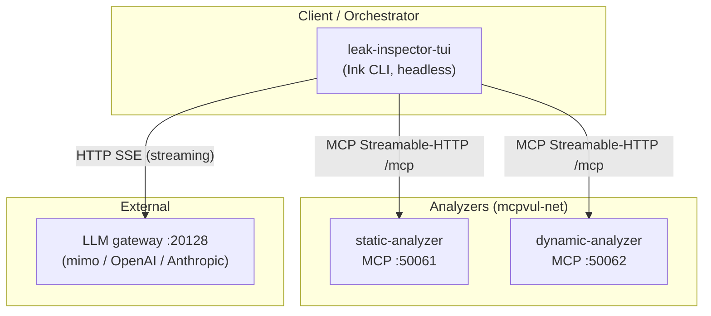
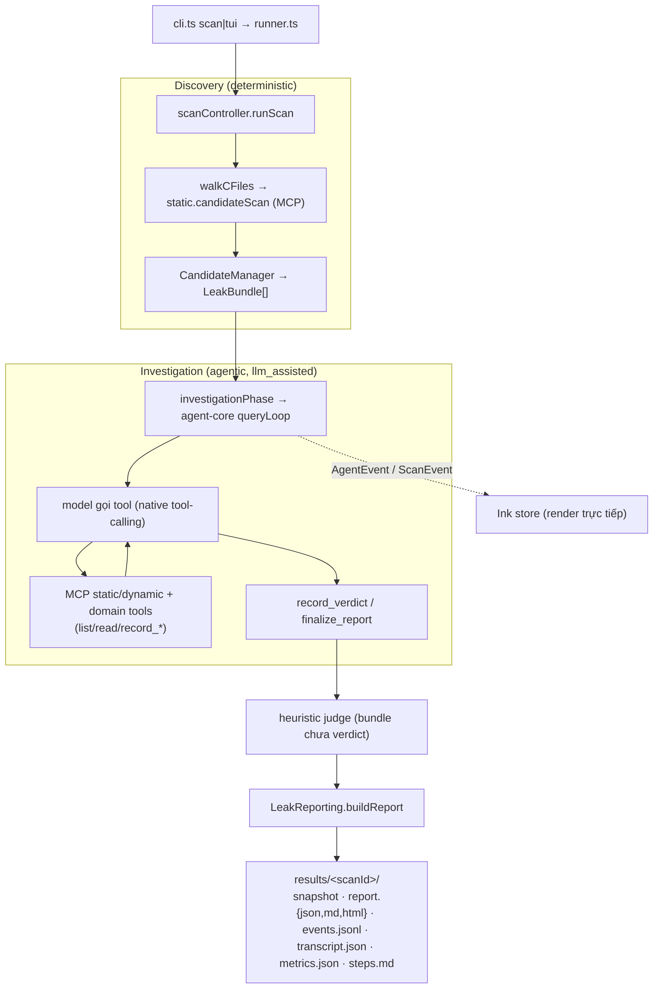
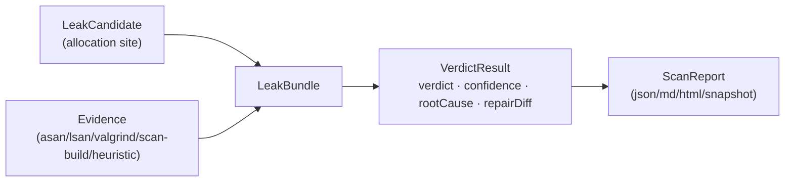

# Kiến trúc hệ thống

> Tài liệu mô tả **các thành phần**, **giao thức** giữa chúng, và **mô hình điều phối
> LLM** của TUI. Tập trung vào *cấu trúc tĩnh + giao thức*; phần *luồng runtime theo thời gian* xem
> [sequence-diagrams.md](./sequence-diagrams.md). Mục tiêu/đánh giá xem [GOAL.md](./GOAL.md);
> danh mục prompt xem [PROMPTS.md](./PROMPTS.md).

## 1. Tổng quan — đường điều phối TUI

Đây là workspace luận văn về **điều tra rò rỉ bộ nhớ C/C++ do LLM điều phối**. Hệ thống có
**một đường (path) điều phối duy nhất**: `leak-inspector-tui` — scanner standalone đóng vai
**orchestrator**, dùng paradigm **native tool-calling** (qua `packages/agent-core`), gọi
analyzer trực tiếp qua MCP.

| | **leak-inspector-tui** (CLI/TUI) |
|---|---|
| Vào | `bun src/cli.ts scan\|tui` |
| Điều phối | `agent-core` `queryLoop` — **native tool-calling** |
| Model làm gì | gọi tool trực tiếp (`tool_use`/`tool_result`) |
| Verdict | tool `record_verdict` (LLM) + heuristic finalize |
| Gọi analyzer | MCP Streamable-HTTP trực tiếp |
| State/Queue | file `results/<scanId>/` |
| Streaming UI | Ink TUI (in-process) |

Pipeline **HYBRID**: `discovery (deterministic) → investigation (agentic) →
judging → reporting`.

> Một bản triển khai web (control-plane NestJS + React SPA, điều phối JSON-action) từng tồn
> tại nhưng đã được gỡ khỏi `master`; nó được bảo tồn trên nhánh git `web-implementation`.

## 2. Bảng thành phần

| Thành phần | Công nghệ | Port | Giao thức | Trách nhiệm |
|---|---|---|---|---|
| **leak-inspector-tui** | TS + Ink (Bun) | — (headless) | MCP client + file I/O | Scanner standalone (luận văn) — **orchestrator**, client MCP trực tiếp tới analyzer |
| **static-analyzer** | NestJS + Tree-sitter | 50061 (MCP HTTP) | MCP Streamable-HTTP | 11 tool: index, candidate scan, AST, call graph, function summary, path constraints, ownership, Clang scan-build |
| **dynamic-analyzer** | NestJS + valgrind/asan/lsan | 50062 (MCP HTTP) | MCP Streamable-HTTP | 9 tool: build target + Valgrind/ASan/LSan + run binary |
| **packages/agent-core** | TS library | — | (nhúng) | Vòng lặp agentic, tool abstraction, MCP client, provider LLM (streaming) |
| **@mcpvul/common** | TS library | — | (chia sẻ) | Type/Zod, heuristic judge + consensus judge + leak analysis, report renderer |
| *(ngoài)* **LLM gateway** | OpenAI-compatible | 20128 | HTTP SSE | `mimo/mimo-v2.5-pro` cục bộ (hoặc OpenAI/Anthropic) |

Hai analyzer nối qua Docker bridge network `mcpvul-net` (`docker-compose.yml`).

> Code gRPC server (proto :50051/:50052) vẫn còn trong cả hai analyzer nhưng **không còn
> consumer** sau khi gỡ web path; `docker-compose.yml` mặc định analyzer chạy
> `TRANSPORT_MODE=mcp`.

## 3. Sơ đồ triển khai / topology



## 4. Giao thức inter-service

### 4.1 MCP Streamable-HTTP — TUI ↔ analyzer

- Server analyzer phục vụ `POST /mcp` (JSON-RPC 2.0, stateless JSON mode).
- Client dùng `@modelcontextprotocol/sdk` `StreamableHTTPClientTransport(new URL(url))`,
  gọi `.callTool(name, args)`. Mỗi lời gọi là một HTTP POST.

Ví dụ request:
```json
{ "jsonrpc": "2.0", "id": 1, "method": "tools/call",
  "params": { "name": "candidateScan", "arguments": { "filePath": "a.c", "content": "..." } } }
```

Tập tool được định nghĩa trong `proto/static-analyzer.proto` và `proto/dynamic-analyzer.proto`
(code gRPC server vẫn tồn tại nhưng không còn consumer — xem §2):

- **static** — 11 tool: `IndexFiles, CandidateScan, AstScan, CallGraph, FunctionSummary,
  InterproceduralFlow, PathConstraints, OwnershipSummary, OwnershipConventions, LeakguardRun,
  LeakguardGetReport`.
- **dynamic** — 9 tool: `BuildTarget, ValgrindMemcheck, ValgrindGetReport, ValgrindListFindings,
  ValgrindCompareRuns, AsanRun, LsanRun, RunBinary, ListRuns`.

### 4.2 LLM — HTTP SSE streaming

TUI stream phản hồi model (SSE). agent-core dùng **idle-timeout** (reset theo mỗi
chunk) thay vì deadline tổng, và **nén context** khi prompt lớn (xem `packages/agent-core`).

## 5. Pipeline điều phối (leak-inspector-tui)



> `no_llm` mode bỏ qua Investigation (chỉ discovery → heuristic judge → report).

## 6. Kết nối LLM

- **Provider dispatch:** `local` (gateway OpenAI-compatible, mặc định
  `mimo/mimo-v2.5-pro` @ `host.docker.internal:20128/v1`) · `openai` · `anthropic` ·
  **`openai-compat`** (endpoint OpenAI-tương-thích tuỳ chỉnh: base URL + model + key, route
  qua đường `/chat/completions`). Khoá tách biệt theo provider.
- **Điều phối TUI:** `agent-core/providers` (`openaiChat`/`anthropic`) — streaming SSE, idle-timeout,
  function-calling thật. Provider/endpoint chọn được qua `/config`, CLI (`--provider/--base-url/
  --model/--api-key`), hoặc env (`OPENAI_COMPAT_*`).
- **Khoá LLM** đọc từ `<root>/.env` hoặc `apps/leak-inspector-tui/.env`.

> **Tầng judge** có 3 cấu hình so-sánh-được: **heuristic** (thuần, tất định) · **single-LLM**
> (`--consensus-n 1`) · **consensus** (bỏ phiếu k mẫu + hợp nhất static/dynamic,
> `packages/common/.../consensus-judge.ts`). Tầng **dynamic** dùng **capture tất định**
> (`leak-inspector-tui/.../dynamicEvidence.ts`: `runDeterministicDynamic`,
> `withDynamicEvidenceCapture`) để loại bỏ dao động run-to-run của bằng chứng động. Xem
> [CONTRIBUTION.md](CONTRIBUTION.md) và [EVALUATION.md](EVALUATION.md) §7.

## 7. Dữ liệu & artifacts

> TUI không dùng database — toàn bộ state nằm trên đĩa ở `results/<scanId>/` (§7.2).
> Các TypeORM entity web (`users`, `scans`, `workspaces`, `repositories`,
> `github_connections`) còn trong `packages/common/src/entities` nhưng **không còn consumer**
> trên `master` (chỉ dùng bởi web impl trên nhánh `web-implementation`).

### 7.1 Chuẩn hoá `LeakBundle`
Findings từ mọi tool gom về `LeakBundle` (`packages/common/src/types`): `candidate` (vị trí
cấp phát) → `evidence[]` (valgrind/asan/lsan/leakguard/heuristic) → `verdict` (`VerdictResult`:
verdict + confidence + explanation + `rootCause` + `repairDiff`).



### 7.2 Artifacts TUI — `results/<scanId>/`
`snapshot.json` (so sánh được giữa các run) · `report.{json,md,html}` · `events.jsonl`
(stream tăng dần) · `transcript.json` (lịch sử message agent) · `steps.md` (log từng bước) ·
`metrics.json` (phân bố verdict, token, thời lượng).

## 8. Analyzer internals

- **static-analyzer** (NestJS + Tree-sitter): mỗi service → một tool MCP (file indexing,
  candidate scan, AST, call graph, function summary, interprocedural flow, path constraints,
  ownership, **Clang scan-build**). Phục vụ MCP :50061 cho TUI (code gRPC :50051 còn nhưng
  không có consumer).
- **dynamic-analyzer** (NestJS + child_process): build target (sanitizer flags), Valgrind
  Memcheck, ASan, LSan, run binary, so sánh run. Phục vụ MCP :50062 (code gRPC :50052 còn nhưng
  không có consumer). **Chỉ chạy trên Linux/Docker** (valgrind/LSan không chạy native trên macOS).

## 9. Hiện trạng vs. cũ (đính chính)

- ✅ **Hướng chính:** `packages/agent-core` (vòng lặp agentic, streaming + idle-timeout +
  nén context) và `apps/leak-inspector-tui` (path HYBRID standalone, **orchestrator duy nhất**).
- ✅ **leakguard slot = Clang Static Analyzer (scan-build)** self-contained, chạy trong image
  static-analyzer. **LeakGuard bên thứ ba đã bị gỡ** — không thêm lại.
- ℹ️ **Web path đã gỡ khỏi `master`** (control-plane NestJS + React SPA + Postgres/Redis +
  GitHub OAuth/SSE), bảo tồn trên nhánh git `web-implementation`.
