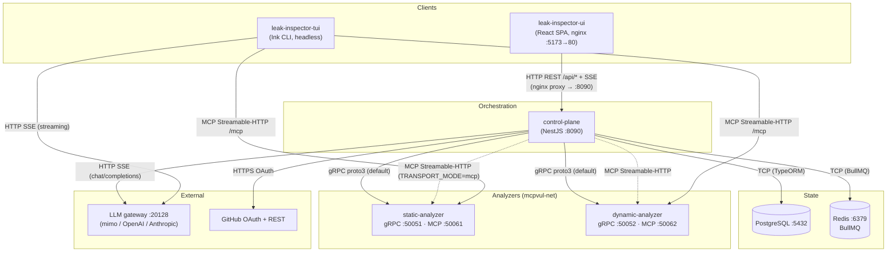
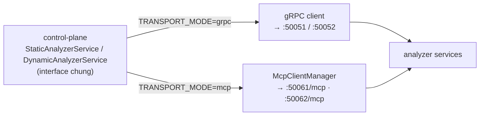
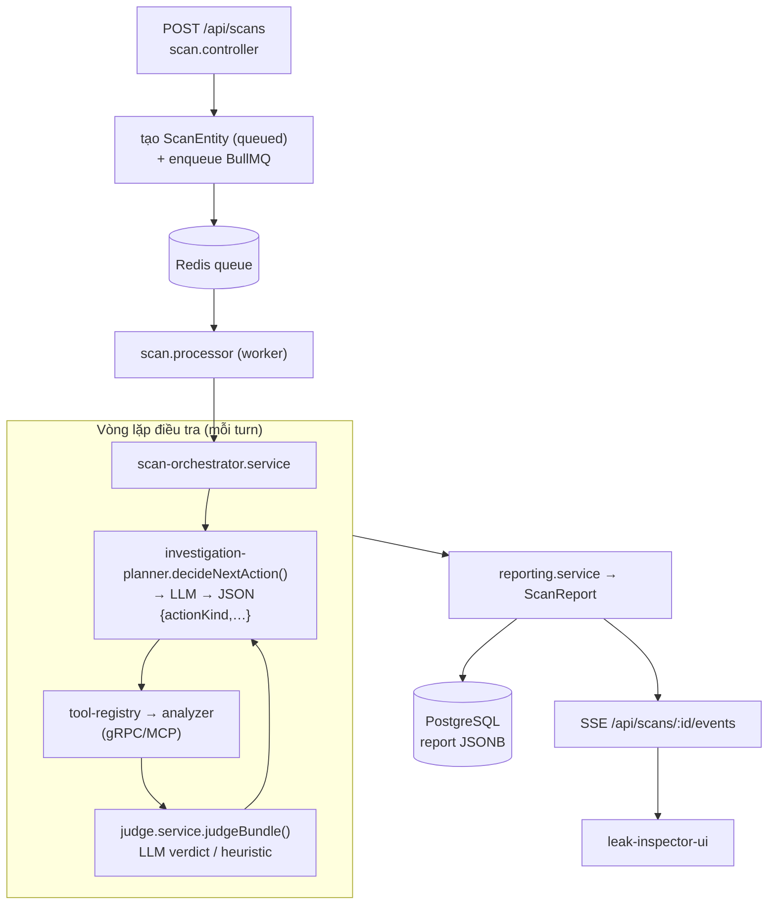
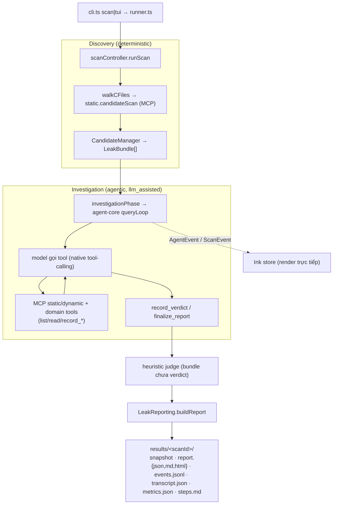
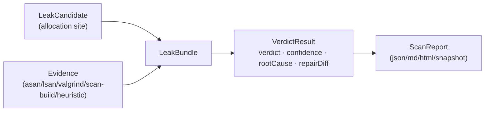

# Kiến trúc hệ thống

> Tài liệu mô tả **các thành phần**, **giao thức** giữa chúng, và **hai mô hình điều phối
> LLM**. Tập trung vào *cấu trúc tĩnh + giao thức*; phần *luồng runtime theo thời gian* xem
> [sequence-diagrams.md](./sequence-diagrams.md). Mục tiêu/đánh giá xem [GOAL.md](./GOAL.md);
> danh mục prompt xem [PROMPTS.md](./PROMPTS.md).

## 1. Tổng quan — hai đường điều phối

Đây là workspace luận văn về **điều tra rò rỉ bộ nhớ C/C++ do LLM điều phối**. Có **hai
đường (path) độc lập**, cùng chia sẻ bộ analyzer và schema, nhưng dùng **hai paradigm điều
phối LLM khác nhau**:

| | **leak-inspector-tui** (CLI/TUI) | **control-plane** (web) |
|---|---|---|
| Vào | `bun src/cli.ts scan\|tui` | `POST /api/scans` (frontend) |
| Điều phối | `agent-core` `queryLoop` — **native tool-calling** | `scan-orchestrator` — **JSON-action** orchestrator |
| Model làm gì | gọi tool trực tiếp (`tool_use`/`tool_result`) | trả JSON `{actionKind, toolName, …}` |
| Verdict | tool `record_verdict` (LLM) + heuristic finalize | `judge.service` (LLM hoặc heuristic) |
| Gọi analyzer | MCP Streamable-HTTP trực tiếp | gRPC **hoặc** MCP (`TRANSPORT_MODE`) |
| State/Queue | file `results/<scanId>/` | PostgreSQL + BullMQ(Redis) |
| Streaming UI | Ink TUI (in-process) | SSE → React SPA |

Cả hai chạy chung pipeline **HYBRID**: `discovery (deterministic) → investigation (agentic) →
judging → reporting`.

## 2. Bảng thành phần

| Thành phần | Công nghệ | Port | Giao thức | Trách nhiệm |
|---|---|---|---|---|
| **postgres** | postgres:16-alpine | 5432 | TCP | Lưu `users, scans, workspaces, repositories, github_connections` (TypeORM) |
| **redis** | redis:7-alpine | 6379 | TCP | Hàng đợi job scan (BullMQ), AOF persistence |
| **control-plane** | NestJS | 8090 | HTTP REST + SSE; client gRPC/MCP | API gateway, orchestrator web, BullMQ worker, JWT + GitHub OAuth, LLM judge |
| **static-analyzer** | NestJS + Tree-sitter | 50051 (gRPC), 50061 (MCP HTTP) | gRPC proto3 / MCP Streamable-HTTP | 11 tool: index, candidate scan, AST, call graph, function summary, path constraints, ownership, Clang scan-build |
| **dynamic-analyzer** | NestJS + valgrind/asan/lsan | 50052 (gRPC), 50062 (MCP HTTP) | gRPC proto3 / MCP Streamable-HTTP | 9 tool: build target + Valgrind/ASan/LSan + run binary |
| **leak-inspector-ui** | React 19 + Vite + nginx | 5173→80 | HTTP + SSE | SPA quản lý workspace/scan, xem report, stream tiến trình |
| **leak-inspector-tui** | TS + Ink (Bun) | — (headless) | MCP client + file I/O | Scanner standalone (luận văn), client MCP trực tiếp tới analyzer |
| **packages/agent-core** | TS library | — | (nhúng) | Vòng lặp agentic, tool abstraction, MCP client, provider LLM (streaming) |
| **@mcpvul/common** | TS library | — | (chia sẻ) | Entity, type/Zod, heuristic judge + leak analysis, report renderer |
| *(ngoài)* **LLM gateway** | OpenAI-compatible | 20128 | HTTP SSE | `mimo/mimo-v2.5-pro` cục bộ (hoặc OpenAI/Anthropic) |
| *(ngoài)* **GitHub** | OAuth + REST | 443 | HTTPS | Đăng nhập + clone repo (web path) |

Tất cả container nối qua Docker bridge network `mcpvul-net` (`docker-compose.yml`).

## 3. Sơ đồ triển khai / topology



Đường nét liền = mặc định; nét đứt = chế độ thay thế (`TRANSPORT_MODE`).

## 4. Giao thức inter-service

### 4.1 gRPC (proto3) — mặc định control-plane ↔ analyzer

Định nghĩa trong `proto/static-analyzer.proto` và `proto/dynamic-analyzer.proto`.

- `service StaticAnalyzer` — 11 RPC: `IndexFiles, CandidateScan, AstScan, CallGraph,
  FunctionSummary, InterproceduralFlow, PathConstraints, OwnershipSummary,
  OwnershipConventions, LeakguardRun, LeakguardGetReport`.
- `service DynamicAnalyzer` — 9 RPC: `BuildTarget, ValgrindMemcheck, ValgrindGetReport,
  ValgrindListFindings, ValgrindCompareRuns, AsanRun, LsanRun, RunBinary, ListRuns`.

Control-plane đăng ký gRPC client qua NestJS `ClientsModule` (`@grpc/grpc-js`).

### 4.2 MCP Streamable-HTTP — TUI ↔ analyzer (và control-plane khi bật)

- Server analyzer phục vụ `POST /mcp` (JSON-RPC 2.0, stateless JSON mode).
- Client dùng `@modelcontextprotocol/sdk` `StreamableHTTPClientTransport(new URL(url))`,
  gọi `.callTool(name, args)`. Mỗi lời gọi là một HTTP POST.

Ví dụ request:
```json
{ "jsonrpc": "2.0", "id": 1, "method": "tools/call",
  "params": { "name": "candidateScan", "arguments": { "filePath": "a.c", "content": "..." } } }
```

### 4.3 Chọn transport (`TRANSPORT_MODE`)

`docker-compose.yml` đặt `TRANSPORT_MODE=${TRANSPORT_MODE:-grpc}` cho control-plane và
`ANALYZER_TRANSPORT_MODE=${...:-both}` cho analyzer (analyzer mặc định phục vụ **cả** gRPC
*và* MCP). Giá trị: `grpc` (mặc định) · `mcp` · `both`.



### 4.4 SSE — control-plane → frontend

`GET /api/scans/:id/events` trả về luồng SSE (`ReplaySubject` trong bộ nhớ); frontend mở
`new EventSource(...)`, fallback poll `/api/scans/:id/events/history` nếu stream đứt. nginx
proxy `/api/` → `control-plane:8090` (giữ kết nối SSE).

### 4.5 LLM — HTTP SSE streaming

Cả hai path stream phản hồi model (SSE). agent-core dùng **idle-timeout** (reset theo mỗi
chunk) thay vì deadline tổng, và **nén context** khi prompt lớn (xem `packages/agent-core`).

## 5. Hai pipeline điều phối

### 5.1 Web path (control-plane)



Discovery (index + candidate scan) chạy trước vòng lặp; `build-discovery` +
`llm-analyzer.service` lo build command cho dynamic; `judging` cuối cùng dùng heuristic cho
bundle chưa có verdict.

### 5.2 CLI/TUI path (leak-inspector-tui)



> `no_llm` mode bỏ qua Investigation (chỉ discovery → heuristic judge → report). agent-core
> chỉ được TUI path dùng — **control-plane không import agent-core**.

## 6. Kết nối LLM

- **Provider dispatch:** `local` (gateway OpenAI-compatible, mặc định
  `mimo/mimo-v2.5-pro` @ `host.docker.internal:20128/v1`) · `openai` · `anthropic` ·
  **`openai-compat`** (endpoint OpenAI-tương-thích tuỳ chỉnh: base URL + model + key, route
  qua đường `/chat/completions`). Khoá tách biệt theo provider.
- **Web path:** `judge.service` + `investigation-planner` + `llm-analyzer` gọi
  chat-completions (JSON mode cho local). `JUDGE_LLM_PROVIDER` chọn backend.
- **TUI path:** `agent-core/providers` (`openaiChat`/`anthropic`) — streaming SSE, idle-timeout,
  function-calling thật. Provider/endpoint chọn được qua `/config`, CLI (`--provider/--base-url/
  --model/--api-key`), hoặc env (`OPENAI_COMPAT_*`).

> **Tầng judge** có 3 cấu hình so-sánh-được: **heuristic** (thuần, tất định) · **single-LLM**
> (`--consensus-n 1`) · **consensus** (bỏ phiếu k mẫu + hợp nhất static/dynamic,
> `packages/common/.../consensus-judge.ts`). Tầng **dynamic** dùng **capture tất định**
> (`leak-inspector-tui/.../dynamicEvidence.ts`: `runDeterministicDynamic`,
> `withDynamicEvidenceCapture`) để loại bỏ dao động run-to-run của bằng chứng động. Xem
> [CONTRIBUTION.md](CONTRIBUTION.md) và [EVALUATION.md](EVALUATION.md) §7.

## 7. Dữ liệu & artifacts

### 7.1 PostgreSQL (web)
Entity (`packages/common/src/entities`): `users`, `scans` (report/summary là JSONB),
`workspaces`, `repositories`, `github_connections`.

### 7.2 Chuẩn hoá `LeakBundle`
Findings từ mọi tool gom về `LeakBundle` (`packages/common/src/types`): `candidate` (vị trí
cấp phát) → `evidence[]` (valgrind/asan/lsan/leakguard/heuristic) → `verdict` (`VerdictResult`:
verdict + confidence + explanation + `rootCause` + `repairDiff`).



### 7.3 Artifacts TUI — `results/<scanId>/`
`snapshot.json` (so sánh được giữa các run) · `report.{json,md,html}` · `events.jsonl`
(stream tăng dần) · `transcript.json` (lịch sử message agent) · `steps.md` (log từng bước) ·
`metrics.json` (phân bố verdict, token, thời lượng).

## 8. Frontend ↔ backend

- React 19 SPA (Vite dev :5173; nginx prod proxy `/api/` → `control-plane:8090`).
- REST: `/api/scans` (CRUD, cancel, report), `/api/workspaces`, `/api/github/*`, `/api/auth/*`.
- Real-time: SSE `/api/scans/:id/events` (+ fallback history poll).
- Auth: JWT (localStorage, `Authorization: Bearer`); GitHub OAuth để clone repo.
- Trang: Setup (`/`), Activity (`/scan/:id`), Report (`/scan/:id/report`), Investigations
  (`/investigations`), Logs (`/logs`).

## 9. Analyzer internals

- **static-analyzer** (NestJS + Tree-sitter): mỗi service → một tool MCP/gRPC (file indexing,
  candidate scan, AST, call graph, function summary, interprocedural flow, path constraints,
  ownership, **Clang scan-build**). Phục vụ `both` (gRPC :50051 + MCP :50061).
- **dynamic-analyzer** (NestJS + child_process): build target (sanitizer flags), Valgrind
  Memcheck, ASan, LSan, run binary, so sánh run. Phục vụ gRPC :50052 + MCP :50062. **Chỉ chạy
  trên Linux/Docker** (valgrind/LSan không chạy native trên macOS).

## 10. Hiện trạng vs. cũ (đính chính)

- ✅ **Mới:** `packages/agent-core` (vòng lặp agentic dùng chung, streaming + idle-timeout +
  nén context) và `apps/leak-inspector-tui` (path HYBRID standalone) — đây là hướng chính của
  luận văn.
- ✅ **leakguard slot = Clang Static Analyzer (scan-build)** self-contained, chạy trong image
  static-analyzer. **LeakGuard bên thứ ba đã bị gỡ** — không thêm lại.
- ℹ️ Hai paradigm điều phối (JSON-action ở control-plane vs native tool-calling ở TUI) cùng
  tồn tại; tài liệu luận văn nên nêu rõ sự khác biệt khi so sánh `llm_assisted` vs `no_llm`.
