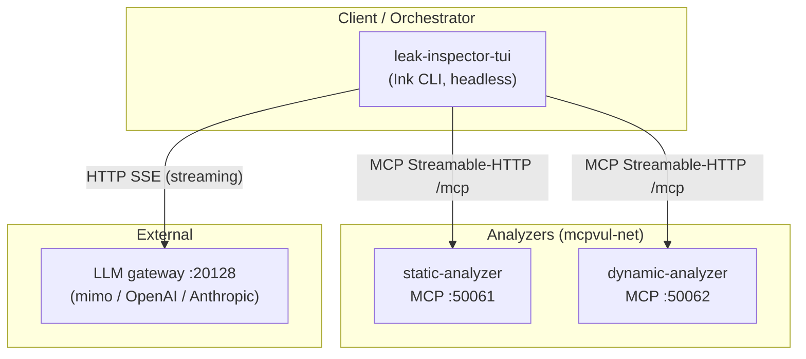
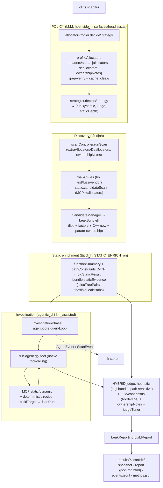
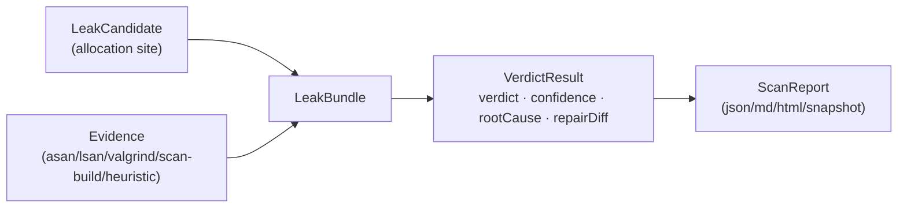

# Kiến trúc hệ thống

> Tài liệu mô tả **các thành phần**, **giao thức** giữa chúng, và **mô hình điều phối
> LLM** của TUI. Tập trung vào *cấu trúc tĩnh + giao thức*; phần *luồng runtime theo thời gian* xem
> [sequence-diagrams.md](./sequence-diagrams.md). Mục tiêu/đánh giá xem [GOAL.md](./GOAL.md);
> danh mục prompt xem [PROMPTS.md](./PROMPTS.md).

## 1. Tổng quan — đường điều phối TUI

Đây là workspace luận văn về **điều tra rò rỉ bộ nhớ C/C++ do LLM điều phối**. Hệ thống có
**một đường (path) điều phối duy nhất**: `leak-inspector-tui` — scanner standalone đóng vai
**orchestrator**, dùng paradigm **native tool-calling** (qua `packages/agent-core`), gọi
analyzer trực tiếp qua MCP.

| | **leak-inspector-tui** (CLI/TUI) |
|---|---|
| Vào | `bun src/cli.ts scan\|tui` |
| Điều phối | `agent-core` `queryLoop` — **native tool-calling** |
| Model làm gì | gọi tool trực tiếp (`tool_use`/`tool_result`) |
| Verdict | tool `record_verdict` (LLM) + heuristic finalize |
| Gọi analyzer | MCP Streamable-HTTP trực tiếp |
| State/Queue | file `results/<scanId>/` |
| Streaming UI | Ink TUI (in-process) |

Pipeline **HYBRID** (đầy đủ, theo thứ tự):
`profiling (LLM, tuỳ chọn) → strategy (LLM, tuỳ chọn) → discovery (tất định) →
static-enrichment (tất định, tuỳ chọn) → investigation (agentic, llm_assisted) →
judging (hybrid) → reporting`.

**Nguyên tắc cốt lõi — LLM sở hữu POLICY, engine sở hữu MECHANISM** (xem §10): những gì
*khác nhau theo từng project* (API cấp phát/giải phóng, quy ước sở hữu, chiến lược phân tích,
hiệu chỉnh judge) do **LLM khám phá → xuất profile có cấu trúc → verify (grep) → cache →
ĐÔNG CỨNG cho benchmark → nạp vào tham số của engine tất định**. Engine (parse/CFG/pairing/
scoring) *thực thi*, không bao giờ phụ thuộc LLM trong đường eval ⇒ Tier-1 determinism + baseline
Juliet giữ nguyên. Thêm project mới = **0 dòng code**.

> Một bản triển khai web (control-plane NestJS + React SPA, điều phối JSON-action) từng tồn
> tại nhưng đã được gỡ khỏi `master`; nó được bảo tồn trên nhánh git `web-implementation`.

## 2. Bảng thành phần

| Thành phần | Công nghệ | Port | Giao thức | Trách nhiệm |
|---|---|---|---|---|
| **leak-inspector-tui** | TS + Ink (Bun) | — (headless) | MCP client + file I/O | Scanner standalone (luận văn) — **orchestrator**, client MCP trực tiếp tới analyzer |
| **static-analyzer** | NestJS + Tree-sitter | 50061 (MCP HTTP) | MCP Streamable-HTTP | 11 tool: index, candidate scan, AST, call graph, function summary, path constraints, ownership, Clang scan-build |
| **dynamic-analyzer** | NestJS + valgrind/asan/lsan | 50062 (MCP HTTP) | MCP Streamable-HTTP | 9 tool: build target + Valgrind/ASan/LSan + run binary |
| **packages/agent-core** | TS library | — | (nhúng) | Vòng lặp agentic, tool abstraction, MCP client, provider LLM (streaming) |
| **@cleak/common** | TS library | — | (chia sẻ) | Type/Zod, heuristic judge + consensus judge + leak analysis, report renderer |
| *(ngoài)* **LLM gateway** | OpenAI-compatible | 20128 | HTTP SSE | `mimo/mimo-v2.5-pro` cục bộ (hoặc OpenAI/Anthropic) |

Hai analyzer nối qua Docker bridge network `mcpvul-net` (`docker-compose.yml`).

> **MCP/HTTP là transport DUY NHẤT.** Một gRPC server (proto :50051/:50052) từng tồn tại để
> phục vụ web control-plane (đã gỡ). Vì không còn consumer (TUI chỉ gọi MCP), toàn bộ code
> gRPC — controller, bootstrap `createMicroservice`, thư mục `proto/`, và các dep
> `@grpc/*` + `@nestjs/microservices` — đã được **xoá** khỏi `master`. Analyzer giờ chỉ
> dựng một DI context và phục vụ MCP/HTTP.

## 3. Sơ đồ triển khai / topology



## 4. Giao thức inter-service

### 4.1 MCP Streamable-HTTP — TUI ↔ analyzer

- Server analyzer phục vụ `POST /mcp` (JSON-RPC 2.0, stateless JSON mode).
- Client dùng `@modelcontextprotocol/sdk` `StreamableHTTPClientTransport(new URL(url))`,
  gọi `.callTool(name, args)`. Mỗi lời gọi là một HTTP POST.

Ví dụ request:
```json
{ "jsonrpc": "2.0", "id": 1, "method": "tools/call",
  "params": { "name": "candidateScan", "arguments": { "filePath": "a.c", "content": "..." } } }
```

Tập tool được khai báo bằng **Zod `inputSchema`** ngay trong các MCP server
`apps/static-analyzer/src/mcp/static-mcp-server.ts` và
`apps/dynamic-analyzer/src/mcp/dynamic-mcp-server.ts` (không còn `.proto`):

- **static** — 11 tool: `IndexFiles, CandidateScan, AstScan, CallGraph, FunctionSummary,
  InterproceduralFlow, PathConstraints, OwnershipSummary, OwnershipConventions, ScanBuildRun,
  ScanBuildGetReport`. Bốn tool (`CandidateScan, FunctionSummary, PathConstraints, CallGraph`)
  nhận thêm `extraAllocators?`/`extraDeallocators?` (tên cấp phát/giải phóng theo project, ≈ LAMeD
  AllocSource/FreeSink) để engine theo dõi factory allocator, không chỉ libc.
- **dynamic** — 9 tool: `BuildTarget, ValgrindMemcheck, ValgrindGetReport, ValgrindListFindings,
  ValgrindCompareRuns, AsanRun, LsanRun, RunBinary, ListRuns`.

### 4.2 LLM — HTTP SSE streaming

TUI stream phản hồi model (SSE). agent-core dùng **idle-timeout** (reset theo mỗi
chunk) thay vì deadline tổng, và **nén context** khi prompt lớn (xem `packages/agent-core`).

## 5. Pipeline điều phối (leak-inspector-tui)



**Giải thích từng tầng:**
- **Profiling/Strategy (LLM, host-side, tuỳ chọn):** `surfaces/headless.ts` resolve trước khi scan.
  `allocatorProfiler` đọc header/source → liệt kê API cấp phát/giải phóng + ownership notes,
  grep-verify, cache `<repo>/.cleak/`. `strategist` (`--strategy auto`) chọn `{runDynamic, judge,
  staticDepth}`. **Bỏ qua khi allocators được cấp tường minh** (benchmark dùng manifest đông cứng) ⇒
  eval không có LLM ⇒ tất định. Kết quả nạp vào plumbing `extraAllocators`/`extraDeallocators`/
  `ownershipNotes` — analyzer KHÔNG đổi.
- **Discovery (tất định):** `walkCFiles` loại dir test/fuzz/vendor; `candidateScan` tìm site cấp phát
  (libc + factory theo allocators + C++ `new` + candidate tổng hợp cho **leak tham số**). Attribution
  hàm bằng range tree-sitter (định tuyến C/C++ theo đuôi file).
- **Static enrichment (tất định, `STATIC_ENRICH=on`):** mỗi candidate gọi `functionSummary` +
  `pathConstraints` (kèm allocators) → `foldStaticResult` điền `bundle.staticEvidence`. Làm heuristic
  judge **path-aware ngay cả ở no_llm** (trước đây judge mù).
- **Investigation (agentic, chỉ llm_assisted):** sub-agent tĩnh gom evidence qua MCP; dynamic worker
  build + chạy LSan theo recipe tất định; LLM có ownership notes của project.
- **Judging (hybrid):** heuristic cho mọi bundle (path-sensitive, §6) + LLM/consensus cho BORDERLINE.

> `no_llm` mode bỏ qua Profiling/Strategy/Investigation (discovery → [enrichment] → heuristic judge →
> report). Eval determinism gate chạy đúng đường này.

## 6. Kết nối LLM

- **Provider dispatch:** `local` (gateway OpenAI-compatible, mặc định
  `mimo/mimo-v2.5-pro` @ `host.docker.internal:20128/v1`) · `openai` · `anthropic` ·
  **`openai-compat`** (endpoint OpenAI-tương-thích tuỳ chỉnh: base URL + model + key, route
  qua đường `/chat/completions`). Khoá tách biệt theo provider.
- **Điều phối TUI:** `agent-core/providers` (`openaiChat`/`anthropic`) — streaming SSE, idle-timeout,
  function-calling thật. Provider/endpoint chọn được qua `/config`, CLI (`--provider/--base-url/
  --model/--api-key`), hoặc env (`OPENAI_COMPAT_*`).
- **Khoá LLM** đọc từ `<root>/.env` hoặc `apps/leak-inspector-tui/.env`.

> **Tầng judge** có 3 cấu hình so-sánh-được: **heuristic** (thuần, tất định) · **single-LLM**
> (`--consensus-n 1`) · **consensus** (bỏ phiếu k mẫu + hợp nhất static/dynamic,
> `packages/common/.../consensus-judge.ts`). Tầng **dynamic** dùng **capture tất định**
> (`leak-inspector-tui/.../dynamicEvidence.ts`: `runDeterministicDynamic`,
> `withDynamicEvidenceCapture`) để loại bỏ dao động run-to-run của bằng chứng động. Xem
> [CONTRIBUTION.md](CONTRIBUTION.md) và [EVALUATION.md](EVALUATION.md) §7.

### 6.1 Heuristic judge PATH-SENSITIVE (`packages/common/.../heuristic-judge.ts`)
Judge tất định chấm `bundle.staticEvidence` + evidence động thành điểm rồi so ngưỡng. Các tín hiệu chính:
- **Alloc→free pairing** (`AllocFreePair.status`): `unpaired` (không free đâu cả) / `conditional`
  (free một số đường) / `paired`. Trạng thái suy từ **guard-subset reconciliation** (path-sensitive).
- **Path-sensitive leak** (`pathSensitiveLeak`): pair `conditional` + có `FeasibleLeakPath` reachable,
  HOẶC biến candidate nằm trong `unreconciledAllocations` của một exit reachable. Là tín hiệu MẠNH và
  **chặn** ownership-penalty (một đường làm MẤT object ≠ đường chuyển sở hữu) — bắt được leak kiểu
  `merge_patch` (free `target` trên một số đường, rò trên đường lỗi).
- **Parameter-ownership leak** (`allocation_type='parameter_ownership'`): tham số con trỏ được free trên
  một số đường nhưng mất trên đường khác.
- **Ngưỡng verdict** đặt tên + đông cứng: `JUDGE_VERDICT_THRESHOLDS = {confirmed:0.7, likely:0.4}`.
  Production có thể nhận override **có biên** từ `domain/judgeTuner.ts` (LLM nudge trong khoảng, clamp);
  **eval LUÔN dùng ngưỡng đông cứng** ⇒ baseline không đổi.
- **LLM judge** (`domain/llmJudge.ts`) cho BORDERLINE: prompt được nạp thêm **ownership conventions**
  (LLM-discovered) + luật path-sensitive/parameter-ownership (xem [PROMPTS.md](PROMPTS.md)).

## 7. Dữ liệu & artifacts

> TUI không dùng database — toàn bộ state nằm trên đĩa ở `results/<scanId>/` (§7.2).
> Các TypeORM entity web (`users`, `scans`, `workspaces`, `repositories`,
> `github_connections`) còn trong `packages/common/src/entities` nhưng **không còn consumer**
> trên `master` (chỉ dùng bởi web impl trên nhánh `web-implementation`).

### 7.1 Chuẩn hoá `LeakBundle`
Findings từ mọi tool gom về `LeakBundle` (`packages/common/src/types`): `candidate` (vị trí
cấp phát) → `evidence[]` (valgrind/asan/lsan/scan_build/heuristic) → `verdict` (`VerdictResult`:
verdict + confidence + explanation + `rootCause` + `repairDiff`).



### 7.2 Artifacts TUI — `results/<scanId>/`
`snapshot.json` (so sánh được giữa các run) · `report.{json,md,html}` · `events.jsonl`
(stream tăng dần) · `transcript.json` (lịch sử message agent) · `steps.md` (log từng bước) ·
`metrics.json` (phân bố verdict, token, thời lượng).

## 8. Analyzer internals

- **static-analyzer** (NestJS + Tree-sitter): mỗi service → một tool MCP (file indexing,
  candidate scan, AST, call graph, function summary, interprocedural flow, path constraints,
  ownership, **Clang scan-build**). Phục vụ MCP :50061 cho TUI. **Engine c-parser** (`c-parser.service.ts`):
  - **C/C++**: định tuyến theo đuôi file → `tree-sitter-c` (`.c/.h`) hoặc `tree-sitter-cpp`
    (`.cc/.cpp/.cxx/.hpp/…`). C++ `new`→alloc, `delete`→free.
  - **Allocator set per-parse**: libc + tên project (LLM-discovered) truyền qua `extraAllocators/
    Deallocators` — dùng XUYÊN SUỐT (candidate-scan, pairing, CFG, call-graph), không list cố định.
  - **Path-sensitive**: `collectLineGuards` (guard if/switch + polarity) → guard-subset reconciliation
    (free trên nhánh-return-khác KHÔNG reconcile exit khác) → `AllocFreePair.status` + exit-path
    `unreconciledAllocations`.
  - **Path-feasibility (heuristic CFG)**: `feasibleLeakPath` sinh ra từ guard-subset reconciliation
    của c-parser (KHÔNG SMT). *(Prototype Z3 in-process đã bị GỠ: `z3-solver` là WASM với trần heap
    2 GiB cứng → emscripten `abort()` không catch được, treo analyzer; tái lặp cả amd64 lẫn arm64.)*
  - **Reachability bảo thủ** (`collectDeadLines`): bỏ exit path sau terminator vô điều kiện (return/goto/
    exit/abort/longjmp/noreturn) cùng block → bớt false-positive trên dead code.
  - **Leak tham số**: param con trỏ free-một-số-đường → candidate `parameter_ownership`.
- **dynamic-analyzer** (NestJS + child_process): build target (sanitizer flags), Valgrind
  Memcheck, ASan, LSan, run binary, so sánh run. Phục vụ MCP :50062. **Chỉ chạy trên
  Linux/Docker** (valgrind/LSan không chạy native trên macOS).

## 9. Hiện trạng vs. cũ (đính chính)

- ✅ **Hướng chính:** `packages/agent-core` (vòng lặp agentic, streaming + idle-timeout +
  nén context) và `apps/leak-inspector-tui` (path HYBRID standalone, **orchestrator duy nhất**).
- ✅ **scan-build slot = Clang Static Analyzer (scan-build)** self-contained, chạy trong image
  static-analyzer. **LeakGuard bên thứ ba đã bị gỡ** — không thêm lại.
- ✅ **gRPC + `proto/` đã gỡ hẳn.** MCP/HTTP là transport duy nhất; controller gRPC,
  bootstrap `createMicroservice`, thư mục `proto/`, và dep `@grpc/*` + `@nestjs/microservices`
  đều đã xoá (không còn consumer sau khi gỡ web path).
- ℹ️ **Web path đã gỡ khỏi `master`** (control-plane NestJS + React SPA + Postgres/Redis +
  GitHub OAuth/SSE), bảo tồn trên nhánh git `web-implementation`.

## 10. Tầng LLM-generalization (POLICY) + determinism

Để khái quát hoá cho project mới mà KHÔNG hardcode, các quyết-định-theo-project được tách thành các
**module LLM host-side** (đều theo cùng khuôn: *gather → one-shot callModel (temp 0) → parse Zod lenient
→ verify → cache*), nạp vào tham số của engine tất định:

| Module (`apps/leak-inspector-tui/src/domain/`) | LLM quyết (POLICY) | Verify | Nạp vào |
|---|---|---|---|
| `allocatorProfiler.ts` | API cấp phát/giải phóng + ownership notes của project | **grep** tên trong source đã đọc | `extraAllocators/Deallocators` (discovery+engine) + `ownershipNotes` (judge) |
| `strategist.ts` | `{runDynamic, judge, staticDepth}` per-project | (fallback rule-based tất định) | gate dynamic stage / fan-out |
| `judgeTuner.ts` | nudge ngưỡng verdict theo project | **clamp** vào khoảng cứng | `judgeHeuristically(...thresholds)` |

**Cầu nối:** LLM xuất **dữ liệu cấu trúc**, engine *thực thi*; output luôn **verify + cache theo repo+commit**
(`<repo>/.cleak/`). **Đảm bảo determinism:** trong benchmark, manifest cung cấp allocators + không bật
`--strategy`/tuner ⇒ **0 LLM non-deterministic trong đường eval** ⇒ Tier-1 gate (`assert-determinism.ts`) +
baseline Juliet (TP29 FP7 FN3) giữ nguyên. LLM-tuned chỉ ở production; luận văn báo cáo cả default lẫn tuned.

Ranh giới **MUST-STAY-CODE** (không LLM hoá): parse tree-sitter, CFG, alloc→free pairing, scoring
math, consensus, grep-verify. Lộ trình tổng quát hoá còn lại (run-recipe, test/vendor dir classify) xem
[CONTRIBUTION.md](CONTRIBUTION.md).
