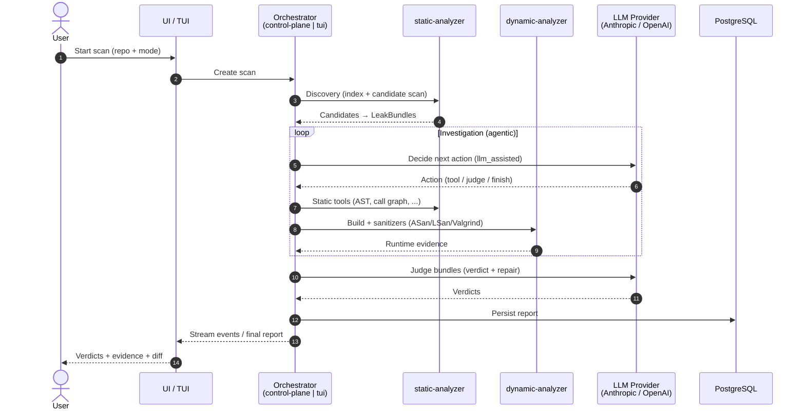
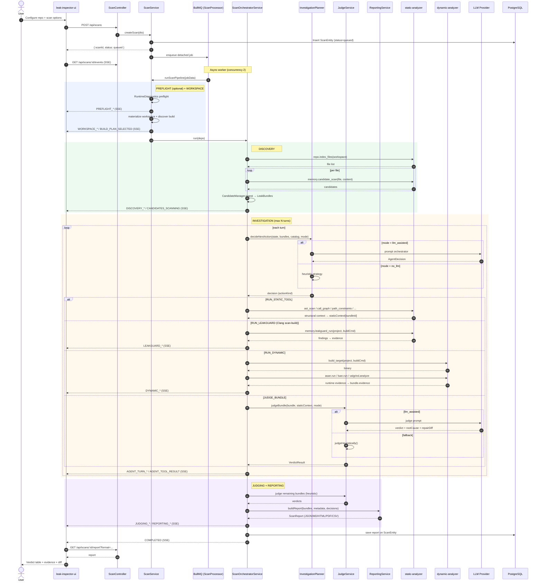

# System Sequence Diagrams

Memory-leak investigation system. The system exposes **two orchestration paths** that share the same data contract (`LeakCandidate` → `LeakBundle` → `VerdictResult` → `ScanReport`):

1. **Web path** — `control-plane` (NestJS, BullMQ worker, SSE to UI)
2. **TUI path** — `leak-inspector-tui` (Bun CLI, native agent loop via `@mcpvul/agent-core`)

Both invoke the same `static-analyzer` / `dynamic-analyzer` services (gRPC by default, MCP-over-HTTP optional) and produce the same report.

---

## 1. High-level overview



---

## 2. Web path — control-plane (deterministic + heuristic/LLM loop)



---

## 3. TUI path — leak-inspector-tui (native agent-core loop)

```mermaid
sequenceDiagram
    autonumber
    actor User
    participant CLI as cli.ts
    participant Scan as ScanController.runScan
    participant Phase as buildInvestigationPhase
    participant Loop as agent-core queryLoop
    participant LLM as callModel (LLM)
    participant Domain as Domain tools<br/>(list/read/record/finalize)
    participant Static as static-analyzer (MCP)
    participant Dynamic as dynamic-analyzer (MCP)
    participant Rep as LeakReporting

    User->>CLI: bun leak-tui scan --repo --mode llm_assisted
    CLI->>Scan: runScan(input, deps)

    rect rgb(236,250,240)
    Note right of Scan: DISCOVERY (deterministic)
    Scan->>Static: candidateScan (host injects file content)
    Static-->>Scan: candidates → CandidateManager
    end

    Scan->>Phase: build toolset + prompts
    Phase->>Phase: loadMcpTools(static) + withHostContent()
    Phase->>Phase: loadMcpTools(dynamic) + withHostPathMapping()
    Phase->>Phase: buildDomainTools(candidates, onVerdict)
    Phase-->>Scan: InvestigationPhase (tools, systemPrompt)

    rect rgb(255,248,236)
    Note right of Loop: INVESTIGATION (native tool-calling)
    Scan->>Loop: queryLoop(systemPrompt, messages, tools, maxTurns)
    loop until finalize_report or maxTurns
        Loop->>LLM: callModel(history, tools)
        LLM-->>Loop: assistant text + tool_use[]
        par concurrent-safe tools (parallel, cap 10)
            Loop->>Domain: list_candidates / read_file
            Domain-->>Loop: tool_result
            Loop->>Static: astScan / callGraph / ... (content injected)
            Static-->>Loop: tool_result
        and dynamic / sequential tools
            Loop->>Dynamic: build + asan/lsan/valgrind (path mapped)
            Dynamic-->>Loop: tool_result
            Loop->>Domain: record_verdict / record_evidence
            Domain-->>Loop: bundle updated
        end
        Loop-->>CLI: AgentEvent (turn_start, text, tool_use, tool_result)
        Note over CLI: TUI renders live
    end
    Loop-->>Scan: { reason, turns, decisions, transcript, usage }
    end

    rect rgb(245,238,255)
    Note right of Scan: JUDGING + REPORTING
    Scan->>Scan: judgeHeuristically() for un-verdicted bundles
    Scan->>Rep: buildReport(bundles)
    Rep-->>Scan: ScanReport
    end
    Scan-->>User: report (headless) / TUI summary
```

---

## Notes

- **Optional phases** (skipped unless the agent chooses them): `PREFLIGHT`, `LEAKGUARD` (Clang `scan-build`), `DYNAMIC`.
- **Transport**: `TRANSPORT_MODE` env selects `grpc` (default) | `mcp` | `both`. control-plane uses gRPC clients (or MCP adapter); TUI uses agent-core `McpClient` over HTTP.
- **Analysis modes**: `no_llm` (deterministic heuristic) vs `llm_assisted` (LLM plans actions & judges) — same report contract for comparability.
- **Verdict enrichment**: `enrichLeakVerdict()` adds `rootCause` + `repairDiff` to each `VerdictResult`.
