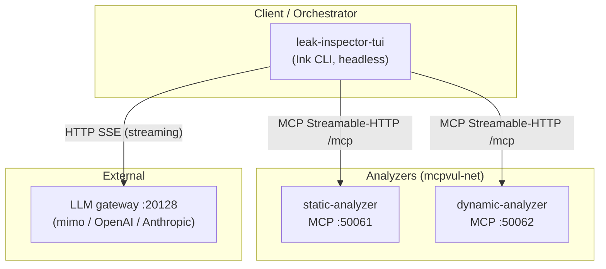
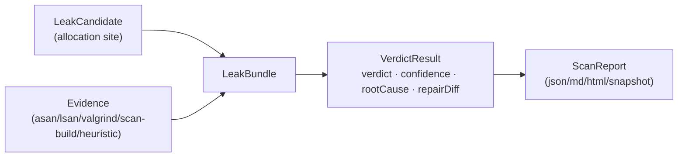

# Chương 2: Lập kế hoạch, phân tích và thiết kế hệ thống

Khi bắt đầu dự án, chúng tôi đối mặt một câu hỏi cơ bản: nếu đã có Clang Static Analyzer, Valgrind, và CodeQL — mỗi công cụ đều đã được kiểm chứng qua nhiều năm — thì tại sao cần xây dựng thêm một hệ thống mới? Câu trả lời nằm ở chỗ không công cụ đơn lẻ nào giải quyết được bài toán đầy đủ: phân tích tĩnh cho nhiều false positive, phân tích động cho coverage thấp, và cả hai đều thiếu khả năng suy luận ngữ nghĩa cấp cao mà LLM có thể cung cấp. Chương này trình bày cách chúng tôi thiết kế hệ thống để kết hợp thế mạnh của từng phương pháp, đồng thời giảm thiểu nhược điểm cố hữu của mỗi phương pháp.

---

## 2.1. Yêu cầu và ràng buộc

### 2.1.1. Yêu cầu chức năng

Hệ thống phải đáp ứng bốn yêu cầu cốt lõi: (1) phát hiện memory leak trong code C/C++ với recall cao mà FP thấp; (2) phân loại mức độ nghiêm trọng (confirmed, likely, uncertain, false positive); (3) cung cấp giải thích và gợi ý sửa chữa cho mỗi finding; (4) hoạt động trên cả corpus synthetic (Juliet) lẫn dự án thực (curl, cjson, libtiff) mà không cần thay đổi code.

### 2.1.2. Yêu cầu phi chức năng

**Tái lập được.** Cùng một input phải cho cùng một output — ít nhất ở chế độ deterministic. Điều này đặc biệt quan trọng cho luận văn: một kết quả không thể tái lập không có giá trị học thuật.

**Mở rộng được.** Thêm project mới phải là việc cấu hình, không phải viết code mới. Hệ thống phải tự khám phá API cấp phát/giải phóng của project thay vì hardcode.

**Chi phí hợp lý.** LLM tốn token. Hệ thống cần chiến lược để giữ chi phí thấp mà không hy sinh chất lượng — ví dụ chỉ dùng LLM cho bundle "borderline" thay vì mọi bundle.

### 2.1.3. Ràng buộc kỹ thuật

MCP (Model Context Protocol) [6] là giao thức giao tiếp giữa orchestrator và analyzer — lựa chọn này gắn liền với thiết kế tool-calling native. Docker là môi trường chạy analyzer (Valgrind chỉ hoạt động trên Linux). Multi-provider LLM là bắt buộc: hệ thống không nên phụ thuộc vào một nhà cung cấp model duy nhất.

---

## 2.2. Phân tích bài toán và lựa chọn kiến trúc

### 2.2.1. Tại sao hybrid — kết hợp static và dynamic

Phân tích tĩnh (Clang SA, CodeQL) bao phủ mọi đường đi lý thuyết nhưng không biết đường nào thực sự chạy được → FP cao. Phân tích động (Valgrind, LSan) chỉ phát hiện leak trên đường thực sự chạy → FN cao. Hassler và cộng sự [7] chỉ ra rằng tập bug mà fuzzers tìm được và tập bug mà static analyzer tìm được gần như không giao nhau.

Kết luận: cần cả hai. Nhưng "kết hợp" không có nghĩa là chạy cả hai rồi nối kết quả — cần một tầng hợp nhất thông minh, biết khi nào bằng chứng tĩnh đủ mạnh, khi nào cần xác nhận bằng bằng chứng động.

### 2.2.2. Tại sao LLM orchestration thay vì hardcode pipeline

Mỗi dự án C/C++ có cách quản lý bộ nhớ riêng: libcurl dùng `curl_easy_cleanup()`, cJSON dùng `cJSON_Delete()`, libTIFF dùng `TIFFClose()`. Một pipeline hardcode sẽ cần liệt kê tất cả các tên này cho mỗi project — không khả thi ở quy mô lớn.

LLM có thể đọc header/source và khám phá ra các API này, cùng với quy tắc ownership (ai sở hữu con trỏ sau khi hàm trả về?). Đây là tầng "POLICY" — quyết định theo-từng-project — trong khi tầng "MECHANISM" (parse AST, tính CFG, ghép cặp alloc→free, scoring) vẫn tất định.

### 2.2.3. Tại sao MCP thay vì gRPC/REST

MCP [6] cung cấp hai lợi thế: (1) tool description đi kèm schema, model thấy ngay tool nào khả dụng mà không cần document riêng; (2) giao thức chuẩn, analyzer có thể thay thế mà không ảnh hưởng orchestrator. Thực tế, dự án từng dùng gRPC nhưng đã loại bỏ sau khi chuyển sang TUI-only — MCP đủ cho mọi nhu cầu hiện tại.

---

## 2.3. Thiết kế tổng quan

### 2.3.1. Pipeline HYBRID

Hệ thống là một pipeline gồm bảy giai đoạn, chạy theo thứ tự nhưng một số giai đoạn có thể song song:

```
profiling (LLM, optional)
    ↓
strategy (LLM, optional)
    ↓
discovery (deterministic)
    ↓
static enrichment (deterministic, optional)
    ↓
investigation (agentic — Stage A + B song song → C → D)
    ↓
judging (hybrid)
    ↓
reporting
```

Hai giai đoạn đầu (profiling, strategy) là tầng POLICY host-side, chạy trước khi pipeline chính bắt đầu. Chúng khám phá allocator set và chọn chiến lược phân tích cho project. Trong benchmark, tầng này bị bỏ qua (manifest cung cấp allocator đông cứng) → eval không có LLM non-deterministic.

### 2.3.2. Nguyên tắc thiết kế: LLM sở hữu POLICY, engine sở hữu MECHANISM

Đây là nguyên tắc cốt lõi. Mọi quyết định thay đổi theo project (tên allocator, quy tắc ownership, chiến lược phân tích) do LLM khám phá. Mọi cơ chế phân tích (parse tree-sitter, tính CFG, ghép cặp alloc→free, scoring) do code tất định thực thi. Output của LLM luôn được verify (grep tên trong source) và cache theo repo+commit.

Ranh giới MUST-STAY-CODE: parse tree-sitter, CFG construction, alloc→free pairing, scoring math, consensus logic, grep-verify. Những thứ này không bao giờ được LLM hoá.

### 2.3.3. Sơ đồ thành phần



Hai analyzer nối qua Docker bridge network `mcpvul-net`. Orchestrator gọi analyzer qua MCP, gọi LLM qua HTTP SSE. Mỗi lời gọi tool là một HTTP POST độc lập (stateless JSON mode).

### 2.3.4. Luồng dữ liệu



Dữ liệu đi qua bốn cấu trúc chính:

- **LeakCandidate**: vị trí cấp phát được phát hiện (file, line, function, allocation_type).
- **LeakBundle**: candidate + evidence tĩnh + evidence động + verdict. Đây là đơn vị xử lý chính.
- **VerdictResult**: verdict (confirmed/likely/uncertain/likely_FP/FP) + confidence + explanation + rootCause + repairDiff.
- **ScanReport**: tổng hợp mọi VerdictResult, output dạng JSON/MD/HTML/snapshot.

---

## 2.4. Thiết kế tầng khám phá tĩnh (Discovery)

### 2.4.1. Candidate scan

Hệ thống scan mỗi file C/C++ tìm các vị trí cấp phát. Không chỉ tìm `malloc`/`calloc`/`realloc`/`new` (libc), mà còn tìm factory allocator theo tên project — ví dụ `cJSON_New_Item()` trong cJSON, `TIFFmalloc()` trong libTIFF. Danh sách này được cung cấp bởi tầng LLM allocator profiler hoặc manifest đông cứng (trong benchmark).

Ngoài ra, hệ thống phát hiện "parameter-ownership leak": tham số con trỏ được giải phóng trên một số đường nhưng không trên đường khác. Các hàm nhận con trỏ và quản lý nó (như `cJSON_merge_patch` nhận `target`) được tạo candidate synthetically.

### 2.4.2. Attribution hàm bằng Tree-sitter

Khi một dòng cấp phát được tìm thấy, cần xác định nó thuộc hàm nào. Tree-sitter [4] cung cấp range-based AST traversal: tìm node function definition chứa dòng đó. Routing C/C++ dựa trên đuôi file: `.c`/`.h` dùng `tree-sitter-c`, `.cc`/`.cpp`/`.cxx`/`.hpp` dùng `tree-sitter-cpp`.

---

## 2.5. Thiết kế tầng làm giàu bằng chứng tĩnh (Static Enrichment)

### 2.5.1. Function summary

Mỗi candidate được phân tích bởi `functionSummary`: đếm lệnh cấp phát và giải phóng trong hàm bao, liệt kê exit paths (return), và xác định biến nào được giải phóng trên đường nào. Kết quả là `AllocFreePair` với status `paired` (giải phóng trên mọi đường), `unpaired` (không giải phóng đâu cả), hoặc `conditional` (giải phóng trên một số đường).

### 2.5.2. Path constraints

`pathConstraints` phân tích guard conditions (if/switch) xung quanh candidate. Guard-subset reconciliation: nếu lệnh free nằm trên nhánh `return` khác, nó không reconcile exit hiện tại — tức free trên đường thành công không "giải oan" cho đường lỗi.

Đây là cơ chế path-sensitive mà không cần SMT solver. Kết quả: `feasibleLeakPaths` — danh sách đường đi khả thi mà leak có thể xảy ra, kèm `unreconciledAllocations` — biến cấp phát mà không có free nào trên đường đó.

### 2.5.3. Interprocedural flow

`interproceduralFlow` mở rộng phân tích qua biên hàm. Variable-level cross-frame matching: nếu hàm A cấp phát biến `x`, gọi hàm B, và `x` không được giải phóng ở bất kỳ exit nào reachable → leak cross-function. Kết quả fold thành `feasibleLeakPath`.

Trên Juliet (leak intra-function), tool này Δ=0. Trên LAMeD (dự án thực), nó bắt thêm 1 leak (cjson `merge_patch`), FP=0. Gain nhỏ nhưng sạch — cơ chế hoạt động end-to-end trên dự án thật.

### 2.5.4. Clang scan-build

`scanBuild` chạy Clang SA ở project level (không phải per-TU như clang --analyze). Kết quả là corroborative evidence: nếu scan-build cũng flag cùng biến, confidence tăng. Nhưng scan-build không thay đổi verdict trên Juliet (heuristic đã đủ mạnh).

---

## 2.6. Thiết kế tầng điều tra agentic (Investigation)

### 2.6.1. Stage A — Static fan-out sub-agents

Candidates được nhóm theo file affinity (4 candidate/nhóm), mỗi nhóm sinh một sub-agent. Sub-agent nhận 5 tool tĩnh (candidateScan, astScan, functionSummary, pathConstraints, ownershipConventions) + `read_file` + `done_static`. Tối đa 3 sub-agent chạy đồng thời.

Tool partitioning: sub-agent tĩnh CHỈ nhận tool tĩnh — model không thể nhảy sang tool động. Điều này đảm bảo mỗi agent tập trung vào nhiệm vụ cụ thể.

### 2.6.2. Stage B — Dynamic worker

Stage B chạy song song với Stage A. Có hai nhánh:

**Nhánh tất định (không LLM):** Khi case có `buildCommand`, hệ thống chạy công thức cố định `buildTarget(buildCommand) → lsanRun(binary)`. Không có LLM trong vòng chạy → coverage tất định → kết quả tái lập. Đây là đóng góp C3 của luận văn.

**Nhánh LLM:** Khi không có `buildCommand`, một dynamic worker (LLM sub-agent) tự đọc Makefile, chọn lệnh build, chạy sanitizer. Nếu build thất bại hai lần, worker dừng.

Bằng chứng dynamic được capture tự động qua `withDynamicEvidenceCapture`: mọi finding từ sanitizer được ghi vào store, không qua "discretion" của LLM. `reconcileDynamicEvidence` gộp finding vào bundle tương quan nhất.

### 2.6.3. Stage C — Synthesize

Stage C hợp nhất static context (từ Stage A) và dynamic evidence (từ Stage B) vào mỗi bundle. Coverage status: `exercised_clean` (chạy sạch), `exercised_leak` (phát hiện leak), `not_exercised` (không chạy được), `dynamic_off`. Đây là deterministic merge, không có LLM.

### 2.6.4. Stage D — Hybrid judge

Xem Section 2.7 bên dưới.

---

## 2.7. Thiết kế tầng phán xét hybrid (Judging)

### 2.7.1. Heuristic judge — path-sensitive, cho mọi bundle

Mọi bundle đều đi qua heuristic judge trước. Hàm scoring tính tổng điểm từ các tín hiệu:

| Tín hiệu | Điểm |
|---|---|
| Runtime leak tương quan (LINKED) | +0.4 – 0.5 |
| Structural "high" thiếu free | +0.5 |
| Alloc→free chưa cặp (unpaired) | +0.25 |
| Feasible leak path | +0.2 |
| Ownership không chuyển ra ngoài | +0.15 |
| Ownership chuyển ra ngoài | −0.1 / −0.25 |
| Early-return | +0.1 |

Threshold: `clamped ≥ 0.7` → `confirmed_leak`, `≥ 0.4` → `likely_leak`, còn lại → `uncertain`.

Hai cổng precision ghi đè: (1) freed-by-callee hoặc dynamic chạy sạch → `likely_false_positive (0.8)`; (2) verdict "flagged" thiếu tín hiệu mạnh (correlatedRuntimeLeak || structuralHigh || unpaired) → hạ xuống `uncertain`.

### 2.7.2. LLM judge — rubric-based, chỉ cho bundle borderline

Không phải mọi bundle đều cần LLM judge. Chỉ những bundle "borderline" mới được leo thang: verdict `likely_leak`/`uncertain`, hoặc confidence trong khoảng [0.35, 0.7].

Ngoài ra, `shouldEscalate` kiểm tra mâu thuẫn: static nói leak nhưng dynamic chạy sạch, hoặc ngược lại. Đây là lúc consensus cần nhất.

LLM judge nhận: source snippet (toàn bộ hàm bao, đã xoá comment), static context, dynamic evidence, và ownership conventions. Output: JSON với 5 nhãn (confirmed_leak/likely_leak/uncertain/likely_false_positive/false_positive), confidence, explanation.

Rubric ưu tiên evidence theo thứ tự: (1) runtime leak LINKED → confirmed ≥ 0.9; (2) ownership transferred → likely_false_positive; (3) freed on all paths → false_positive; (4) path-sensitive leak (conditional + feasible path) → confirmed.

### 2.7.3. Consensus judge — K-sample voting

Đây là đóng góp C1 của luận văn. Khi `CONSENSUS_N > 1` (ví dụ K=3), hệ thống lấy K mẫu verdict LLM độc lập với temperature lấy mẫu > 0 (mặc định 0.7) để tạo diversity.

`combineVerdicts` gộp K nhãn thành 1 cờ flag theo luật:
- **Majority**: `flagging * 2 > n`.
- **Weighted**: `flagWeight / total > 0.5`. Phiếu nghịch bằng chứng dynamic bị nhân ×0.3 (giảm trọng số).
- **Unanimous-to-flag**: `flagging === n`.

Nhãn cuối: verdict modal trong cụm đồng thuận. Hoà → chọn nhãn ít nghiêm trọng hơn.

**Precision-override veto:** exculpation mạnh của heuristic (FP/likely_FP, conf ≥ 0.75) phủ quyết cờ flag — nhưng chỉ *gỡ* flag, không *thêm*. Dynamic confirmed không bị veto.

### 2.7.4. Escalation logic

`shouldEscalate` leo thang lên consensus khi:
1. Bundle borderline (theo isBorderline).
2. Static nói leak nhưng verdict heuristic là FP/likely_FP.
3. Verdict là leak nhưng dynamic chạy sạch (exercised_clean).
4. Không có verdict leak nhưng dynamic có leak tương quan (exercised_leak + LINKED).

---

## 2.8. Thiết kế giao thức tái lập hai tầng

### 2.8.1. Vấn đề: LLM không tất định bit-for-bit

Ngay cả ở `temperature=0`, LLM có thể cho kết quả khác nhau giữa các lần chạy do provider-side batching, floating-point scheduling. Báo cáo một con số đơn lẻ sẽ overstate reproducibility.

### 2.8.2. Tier-1 — no_llm tất định

Toàn bộ đường phi-LLM (heuristic judge + recipe dynamic ghim + capture tất định + scoring) cho kết quả chấm điểm y hệt giữa hai lần chạy. Ép bằng gate `determinism-gate.sh` chạy hai lần → `assert-determinism.ts` so sánh scoring-relevant subset.

Gate từ chối hai kiểu "đậu giả": (a) self-compare — timestamp trùng làm hai lần chạy ghi cùng thư mục; (b) degenerate run — analyzer lỗi, mọi ca error.

### 2.8.3. Tier-2 — llm_assisted báo cáo phân phối

Vì không thể đạt bit-for-bit với LLM judge, số liệu được báo cáo dạng `mean ± std` qua nhiều lần chạy. `verdict-stability.ts` đo case-level stability, flip rate, modal agreement. Điều này phơi bày dao động mà aggregate "may mắn" có thể che giấu.

---

## 2.9. Thiết kế corpus pipeline

### 2.9.1. Chuẩn bị và ingest

**Juliet:** NIST v1.3 zip, hash `ada9d7e1…`. `ingest.ts` copy file verbatim (kể cả `.h` local), nhóm C++ multi-file variant (tránh phá build), derive flaw/clean label từ source (quy ước bad/good).

**LAMeD:** Zenodo 15089703, clone repo tại bug commit. cjson pin `12c4bf1986`, 6 project còn lại từ DiverseVul.

### 2.9.2. Validate — 5-gate

`validate-corpus.ts` chạy năm gate: (a) zod schema, (b) structural (case dir + local #include), (c) compile (`clang -fsyntax-only` per TU), (d) label (overlap detection), (e) content-hash. HARD failure → quarantine; exit non-zero (CI-able).

### 2.9.3. Lock và gate

`--write-lock` emit `<corpus>.lock.json`: source hash, ingest commit, clang version, content-hash, validation summary. Juliet: `f578c3ee…`, 1658 cases, 0 quarantined. `evalHarness.runEval` từ chối corpus không có lockfile hoặc hash drift.

---

## 2.10. Tổng kết chương

Chương này trình bày thiết kế hệ thống bảy tầng, xoay quanh nguyên tắc "LLM owns POLICY, engine owns MECHANISM." Điểm khác biệt chính so với các hệ thống đã có: (1) kết hợp static + dynamic chuyên cho memory leak (không phải vulnerability nói chung); (2) consensus judge giảm dao động verdict; (3) tất định hoá dynamic để đảm bảo reproducibility; (4) pipeline mở rộng được qua LLM discovery, không cần hardcode per-project. Chương tiếp theo sẽ trình bày chi tiết cách hiện thực hoá thiết kế này.
