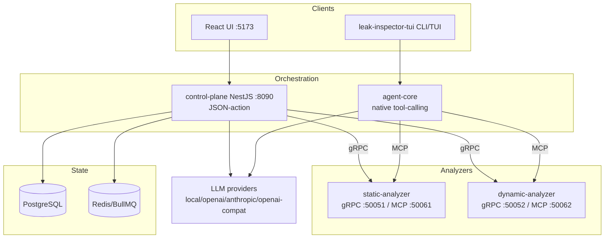
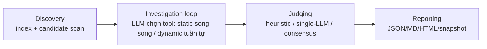

# Đề cương luận văn

> Đề cương chi tiết. Tài liệu tham khảo ở cuối, đánh số theo kiểu IEEE `[n]`. Mọi số liệu
> kết quả trong đề cương là **số đã chạy thực** trong hệ thống (xem §5, đối chiếu
> `docs/EVALUATION.md`, `docs/BASELINE-COMPARISON.md`).

# Tên đề tài
- **Tiếng Việt:** Hệ thống LLM điều phối hợp nhất phân tích tĩnh–động phát hiện rò rỉ bộ nhớ C/C++
- **Tiếng Anh:** An LLM-Orchestrated Static–Dynamic System for C/C++ Memory-Leak Detection

---

# Tổng quan đề tài

## Đặt vấn đề

Rò rỉ bộ nhớ (memory leak, **CWE-401 — Missing Release of Memory after Effective Lifetime**
[16]) trong C/C++ là lớp lỗi **không gây crash**: chương trình vẫn chạy nhưng tiêu hao bộ
nhớ tăng dần, dẫn tới suy giảm hiệu năng và sự cố dài hạn. Vì không sinh tín hiệu rõ ràng,
loại lỗi này khó lộ ra qua kiểm thử thông thường.

Hai họ công cụ truyền thống đều có hạn chế cố hữu:

- **Phân tích tĩnh (static analysis)** — Clang Static Analyzer (`scan-build`), Infer, CodeQL —
  liệt kê ứng viên rò rỉ mà không thực thi chương trình, nhưng **tỉ lệ dương tính giả (false
  positive) cao** do phân tích đường đi (path) và quan hệ sở hữu con trỏ không đầy đủ.
- **Phân tích động (dynamic analysis)** — Valgrind Memcheck [10], [11], AddressSanitizer [9] /
  LeakSanitizer [12] — cho **bằng chứng chắc chắn** về rò rỉ tại thời điểm chạy, nhưng **chỉ quan sát được
  đường đã thực thi** (đòi hỏi input kích hoạt) và phụ thuộc build có sanitizer.

Quan trọng hơn, cả hai chỉ tạo ra *cảnh báo*, **không giải thích vì sao** rò rỉ xảy ra và
**không đề xuất cách sửa**. Khoảng cách giữa "một cảnh báo" và "một kết luận có bằng chứng +
giải thích nguyên nhân + bản vá" chính là nơi cần tới năng lực suy luận và điều phối của các
mô hình ngôn ngữ lớn (LLM).

Các hệ thống LLM gần đây cho kiểm thử/kiểm toán mã nguồn (các agent tự động như RepoAudit [2],
iAudit [3], LLMxCPG [4]; hệ multi-agent như FuzzingBrain V2 [5]) cho thấy LLM có thể
**điều phối** nhiều công cụ phân tích và **phán xử** kết quả. Tuy nhiên, các hệ này hoặc
**chỉ tĩnh** (LAMeD [1]), hoặc **xác minh bằng crash** cho lớp lỗi gây sập
(use-after-free, double-free, buffer overflow) — chưa có hệ nào **kết hợp tĩnh + động chuyên
cho lớp rò rỉ không-crash** trong C/C++ (xem §4.1).

**Ý tưởng đề tài:** xây dựng một hệ thống trong đó **LLM điều phối** một vòng lặp điều tra
rò rỉ — chọn công cụ phân tích chạy tiếp theo, **hợp nhất bằng chứng tĩnh và động**, rồi một
**tầng phán xử (judge)** sinh **kết luận (verdict) + giải thích nguyên nhân gốc + bản vá
(diff)** — đồng thời giải quyết hai vấn đề học thuật then chốt: (i) **độ tin cậy/dao động**
của phán xử LLM, và (ii) **tính tái lập (reproducibility)** của kết quả đánh giá.

---

# Mục tiêu đề tài

Mỗi lần quét một kho mã C/C++ phải tạo ra đủ năm sản phẩm:

1. **Phát hiện** ứng viên rò rỉ bộ nhớ trong kho mã.
2. **Bằng chứng** — finding tĩnh + động được chuẩn hoá vào *gói rò rỉ* dùng chung (LeakBundle).
3. **Giải thích vì sao** — đường cấp phát → đường rò → nguyên nhân gốc (root cause).
4. **Đề xuất sửa** dưới dạng **diff áp dụng được**.
5. **Báo cáo** đa định dạng (JSON / Markdown / HTML / Snapshot).

Mục tiêu **nghiên cứu (đóng góp luận văn)**:

- **C1 — Tầng phán xử đồng thuận (consensus judge):** hợp nhất bằng chứng tĩnh + động và bỏ
  phiếu trên *k* mẫu LLM độc lập (self-consistency [13], LLM-as-judge [14]) để **giảm dao động
  phán xử** trên ca biên.
- **C2 — Giao thức tái lập hai tầng:** `no_llm` tất định bit-for-bit (Tier-1) + `llm_assisted`
  báo cáo phân phối mean ± CI và tỉ lệ lật verdict (Tier-2).
- **C3 — Tất định hoá tầng động:** ghim recipe build+run sanitizer (không LLM trong vòng chạy)
  + capture bằng chứng tất định + trạng thái `dynamicCoverage` trung thực.
- **C4 — Làm giàu bằng chứng:** ownership, cặp alloc→free, đường rò khả thi, tương quan
  runtime↔ứng viên (LINKED vs file-only).

---

# Phạm vi và giới hạn đề tài

## Phạm vi và đối tượng nghiên cứu

- **Đối tượng:** rò rỉ bộ nhớ (CWE-401) trong mã nguồn **C/C++**, cả mã tổng hợp (Juliet) lẫn
  dự án thực.
- **Phạm vi:** một hệ thống agentic do LLM điều phối, kết hợp phân tích tĩnh (Clang
  `scan-build`, AST tree-sitter, call graph, interprocedural flow) và động (Valgrind/ASan/LSan),
  với tầng judge sinh verdict + giải thích + bản vá, và một bộ khung đánh giá có tái lập.

## Giới hạn của đề tài

- **Không** phải nền tảng SAST/DAST đa năng — phạm vi là rò rỉ bộ nhớ C/C++.
- **Không** thay thế các analyzer nền — LLM **điều phối và phán xử** đầu ra của chúng, không
  cài đặt lại.
- **Không** nhắm tới hardening sản phẩm zero-config — mục tiêu là một khung **nghiên cứu/đánh
  giá có tái lập** cho luận văn.

## Phương pháp phân tích cấu trúc, phân rã hệ thống

Hệ thống được phân rã thành **microservices** trong một monorepo Turborepo (ngôn ngữ
TypeScript, runtime bun): một **control-plane** điều phối, hai **analyzer** (tĩnh/động) phục
vụ cả gRPC lẫn MCP, một thư viện **agent-core** (vòng lặp tool-calling), một thư viện
**common** (type/scoring/judge dùng chung), và hai giao diện (web React + CLI/TUI). Việc phân
rã theo *ranh giới phân tích* (tĩnh vs động) + *ranh giới điều phối* (web vs CLI) cho phép
tái dùng analyzer cho cả hai đường và so sánh hai mô hình điều phối LLM (xem §4.2).

## Thiết kế hệ thống

Hai đường điều phối dùng chung analyzer + scorer (chi tiết §4.2): (a) **đường web** —
control-plane điều phối theo mô hình *JSON-action* qua Postgres/Redis; (b) **đường CLI/TUI** —
`leak-inspector-tui` + `agent-core` điều phối theo *native tool-calling*. Vòng lặp điều tra
3 pha: **discovery → investigation loop → judging/reporting**. Tầng judge có ba cấu hình
so-sánh-được: heuristic (tất định) · single-LLM · consensus.

## Triển khai hệ thống

Triển khai qua Docker Compose (Postgres, Redis, control-plane :8090, static-analyzer
MCP :50061, dynamic-analyzer MCP :50062, UI :5173). LLM nối qua lớp provider đa nhà cung cấp
(`local | openai | anthropic | openai-compat`) dùng giao thức **MCP** [12] cho tool-calling.

## Phương pháp nghiên cứu

- **Thực nghiệm có đối chứng:** so `no_llm` (heuristic) vs `llm_assisted` (single-LLM) vs
  `consensus` trên cùng corpus + cùng bộ chấm điểm.
- **Chấm điểm site-based** (không count-based): mỗi site ground-truth là một mẫu; site sạch bị
  flag = FP thật, flaw bị bỏ = FN.
- **Thống kê:** bootstrap CI cho P/R/F1; kiểm định **McNemar** ghép cặp theo `siteId`.
- **Tái lập:** gate tất định Tier-1 + đo verdict-stability Tier-2.
- **So sánh baseline:** chuẩn hoá finding của baseline (clang-analyzer/infer) về cùng shape +
  cùng `scoreCase` (xem §4.4 và `docs/BASELINE-COMPARISON.md`).

---

# Các nội dung chính

## Các nghiên cứu và công nghệ liên quan

### (a) Công trình liên quan

Khảo sát 2025–2026 (đã kiểm chứng đối kháng — fetch + bỏ phiếu 3 agent/claim, xem `researchs/`
và bước verify deep-research) theo ba trục:

**Trục A — phát hiện rò rỉ C/C++ trực tiếp:**
- **LAMeD** [1] (EASE 2025, peer-reviewed): LLM sinh annotation AllocSource/FreeSink nạp cho
  analyzer cổ điển (Cooddy/CodeQL/Infer); theo công bố của nhóm tác giả, khi tích hợp annotation
  thì **phát hiện leak cải thiện rõ và giảm path-explosion**, nhưng **số cảnh báo cũng tăng** —
  minh hoạ đánh đổi *recall↑ / FP↑* mà consensus judge của đề tài nhắm giải quyết. **Static-only**,
  và là baseline peer-reviewed sát đề tài nhất.
- Một số hướng *neuro-symbolic* (LLM kết hợp SMT/Z3) cho leak C/C++ đang xuất hiện dưới dạng
  **preprint 2026** (ví dụ MemHint); ở lần kiểm chứng mới nhất chưa xác minh độc lập được định
  danh nên **không đưa vào danh mục trích dẫn chính thức** (xem ghi chú ở mục Tài liệu tham khảo).

**Trục B — kiến trúc agentic + judge (analogue):**
- **RepoAudit** [2] (ICML 2025, PMLR vol. 267): agent tự động + validator path-condition SAT;
  theo công bố của nhóm tác giả đạt precision **78.43%** trên 40 bug thật (đa ngôn ngữ, đa loại
  lỗi — *không* leak-only, *không* báo recall).
- **iAudit** [3] (ICSE 2025, IEEE/ACM): kiến trúc **đa agent tranh luận** (Ranker–Critic) trên
  nền Reasoner đã fine-tune để chọn + biện minh nguyên nhân lỗi. *Lưu ý:* đây là cơ chế *tranh
  luận* hai agent, **không phải bỏ phiếu đồng thuận** như đề tài (miền là smart contract).
- **LLMxCPG** [4] (USENIX Security 2025): hợp nhất **Code Property Graph** với LLM để phát hiện
  lỗ hổng — ví dụ điển hình của hướng *phân tích chương trình + LLM*.
- **FuzzingBrain V2** [5] (preprint 2026): multi-agent **trên MCP**, kết hợp static (Fuzz
  Introspector) + dynamic (libFuzzer + ASan/MSan/UBSan), đạt 90% (36/40) trên AIxCC 2025 — nhưng
  xác minh **bằng crash**, leak chỉ là phụ. Cùng nhóm AIxCC có **ATLANTIS** [6] (và Buttercup),
  kiến trúc static+dynamic+agentic+judge, đều xác minh qua crash.

**Trục C — formal / dataset (phụ trợ):**
- **POM** [7] (CMU SEI Tech Report CMU/SEI-2025-TR-008): LLM gán nhãn ownership + SAT verify
  (hướng *prevention*); độ chính xác gán nhãn con trỏ **94.1%** trên Juliet. (Không trích các số
  precision/recall headline — đã bị loại trong kiểm chứng.)
- **SecVulEval** [8] (preprint 2025): **dataset** 25.440 hàm / 145 CWE — tập đánh giá phụ, không
  chuyên leak.

> **Loại trừ minh bạch:** một paper LLM4Code (ICSE 2025 workshop) chỉ nhắm **Java** (GC) → ngoài
> phạm vi, không dùng làm baseline.

**Khoảng trống nghiên cứu:** chưa tìm thấy hệ 2025–2026 nào **kết hợp tĩnh + động (Valgrind/ASan/
LSan) chuyên cho memory-LEAK** trong C/C++ — đây là vị trí định vị của đề tài (mang mô hình
agentic static+dynamic từ lỗi-gây-crash sang lớp **rò rỉ không-crash**).

| Hệ | Static | Dynamic | Agentic | Judge | Leak trọng tâm? | Peer-review |
|---|:--:|:--:|:--:|:--:|:--:|---|
| LAMeD [1] | ✅ | ❌ | ❌ | 🟡 | ✅ | ✅ EASE 2025 |
| RepoAudit [2] | 🟡 | ❌ | ✅ | ✅ | 🟡 | ✅ ICML 2025 |
| iAudit [3] | ❌ | ❌ | ✅ (debate) | ✅ | ❌ (smart contract) | ✅ ICSE 2025 |
| LLMxCPG [4] | ✅ (CPG) | ❌ | 🟡 | 🟡 | ❌ (vuln chung) | ✅ USENIX Sec 2025 |
| FuzzingBrain V2 [5] | ✅ | ✅ | ✅ | 🟡 | 🔶 crash | ❌ preprint |
| POM [7] | ✅ | ❌ | ❌ | ✅ | 🔶 | ❌ tech report |
| **Đề tài** | ✅ | ✅ | ✅ | ✅ (consensus) | ✅ | — |

### (b) Công nghệ nền

- **LLM tool-calling / agentic orchestration:** mô hình agent gọi tool lặp (như RepoAudit [2],
  iAudit [3], FuzzingBrain V2 [5]); chuẩn **Model Context Protocol (MCP)** [15] để LLM gọi tool
  của analyzer (JSON-RPC 2.0 streamable-HTTP).
- **Self-consistency & LLM-as-judge:** bỏ phiếu trên nhiều mẫu suy luận để chọn đáp án nhất quán,
  tăng độ tin cậy [13]; dùng LLM làm bộ phán xử [14] — nền tảng học thuật cho consensus judge (C1).
- **Phân tích động:** Valgrind/Memcheck (dynamic binary instrumentation) [10], [11];
  AddressSanitizer (instrumentation thời biên dịch) [9]; LeakSanitizer (`-fsanitize=leak`) [12].
- **Phân tích tĩnh:** Clang Static Analyzer (`scan-build`); AST qua tree-sitter; call graph;
  interprocedural data-flow.
- **Nền kỹ thuật:** monorepo Turborepo + bun; **NestJS** (control-plane + analyzer); **gRPC**
  (proto3) cho control-plane↔analyzer; **React 19** + Vite + Ant Design + Zustand cho UI;
  **Ink/React** cho TUI; **PostgreSQL** + **Redis/BullMQ** cho trạng thái/queue; GitHub OAuth.

## Lập kế hoạch, phân tích và thiết kế hệ thống

### Kiến trúc tổng thể — hai đường điều phối

### Phân rã thành phần

| Thành phần | Công nghệ | Vai trò |
|---|---|---|
| `apps/control-plane` | NestJS, gRPC, BullMQ | Điều phối web (JSON-action), API REST + SSE, OAuth, lưu lịch sử quét |
| `apps/leak-inspector-tui` | Ink/React, bun | Điều phối CLI/TUI (native tool-calling); dùng cho eval/benchmark |
| `packages/agent-core` | TypeScript | Vòng lặp tool-calling, MCP client, `callModel` đa-provider (streaming), nén ngữ cảnh |
| `packages/common` | TS + Zod | Type/schema, `scoreCase`, heuristic + **consensus judge**, reporting |
| `apps/static-analyzer` | NestJS, tree-sitter, Clang | index, candidate/AST scan, call graph, interprocedural flow, `scan-build` |
| `apps/dynamic-analyzer` | NestJS, Valgrind/ASan/LSan | build sanitizer, chạy Memcheck/ASan/LSan, chuẩn hoá báo cáo |
| `apps/leak-inspector-ui` | React 19, Vite, Zustand | timeline + workflow DAG (SSE), trình duyệt findings |

### Giao thức & mô hình dữ liệu

- **gRPC** (proto3): control-plane ↔ analyzer (mặc định đường web).
- **MCP** (JSON-RPC 2.0 streamable-HTTP): TUI ↔ analyzer (và control-plane khi bật).
- **SSE:** control-plane → UI (timeline thời gian thực).
- **`LeakBundle`** (mô hình trung tâm): một ứng viên + `staticEvidence` (ownership, cặp
  alloc→free, đường rò khả thi) + `evidence[]` động (valgrind/asan/lsan + tương quan
  LINKED/file-only) + `dynamicCoverage` + `verdict` (`VerdictResult`).

### Thiết kế tầng phán xử & tái lập (đóng góp)

- **Consensus judge (C1):** `judgeByConsensus` lấy *k* mẫu LLM độc lập rồi `combineVerdicts`
  theo luật `majority | weighted | unanimous-to-flag`; sau bỏ phiếu có *precision-override*
  heuristic (chỉ gỡ flag khi heuristic tự tin miễn tội, không khi dynamic đã xác nhận). `n=1`
  ⇒ single-LLM baseline → ablation 3-bậc là so-sánh như-với-như.
- **Two-tier determinism (C2):** Tier-1 ép bằng `determinism-gate.sh` + `assert-determinism.ts`
  (từ chối hai kiểu "đậu giả": so-dir-với-chính-nó, và run lỗi/rỗng); Tier-2 báo mean ± std
  (`--runs N`) + `verdict-stability.ts`.
- **Deterministic dynamic (C3):** `runDeterministicDynamic` ghim build+run; `withDynamicEvidence
  Capture` ghi mọi finding (không "discretion" của LLM).

### Pipeline điều tra (CLI/TUI)

## Hiện thực, triển khai hệ thống

- **Khởi chạy:** `docker compose up --build` (toàn stack). Quét: TUI tương tác
  (`/scan <repo>`, `/config` chọn provider) hoặc headless (`leak-tui scan --repo … --mode …`).
- **Provider LLM:** ngoài `local/openai/anthropic`, hỗ trợ **`openai-compat`** — trỏ tới bất kỳ
  endpoint kiểu OpenAI `/chat/completions` (LM Studio, vLLM, Ollama, gateway riêng), cấu hình
  qua `/config` / CLI (`--base-url/--model/--api-key`) / env.
- **Tool tĩnh:** index, candidate scan (allocator-aware), AST tree-sitter, call graph,
  interprocedural flow, `scan-build`. **Tool động:** buildTarget (sanitizer), Valgrind Memcheck,
  ASan, LSan.
- **Báo cáo:** JSON (máy đọc), Markdown, HTML (verdict card: coverage/judge/correlation/static),
  Snapshot (so sánh thực nghiệm).

## Đánh giá kết quả

### Phương pháp & dữ liệu

- **Corpus:** Juliet CWE-401 (**1984 ca**, 49 biến thể luồng; build `make CC=clang CXX=clang++`,
  bỏ `-DOMITGOOD` + `-fsanitize=leak` để chạy cả đường good lẫn bad) [17]; corpus dự án thực
  (cJSON, 4 ca = 2 cặp bad/fixed theo *commit oracle*, chấm line-mode).
- **Chấm điểm:** site-based (`scoreCase`), function-mode (Juliet) / line-mode (real); bootstrap
  CI; McNemar ghép cặp theo `siteId`.

### Kết quả thực (Juliet CWE-401, 30 ca, analyzer qua MCP Docker)

| Hệ / cấu hình | sites | TP | FP | FN | TN | Precision | Recall | **F1** | FP/KLOC |
|---|--:|--:|--:|--:|--:|--:|--:|--:|--:|
| **Hệ thống — no_llm (heuristic)** | 77 | 29 | 7 | 3 | 38 | 0.806 | 0.906 | **0.853** | **0.741** |
| **Hệ thống — consensus (×3/weighted)** | 77 | 30 | 10 | 2 | 35 | 0.750 | 0.938 | **0.833** | 1.058 |
| Clang Static Analyzer (cùng corpus + scorer) | 44 | 27 | 12 | 5 | 0 | 0.692 | 0.844 | **0.761** | 1.270 |

> *FPR/specificity/MCC bị bỏ:* clang là positive-only (TN=0). So theo Precision/Recall/F1 +
> FP/KLOC. **Cả hai cấu hình hệ thống thắng Clang về F1** (0.853 / 0.833 > 0.761) và **ít FP
> hơn theo KLOC**.

**Headline ablation — consensus giảm dao động phán xử (cùng 30 ca, 2 lần chạy mỗi nhánh):**

| Nhánh judge | case-stability | **tỉ lệ lật verdict** | modal agreement |
|---|---|---|---|
| single-LLM (`--consensus-n 1`) | 73.3% | **26.7%** (8/30) | 86.7% |
| consensus (`--consensus-n 3`) | **93.3%** | **6.7%** (2/30) | **96.7%** |

→ Bỏ phiếu k=3 **cắt tỉ lệ lật verdict ~4×** (26.7% → 6.7%), nâng case-stability 73% → 93%.
**Tier-1:** hai lần chạy `no_llm` cho **chấm điểm y hệt** (TP29 FP7 FN3 TN38).

### Bàn luận trung thực (threats to validity)

Trên Juliet *dễ*, heuristic baseline là mạnh nhất; LLM + dynamic có thể **tăng FP** vì bằng
chứng động làm heuristic tự tin hơn → ít ca rơi vào dải biên nơi consensus phát huy, và tương
quan dynamic↔ứng viên còn thô. Giá trị của LLM/consensus kỳ vọng thể hiện trên **ca khó** (dự
án thực, control-flow phức tạp). Mọi số FP đơn-lần-chạy bị nhiễu bởi tính bất định LLM → cần
multi-seed + McNemar trước khi quy kết. Baseline peer-reviewed mỏng (chỉ LAMeD [1] đầy đủ phản
biện) → cân nhắc khi nộp.

## Kết luận và hướng phát triển trong tương lai

Đề tài đề xuất và hiện thực một hệ thống LLM điều phối hợp nhất tĩnh–động cho rò rỉ bộ nhớ
C/C++, với ba đóng góp đo được: (i) consensus judge giảm dao động phán xử ~4×; (ii) giao thức
tái lập hai tầng; (iii) tất định hoá tầng động. **Hướng phát triển:** mở rộng corpus dự án
thực; tăng độ chặt của tương quan dynamic↔ứng viên; escalation lên consensus theo *bất đồng*
tĩnh↔động; mở rộng sang các CWE memory-safety khác (UAF/double-free); chạy multi-seed +
McNemar để khẳng định hiệu ứng có ý nghĩa thống kê.

---

# Kế hoạch thực hiện

| Giai đoạn | Nội dung | Trạng thái |
|---|---|---|
| 1 | Khảo sát công trình + công nghệ liên quan (`researchs/`) | ✅ Hoàn thành |
| 2 | Thiết kế kiến trúc + phân rã + giao thức (gRPC/MCP/SSE) | ✅ Hoàn thành |
| 3 | Hiện thực analyzer tĩnh/động + agent-core + control-plane + UI/TUI | ✅ Hoàn thành |
| 4 | Tầng judge (heuristic/single-LLM/consensus) + làm giàu bằng chứng | ✅ Hoàn thành |
| 5 | Khung đánh giá (site-based scoring, CI, McNemar) + two-tier determinism | ✅ Hoàn thành |
| 6 | So sánh baseline (clang/infer) + ablation consensus | ✅ Hoàn thành |
| 7 | Mở rộng corpus dự án thực + multi-seed McNemar | ⏳ Đang/kế tiếp |
| 8 | Viết luận văn + bảo vệ | ⏳ Kế tiếp |

---

# Tài liệu tham khảo

> Mỗi mục có **định danh xác minh được** (arXiv ID / DOI / venue). Các nguồn baseline + nền tảng
> đã được kiểm chứng đối kháng (fetch nguồn gốc + bỏ phiếu 3 agent/claim) trong `researchs/` và
> bước verify deep-research (25/25 claim được xác nhận, 0 bị bác bỏ). Một số trang publisher
> (ACM DL/USENIX) chặn fetch tự động (HTTP 403) nhưng mọi trường then chốt được đối chiếu qua
> arXiv/DBLP/OpenReview/trang hội nghị.
>
> **Ghi chú minh bạch (không bịa):** *MemHint* (neuro-symbolic, preprint 2026) được nhắc trong
> khảo sát nhưng **không** đưa vào danh mục dưới đây vì ở lần kiểm tra mới nhất **không xác minh
> độc lập được định danh arXiv**. Các con số bị bác bỏ trong kiểm chứng (vd precision/recall
> headline của POM; phạm vi double-free / "C-only" của RepoAudit; hệ "Argus") **không** được
> trích dẫn.

[1] E. Shemetova, I. Shenbin, I. Smirnov, A. Alekseev, A. Rukhovich, S. Nikolenko, V. Lomshakov, I. Piontkovskaya, "LAMeD: LLM-generated Annotations for Memory Leak Detection," in *Proc. 29th Int. Conf. on Evaluation and Assessment in Software Engineering (EASE '25)*, Istanbul, Turkey, 2025, pp. 1024–1034. DOI: 10.1145/3756681.3756999. (Preprint: arXiv:2505.02376.)

[2] "RepoAudit: An Autonomous LLM-Agent for Repository-Level Code Auditing," in *Proc. 42nd Int. Conf. on Machine Learning (ICML)*, PMLR vol. 267, 2025, pp. 21083–21100. arXiv:2501.18160.

[3] W. Ma, D. Wu, Y. Sun, T. Wang, S. Liu, J. Zhang, Y. Xue, Y. Liu, "Combining Fine-Tuning and LLM-based Agents for Intuitive Smart Contract Auditing with Justifications," in *Proc. 47th IEEE/ACM Int. Conf. on Software Engineering (ICSE)*, 2025, pp. 1742–1754. DOI: 10.1109/ICSE55347.2025.00027. arXiv:2403.16073.

[4] A. Lekssays, H. Mouhcine, K. Tran, T. Yu, I. Khalil, "LLMxCPG: Context-Aware Vulnerability Detection Through Code Property Graph-Guided Large Language Models," in *Proc. 34th USENIX Security Symposium*, 2025, pp. 489–507. arXiv:2507.16585.

[5] Z. Sheng, Z. Chen, Q. Xu, K. Zhu, J. Huang, "FuzzingBrain V2: A Multi-Agent LLM System for Automated Vulnerability Discovery and Reproduction," arXiv preprint arXiv:2605.21779, 2026. (Preprint.)

[6] Team Atlanta, "ATLANTIS: Autonomous Cyber Reasoning System (AIxCC)," arXiv preprint arXiv:2509.14589, 2025. (Preprint / tech report.)

[7] D. Svoboda et al., "Design of Enhanced Pointer Ownership Model for C," Software Engineering Institute, Carnegie Mellon University, Tech. Rep. CMU/SEI-2025-TR-008, 2025.

[8] M. M. Ahmed, N. Harzevili, J. Shin, H. V. Pham, S. Wang, "SecVulEval: Benchmarking LLMs for Real-World C/C++ Vulnerability Detection," arXiv preprint arXiv:2505.19828, 2025. (Preprint; dataset.)

[9] K. Serebryany, D. Bruening, A. Potapenko, D. Vyukov, "AddressSanitizer: A Fast Address Sanity Checker," in *Proc. USENIX Annual Technical Conf. (ATC)*, 2012, pp. 309–318.

[10] J. Seward, N. Nethercote, "Using Valgrind to Detect Undefined Value Errors with Bit-Precision," in *Proc. USENIX Annual Technical Conf. (ATC), General Track*, 2005, pp. 17–30. (Memcheck — phát hiện rò rỉ bộ nhớ.)

[11] N. Nethercote, J. Seward, "Valgrind: A Framework for Heavyweight Dynamic Binary Instrumentation," in *Proc. ACM SIGPLAN Conf. on Programming Language Design and Implementation (PLDI)*, 2007, pp. 89–100. DOI: 10.1145/1250734.1250746.

[12] LLVM/Clang Project, "LeakSanitizer," Clang Documentation. [Online]. Available: https://clang.llvm.org/docs/LeakSanitizer.html

[13] X. Wang, J. Wei, D. Schuurmans, Q. Le, E. Chi, S. Narang, A. Chowdhery, D. Zhou, "Self-Consistency Improves Chain of Thought Reasoning in Language Models," in *Int. Conf. on Learning Representations (ICLR)*, 2023. arXiv:2203.11171.

[14] L. Zheng, W.-L. Chiang, Y. Sheng, S. Zhuang, Z. Wu, Y. Zhuang, Z. Lin, Z. Li, D. Li, E. P. Xing, H. Zhang, J. E. Gonzalez, I. Stoica, "Judging LLM-as-a-Judge with MT-Bench and Chatbot Arena," in *Advances in Neural Information Processing Systems (NeurIPS), Datasets and Benchmarks Track*, 2023. arXiv:2306.05685.

[15] Anthropic, "Model Context Protocol — Specification," 2025. [Online]. Available: https://modelcontextprotocol.io/specification/2025-11-25

[16] MITRE, "CWE-401: Missing Release of Memory after Effective Lifetime," Common Weakness Enumeration. [Online]. Available: https://cwe.mitre.org/data/definitions/401.html

[17] NIST, "Juliet Test Suite for C/C++ (SARD)," National Institute of Standards and Technology. [Online]. Available: https://samate.nist.gov/SARD/
